# BugBuster Desktop App

Tauri v2 + Leptos 0.7 desktop application for controlling the BugBuster hardware.

**Current version:** `0.6.0` — 2026-04-27 (validated across `Cargo.toml`, `src-tauri/Cargo.toml`, and `src-tauri/tauri.conf.json` by `scripts/desktop_version.py --check`).

## Stack

- **Backend:** Rust (Tauri v2) -- serial/HTTP transport, BBP protocol, state management
- **Frontend:** Leptos 0.7 (WASM) -- reactive UI compiled via Trunk
- **Build:** Trunk (WASM) + Cargo (Tauri)

## Screenshots

The current desktop screenshots live under [`../../Docs/Images/screenshots/`](../../Docs/Images/screenshots/).

<table>
  <tr>
    <td align="center"><br/><sub><b>Dashboard</b></sub></td>
    <td align="center">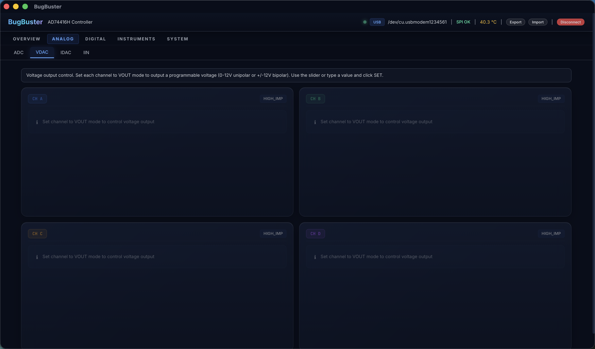<br/><sub><b>ADC</b></sub></td>
    <td align="center">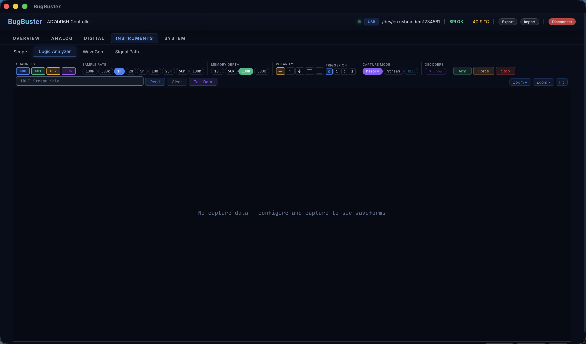<br/><sub><b>Scope</b></sub></td>
  </tr>
  <tr>
    <td align="center"><br/><sub><b>Logic Analyzer</b></sub></td>
    <td align="center">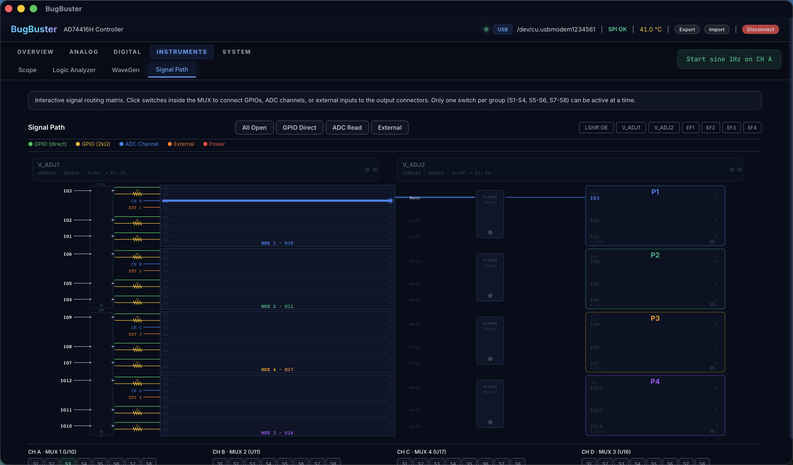<br/><sub><b>WaveGen</b></sub></td>
    <td align="center">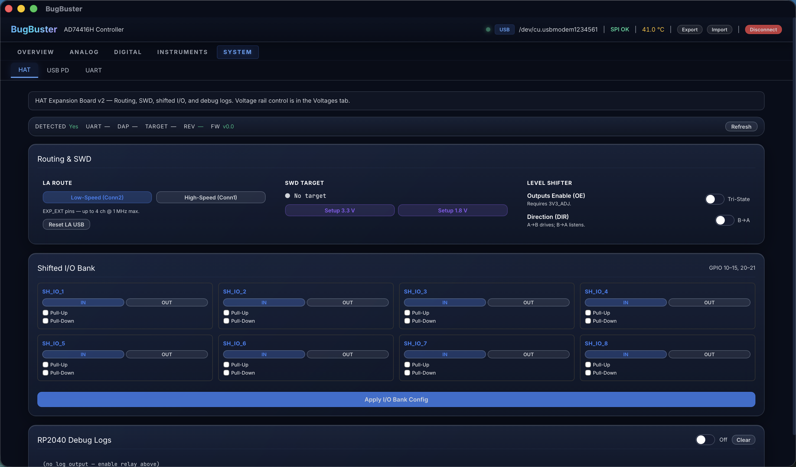<br/><sub><b>Signal Path</b></sub></td>
  </tr>
  <tr>
    <td align="center">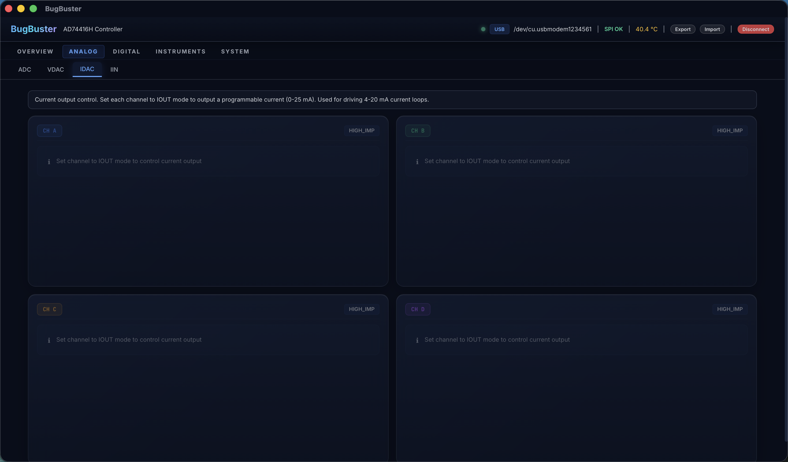<br/><sub><b>VDAC</b></sub></td>
    <td align="center">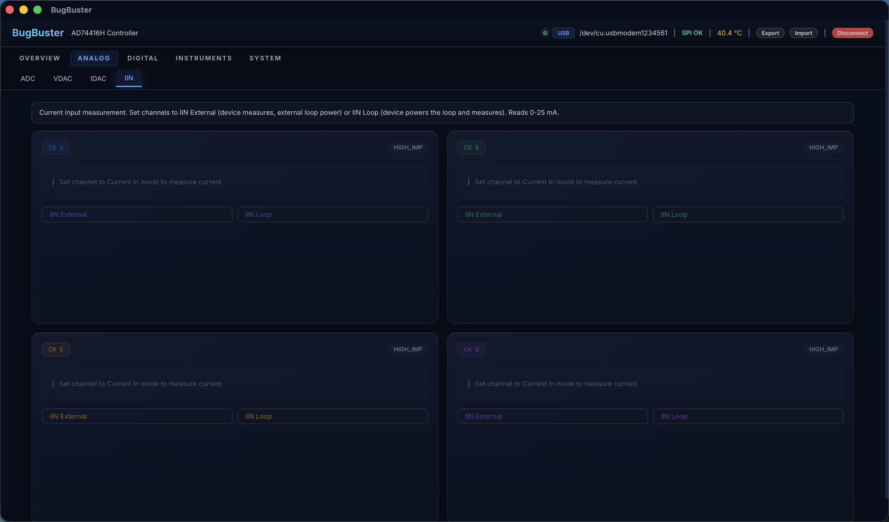<br/><sub><b>IDAC</b></sub></td>
    <td align="center">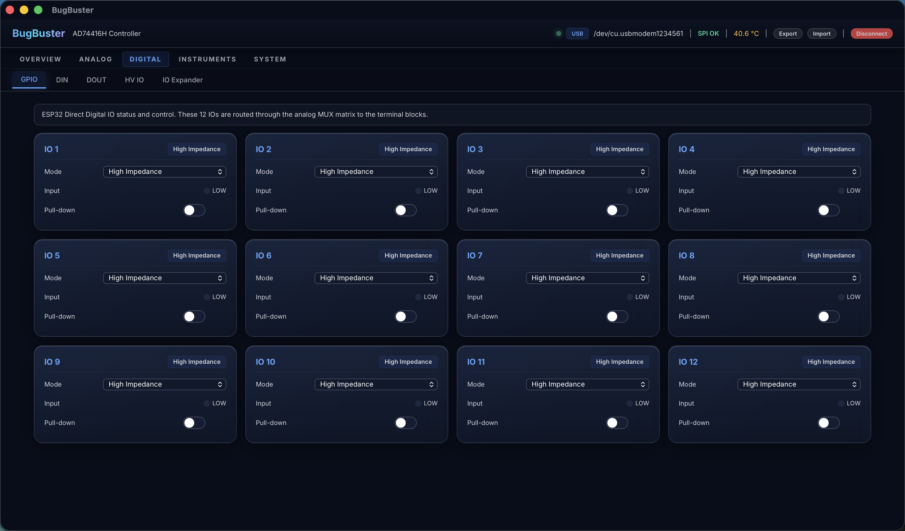<br/><sub><b>IIN</b></sub></td>
  </tr>
  <tr>
    <td align="center">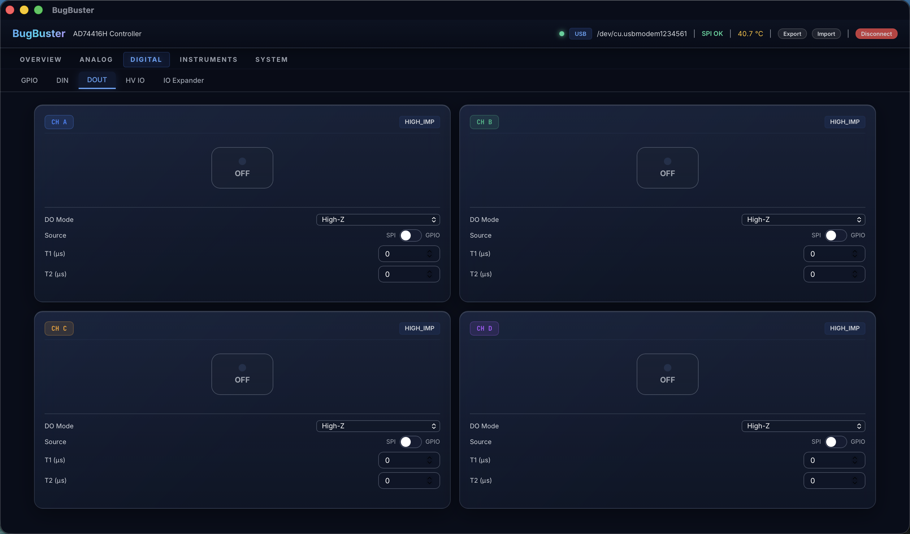<br/><sub><b>DIN</b></sub></td>
    <td align="center">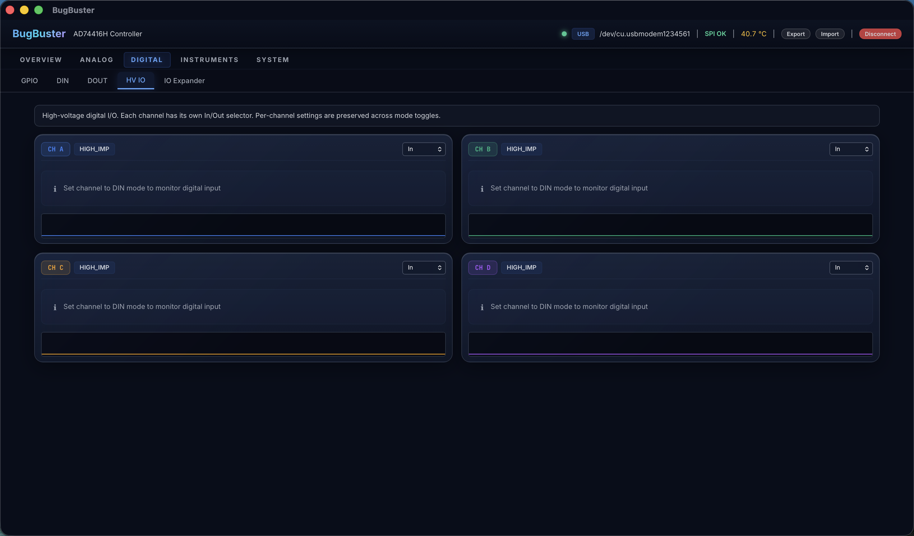<br/><sub><b>DOUT</b></sub></td>
    <td align="center">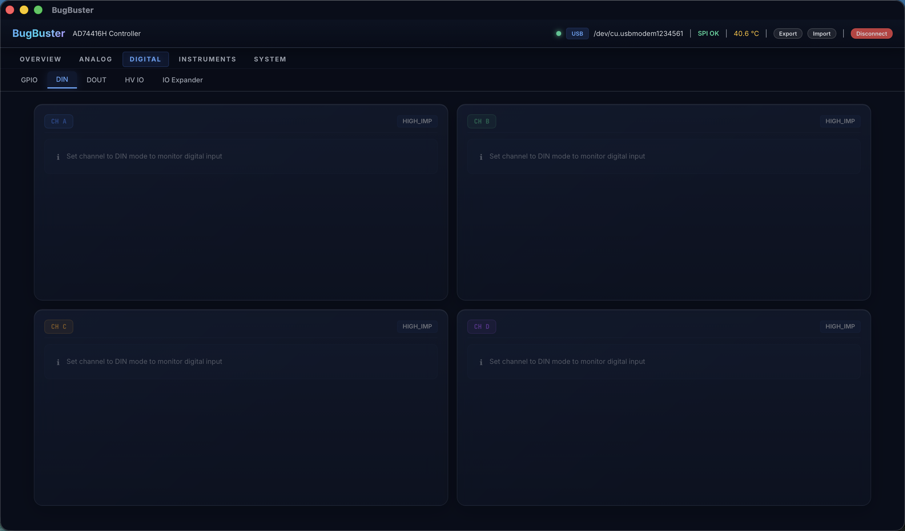<br/><sub><b>GPIO</b></sub></td>
  </tr>
  <tr>
    <td align="center"><br/><sub><b>USB-PD</b></sub></td>
    <td align="center">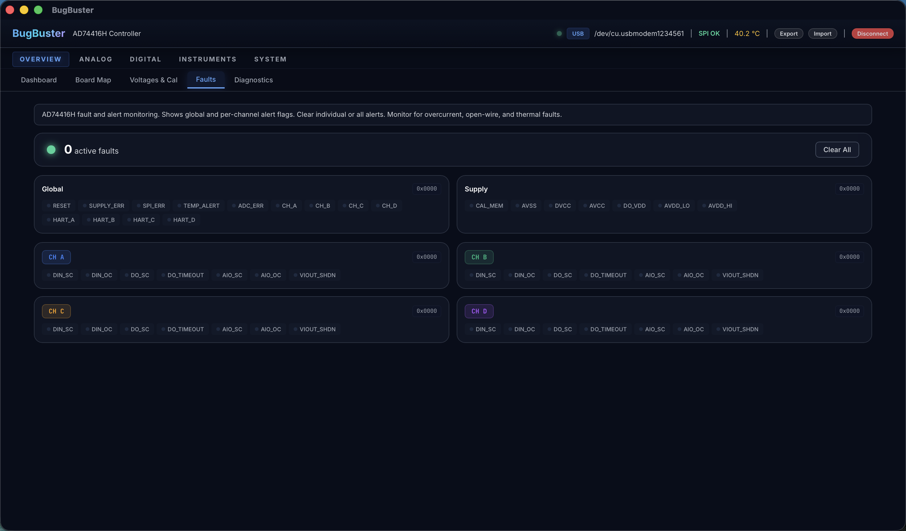<br/><sub><b>Voltages + Cal</b></sub></td>
    <td align="center">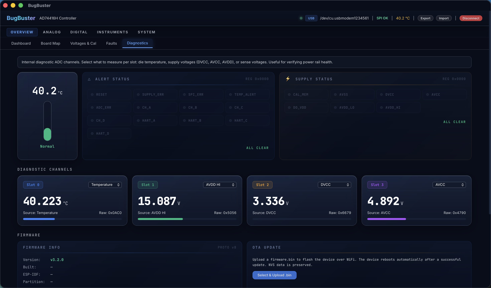<br/><sub><b>Faults</b></sub></td>
  </tr>
  <tr>
    <td align="center">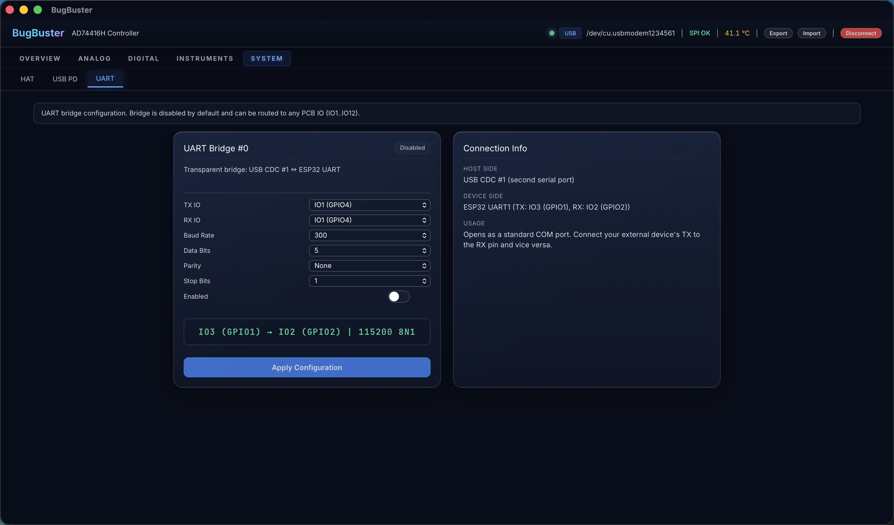<br/><sub><b>UART</b></sub></td>
    <td align="center">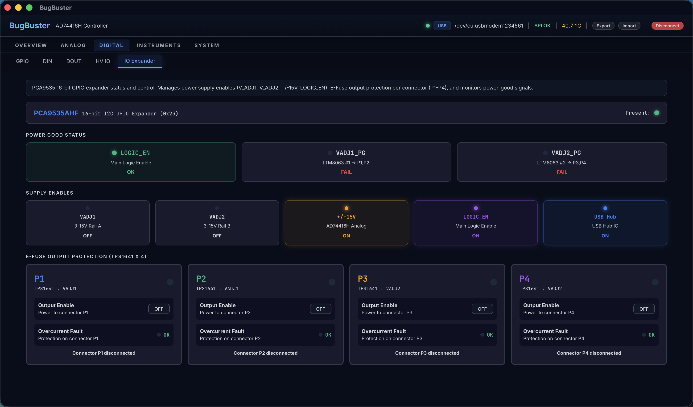<br/><sub><b>HV IO</b></sub></td>
    <td align="center">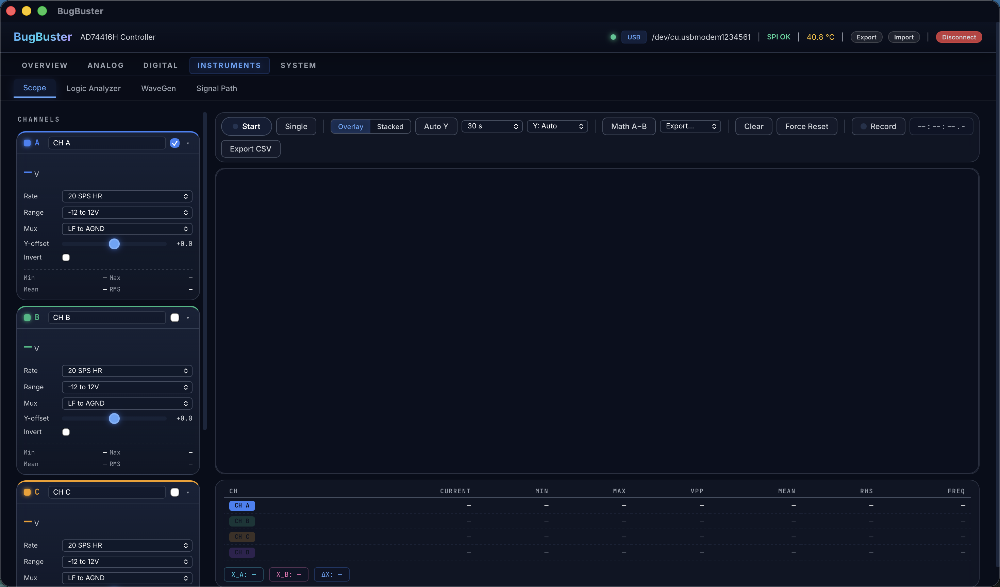<br/><sub><b>IO Expander</b></sub></td>
  </tr>
  <tr>
    <td align="center">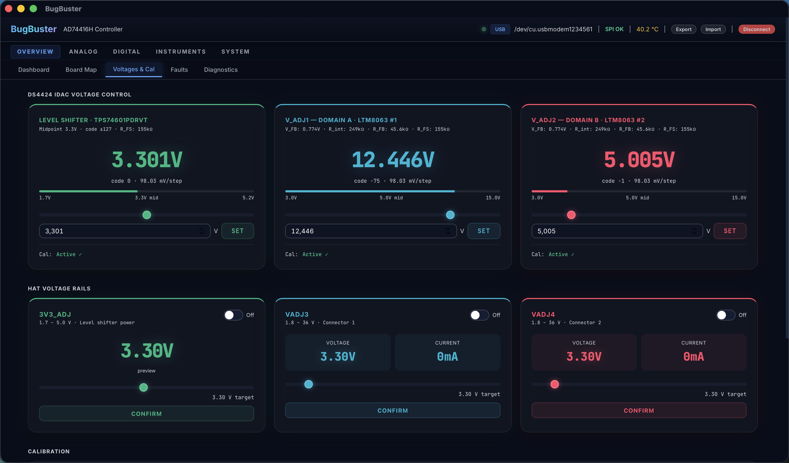<br/><sub><b>Board Map</b></sub></td>
    <td align="center">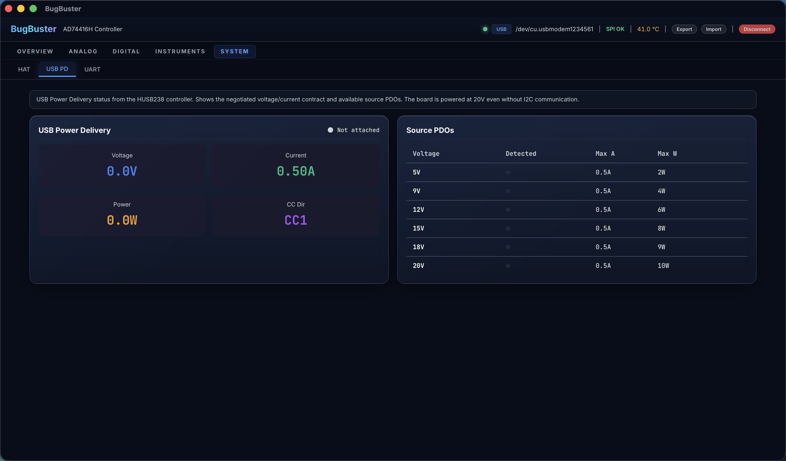<br/><sub><b>HAT</b></sub></td>
    <td align="center">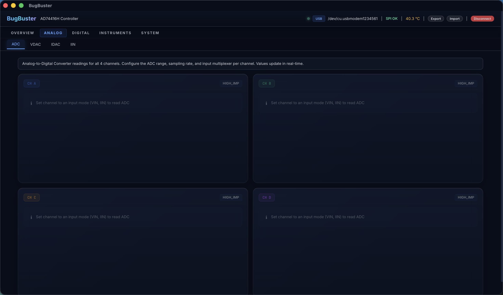<br/><sub><b>Diagnostics</b></sub></td>
  </tr>
</table>

## Development

```bash
# Install dependencies (first time)
cargo install trunk
cargo install tauri-cli

# Dev mode (hot-reload frontend + backend)
cargo tauri dev

# Production build
cargo tauri build
```

## GitHub Releases

Cross-platform desktop releases are handled by `../../.github/workflows/desktop-release.yml`.

Release flow:

```bash
# 1. Sync the desktop version in all release files
python3 DesktopApp/BugBuster/scripts/desktop_version.py 0.6.0

# 2. Commit the version bump
git add DesktopApp/BugBuster/Cargo.toml \
        DesktopApp/BugBuster/src-tauri/Cargo.toml \
        DesktopApp/BugBuster/src-tauri/tauri.conf.json
git commit -m "desktop: release 0.6.0"

# 3. Push a release tag
git tag desktop-v0.6.0
git push origin main --tags
```

What the workflow does:
- Builds the Tauri desktop bundle on `windows-latest`, `ubuntu-22.04`, and `macos-latest`
- Uploads the generated installers and bundles to a GitHub Release draft
- Verifies the three desktop version files stay synchronized
- Rejects a pushed tag if it does not match the app version

Current limitations:
- macOS builds are not notarized yet
- Windows builds are not code-signed yet
- The workflow publishes one macOS runner build; if you need separate Intel and Apple Silicon artifacts, extend the matrix with explicit macOS targets

## Project Structure

```
src/                    Leptos frontend (WASM)
  app.rs                Main app shell, routing, particle background
  tauri_bridge.rs       Tauri invoke wrappers, type definitions
  tabs/                 21 tab components (overview, adc, scope, LA, HAT,
                        USB-PD, GPIO, UART, board-profile, etc.)
  components/           Shared UI components

src-tauri/              Tauri backend (Rust)
  src/
    lib.rs              Tauri plugin setup, command registration
    commands.rs         40+ Tauri commands (device control, OTA, etc.)
    connection_manager.rs  Transport lifecycle, state polling
    usb_transport.rs    BBP over USB CDC (COBS framing)
    http_transport.rs   REST API over WiFi (JSON re-encoding to BBP binary)
    discovery.rs        Device discovery (USB enumeration + subnet scan)
    bbp.rs              Protocol constants, frame builder, payload helpers
    state.rs            DeviceState, ChannelState, connection types
    transport.rs        Transport trait abstraction

styles.css              Global glass UI theme
index.html              Trunk entry point
```

## Connecting

The app auto-discovers devices on:
- **USB:** Scans for Espressif VID serial ports, probes with BBP handshake
- **WiFi:** Scans `192.168.4.1` (AP) + all local subnet IPs

USB is preferred for low-latency streaming. WiFi works for all features except real-time scope streaming and IDAC calibration.

Mutating HTTP requests require an admin token. On first USB connect the desktop
persists the token keyed by the device MAC; HTTP sessions then reuse the cached
token automatically. If `/api/device/info` does not report a MAC, the app
surfaces a clear "firmware too old" error instead of looping on pairing.

## Board configuration

The `Board` tab lets you import/export board profiles (`.json`) that lock
VLOGIC / VADJ1 / VADJ2 rails and declare per-pin names and directions. The
MCP server consumes the same profiles via `list_boards` / `set_board` and
enforces the rail lock in `bugbuster_mcp/safety.py`. See
[`Docs/board_profiles.md`](../../Docs/board_profiles.md) for the schema.
