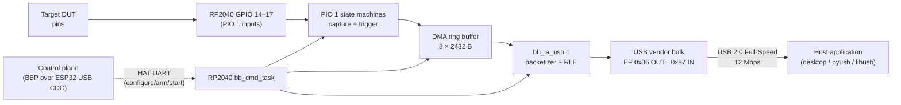

# BugBuster Logic Analyzer

**Subsystem:** RP2040 HAT
**Firmware module:** `Firmware/RP2040/src/bb_la*.c/.pio/.h`
**USB interface:** Vendor bulk (interface `BB_LA_VENDOR_ITF = 0`, EP `0x06` OUT / `0x87` IN)
**Transport:** Direct host ⇄ RP2040 USB (bypasses the ESP32 entirely)
**Current version:** `bb-hat-2.0`

---

## 1. Architecture at a glance



Two distinct USB interfaces are in play:

| Interface | Mounted on | Purpose | Data rate |
|---|---|---|---|
| **ESP32 USB CDC #0 (BBP)** | ESP32-S3 USB | Control plane: arm, trigger, config, status, LA-done events | sub-ms commands |
| **RP2040 USB vendor bulk** | RP2040 HAT USB | Data plane: sample stream / one-shot readout | ~1 MB/s sustained |

**The ESP32 is not in the LA data path.** The host application opens *two* USB endpoints — one on each MCU — and routes control to the ESP32 and data to the RP2040 in parallel.

---

## 2. Why a separate vendor-bulk interface

Early firmware relayed LA data over the ESP32 via:

```
RP2040 PIO → DMA → HAT UART (921600) → ESP32 BBP → USB CDC
```

This topped out at roughly 90 KB/s and introduced three problems:

1. **HAT UART saturation** — 921600 baud = ~92 kB/s theoretical, well below 1 MHz × 4 ch × 1 B = 4 MB/s.
2. **Control/data contention** — every LA byte competed with BBP commands, status polls, and fault events on the same CDC.
3. **End-to-end latency** — ESP32 re-framing added 1-2 ms per chunk, which matters when you want the UI to keep up with live capture.

Moving to a dedicated RP2040 vendor-bulk interface eliminates all three. The RP2040 already exposes a USB device (for CMSIS-DAP + CDC UART bridge via debugprobe); adding a vendor class interface alongside CMSIS-DAP HID and CDC bridge is a descriptor change, not a new physical connector.

---

## 3. USB descriptor

The RP2040 HAT enumerates as a composite device with three interfaces:

| Interface | Class | Endpoints | Purpose |
|---|---|---|---|
| **0 (Vendor — `BB_LA_VENDOR_ITF`)** | Vendor-specific | `0x06` OUT (64 B), `0x87` IN (64 B) | **LA streaming / readout** |
| 1 (Vendor — DAP) | Vendor-specific, subclass 0xFF | `0x04` OUT, `0x85` IN | CMSIS-DAP v2 |
| 2-3 (CDC) | Communications | `0x81` notif, `0x02` OUT, `0x83` IN | Transparent UART bridge to target |

The subclass fix in `bb_usb_descriptors.c` (2026-04) ensures TinyUSB's built-in vendor driver claims interface 0 only, letting the custom CMSIS-DAP driver own interface 1. Before that fix, the BB_LA interface index was 1 — any tooling still holding that constant needs updating.

VID/PID: inherited from the debugprobe fork. Use `bb-hat-2.0` in the USB product string to disambiguate from upstream probes.

---

## 4. Packet format (streaming mode)

Every vendor-bulk packet is a 4-byte header followed by 0–60 bytes of payload. Header layout:

```
offset  field         type  notes
 0      type          u8    LA_USB_STREAM_PKT_*
 1      seq           u8    wraps mod 256; monotonically increasing
 2      payload_len   u8    0–60 bytes; enforced so the full 64-byte FS USB packet fits one frame
 3      info          u8    type-dependent; see §4.2
 4..    payload       u8[]  raw or RLE-compressed samples (DATA only)
```

### 4.1 Packet types

| Value | Name | Direction | Payload |
|---|---|---|---|
| `0x01` | `PKT_START` | RP2040 → host | empty — stream started (or `info=0x80` = rejected) |
| `0x02` | `PKT_DATA` | RP2040 → host | raw or RLE samples |
| `0x03` | `PKT_STOP` | RP2040 → host | empty — stream ended, `info` = reason |
| `0x04` | `PKT_ERROR` | RP2040 → host | empty — fatal error, `info` = reason |

### 4.2 `info` byte semantics

| Packet type | `info` value | Meaning |
|---|---|---|
| `PKT_START` | `0x00` | stream armed, data will follow |
| `PKT_START` | `0x80` | `START_REJECTED` — configuration invalid or already streaming |
| `PKT_DATA`  | `0x00` | raw bytes, pack format depends on capture config (1/2/4 ch) |
| `PKT_DATA`  | `0x01` | `COMPRESSED` — payload is RLE pairs `[value:u8][count-1:u8]` |
| `PKT_STOP`  | `0x01` | `HOST` — host requested stop via `HAT_CMD_LA_STOP` |
| `PKT_STOP`  | `0x02` | `USB_SHORT_WRITE` — TinyUSB FIFO backpressure, stream deadlocked |
| `PKT_STOP`  | `0x03` | `DMA_OVERRUN` — PIO FIFO overflowed faster than DMA drained |
| `PKT_ERROR` | `0x01..` | reserved; maps onto `bb_la_error_t` when defined |

RLE format (applies when `info & 0x01` in a DATA packet): each pair encodes one run of identical sample bytes, where the stored count is `run_length - 1` (so `count=0` means one sample, `count=255` means 256 samples). For purely digital captures with slow signals, typical compression ratio is 10:1 to 30:1.

### 4.3 Sequence numbers

- `seq` is a single byte that wraps from `0xFF` back to `0x00`. Hosts MUST tolerate wrap.
- `seq` is reset to `0` on every `PKT_START`.
- A gap of more than `(stream_buffer_bytes / average_payload_len)` packets in `seq` indicates an endpoint stall — the host should request a `PKT_STOP` and rearm.
- The 2026-04 firmware surfaces rearm recovery state (`usb_rearm_pending` / `request_count` / `complete_count`) via `HAT_LA_STATUS` — see §7.

### 4.4 One-shot readout mode (legacy)

`HAT_CMD_LA_USB_SEND` (BBP 0xD8 over the ESP32) still uses the same vendor-bulk endpoint but with a simpler framing: one 4-byte length header (little-endian total byte count) followed by the raw capture buffer. This is the path used by "arm → trigger → done → read whole buffer" workflows where streaming is not required. It bypasses the RLE/packetizer entirely.

---

## 5. Ring buffer and throughput

```
PIO 1 FIFO  ──DMA──▶  ring[8][2432]  ──packetizer──▶  TinyUSB FIFO  ──▶  EP 0x87 IN
```

- **Ring slot size:** 2432 bytes, chosen so a fully packed slot rounds to an integer number of 60-byte bulk payloads (2432 = 60 × 40 + 32, with 32 bytes of slack for partial-packet emission at `PKT_STOP`).
- **Ring depth:** 8 slots (~19.5 KB). Sized so at 1 MHz × 4 ch × 1 B = 4 MB/s instantaneous, the host has ~5 ms of slack to service `tud_vendor_n_read` before overrun.
- **Throughput target:** 1 MHz / 4 ch sustained, which at 8-bit packing is 1 MB/s. USB 2.0 Full-Speed can push ~1.1 MB/s on vendor bulk with low fragmentation, so the link is the bottleneck, not the RP2040.
- **Practical ceiling:** RLE-friendly signals push past the 1 MHz wall because compression shrinks on-wire volume. For noisy/random inputs, plan around 1 MHz / 4 ch as the ceiling.

At higher PIO rates (into the 10–125 MHz range), the LA runs in one-shot mode — PIO 1 fills the on-chip capture buffer (up to ~200 KB), then streaming reads the whole buffer via the length-prefixed mode in §4.4.

---

## 6. Streaming lifecycle

```
idle ──► CONFIG ──► ARM ──► TRIGGER ──► STREAMING ──► STOP ──► idle
                                               ▲                     │
                                               └──────── HOST STOP ◄─┘
```

1. **Configure** — `HAT_LA_CONFIG` (BBP `0xCF`) sets channel count, rate divider, trigger, depth.
2. **Arm** — `HAT_LA_ARM` (BBP `0xD5`) moves PIO to armed; waits for trigger.
3. **Start stream** — `HAT_LA_STREAM_START` (BBP `0xEE`) opens the vendor-bulk endpoint and emits `PKT_START`.
4. **Data phase** — `PKT_DATA` packets flow continuously until either the configured depth is reached or the host issues `HAT_LA_STOP`.
5. **Stop** — `PKT_STOP` (with `info` = reason) is emitted, then the endpoint drains and returns to idle.

### 6.1 Reliable rearm (consecutive runs)

Re-running the lifecycle without bouncing USB was the source of several stalls through 2026-04. Current firmware handles it via a three-step sequence driven by `HAT_LA_STOP`:

1. **STOP-first preflight** — host always sends a STOP before any new START, even if the previous run finished naturally. This clears device-side state without requiring an error path.
2. **SIE endpoint reset** — the RP2040 Serial Interface Engine registers for EP `0x87` are reset, so any half-sent bulk packet on the RP2040 side is discarded.
3. **`tud_vendor_n_fifo_clear`** — TinyUSB's FIFO is cleared *after* the SIE reset, not before, so the software and hardware states agree on "empty".

The counters exposed on `HAT_LA_STATUS` let the host verify this completed:

| Counter | Meaning |
|---|---|
| `usb_rearm_pending` | `1` while the STOP→SIE→FIFO sequence is in flight |
| `request_count` | host-initiated rearm attempts |
| `complete_count` | successful rearms (should match `request_count`) |

If `request_count > complete_count` persistently, the RP2040 vendor interface is stuck; a USB bus reset (`HAT_LA_USB_RESET`, BBP `0xED`) is the escape hatch.

### 6.2 SMP core affinity

At 1 MHz / 4 ch, the USB task must not preempt the PIO/DMA path. Firmware pins:

- **Core 0**: CMSIS-DAP (`dap_task`), CDC UART bridge, `bb_cmd_task` (control plane).
- **Core 1**: `bb_la_usb_send_pending` / packetizer / `tud_task` *while streaming is active*.

`bb_la_usb_set_streaming(true)` toggles the scheduling hint. When the stream ends, the USB task drops back to Core 0 so Core 1 is available for other work.

---

## 7. Observability

All exposed via `HAT_LA_STATUS` (BBP `0xD6`):

| Field | Meaning |
|---|---|
| `state` | 0=IDLE, 1=ARMED, 2=CAPTURING, 3=DONE, 4=STREAMING, 5=ERROR |
| `samples_captured` | for one-shot mode |
| `bytes_streamed` | for streaming mode |
| `last_packet_seq` | latest `seq` sent on bulk IN |
| `dma_overruns` | cumulative `PKT_STOP info=0x03` events |
| `usb_rearm_pending` | see §6.1 |
| `usb_rearm_request_count` | see §6.1 |
| `usb_rearm_complete_count` | see §6.1 |
| `stream_buffer_watermark` | peak ring-slot occupancy since last arm |

For deeper debug, `HAT_LA_LOG_ENABLE` (BBP `0xEB`) opts the host into `0xEC LA_LOG` events — `bb_la_log()` messages from the RP2040 are forwarded through the ESP32 as unsolicited BBP events. Default off (the logger drops silently to avoid jamming CDC).

---

## 8. Host-side usage

Python (`bugbuster` library):

```python
import bugbuster as bb

with bb.connect_usb("/dev/cu.usbmodemBB01") as dev:
    # Control plane via ESP32 BBP
    dev.hat_la_config(channels=4, rate_hz=1_000_000, depth=200_000)
    dev.hat_la_arm()
    dev.hat_la_stream_start()

    # Data plane: libusb claim of RP2040 vendor interface 0.
    # bb helpers open it internally and return an iterator of packets.
    for packet in dev.hat_la_stream_iter():
        if packet.type == bb.LaPkt.DATA:
            process(packet.payload, compressed=packet.info & 0x01)
        elif packet.type == bb.LaPkt.STOP:
            print(f"Stop reason: {packet.info}")
            break

    dev.hat_la_stop()
```

Rust (desktop app, `la_usb.rs`):

```rust
let mut stream = la::open_vendor_stream(&device_mac)?;   // libusb + interface 0 claim
stream.send_start()?;

while let Some(pkt) = stream.recv()? {
    match pkt.kind {
        LaStreamPacket::Data { payload, compressed } => frontend.emit(payload, compressed),
        LaStreamPacket::Stop { reason } => break,
        LaStreamPacket::Error { code }  => frontend.error(code),
        _ => {}
    }
}
```

The desktop app's Logic Analyzer tab renders incoming packets directly — no intermediate storage, so a 10-second capture at 1 MHz / 4 ch fits comfortably in RAM (40 MB raw, ~2-5 MB RLE) and can be decoded live for UART / I²C / SPI protocols.

---

## 9. Known limitations

- **USB Full-Speed only.** The RP2040 USB PHY does not support High-Speed. 1 MB/s is the ceiling for sustained streaming.
- **macOS libusb endpoint stuck-busy.** Cancelling a transfer on macOS can leave EP `0x87` with pending URBs inside the kernel; the STOP-first preflight recovers, but expect the first packet after rearm to arrive ~80 ms later than usual.
- **PIO 1 shared with triggers.** The trigger state machine occupies one PIO 1 SM. For 4-ch / 125 MHz captures, the trigger falls back to a software window.
- **No simultaneous one-shot + stream.** The ring buffer serves both paths; arming one cancels the other.

---

## 10. See also

- `Firmware/BugBusterProtocol.md` — BBP opcodes for the control plane (`HAT_LA_*`).
- `Firmware/HAT_Protocol.md` — HAT UART framing between ESP32 and RP2040.
- `Firmware/HAT_Architecture.md` — overall HAT board architecture.
- `Firmware/RP2040/src/bb_la_usb.{c,h}` — firmware source of truth.
- `DesktopApp/BugBuster/src-tauri/src/la_usb.rs` — host-side parser.
