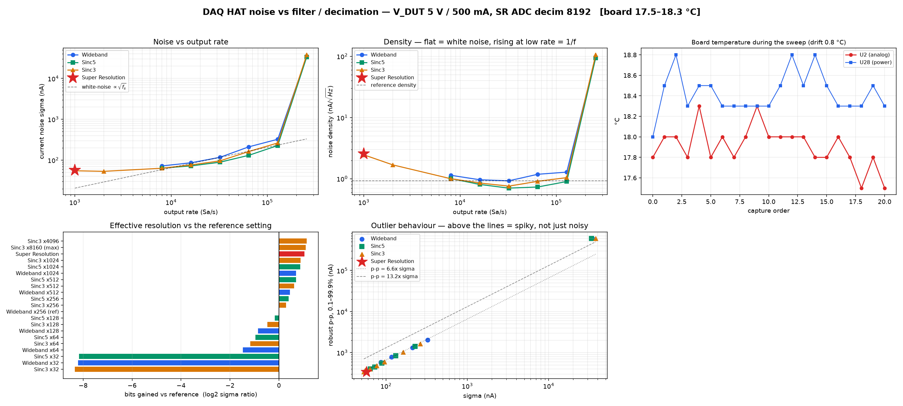
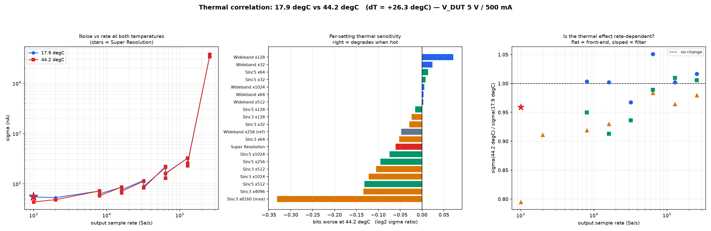

# BugBuster DAQ HAT Noise Characterisation

> How to measure, compare and trust the noise floor of the ADAQ7769-1 acquisition
> chain across every filter, hardware decimation and Super Resolution.

**Live figures - P4 fw 2.1.0, V_DUT 5 V / 500 mA, RANGE_HI (51 Ω), measured on
hardware (2026-08-06):** reference (Wideband ×256, 32 ksps) **117.1 nA** σ at
0.93 nA/√Hz; best density **Sinc5 ×256, 0.66 nA/√Hz**; quietest absolute
**Sinc3 ×8160, 43.7 nA @ 1 ksps**; Super Resolution **54.8 nA @ 1 ksps**
(+1.05 bits vs reference). Noise is flat across a **+26.3 °C** rise
(median −0.03 bits).

---

## Why this exists

A single σ figure is almost meaningless on its own. Decimating to a lower output
rate *always* reduces σ, so "quieter" can mean nothing more than "narrower
bandwidth". Three things have to be measured together before a number means
anything:

| Question | What answers it |
|---|---|
| How quiet is this setting? | σ, detrended |
| Is it quiet because of filtering, or only because of bandwidth? | noise **density** (σ/√BW) |
| Is the DSP earning its keep, or would a plain decimator do the same? | the **naive keep-1-of-N control** |

The third is the one that catches real bugs. It is the reason this suite exists,
and it has already found four firmware defects (see *What this found*).

---

## The tools

| Tool | Purpose |
|---|---|
| `tests/tools/daq_noise_sweep.py` | Drives the device through every filter/decimation setting plus SR, captures each, computes statistics, writes JSON |
| `tests/tools/daq_noise_plot.py` | Renders one run (4 panels + thermal drift), or correlates two runs at different temperatures |

**Transport split** - this is deliberate and worth knowing before you wire
anything up: settings are applied over **HTTP to the S3** (`/api/daq/acq_config`),
while samples are captured over the **P4's own USB-HS vendor-bulk link**
(VID `0x303A` / PID `0x4001`). The P4's USB-C port must be plugged into the host;
the S3's port is *not* the stream link. This mirrors how the stack is used in the
field: control plane through the mainboard, data plane straight off the HAT.

---

## Quick start

```bash
# Prerequisites: P4 USB-C into this host, DAQ HAT attached to the S3,
#                USB-PD supply of at least 9 V / 3 A, matplotlib installed.
export BB_TOKEN=<admin token>        # or pass --token; `token` on the S3 CLI prints it

# Full sweep, DUT supply live at 5 V
python tests/tools/daq_noise_sweep.py --host <s3-ip> --seconds 4 \
    --settle 3 --reconfig-delay 4 --vdut 5.0 --ilimit 500 \
    --json data/noise_run.json

# SR vs reference only (fast, and avoids the modes that destabilise the pipeline)
python tests/tools/daq_noise_sweep.py --host <s3-ip> --sr-only --vdut 5.0

# Plot one run
python tests/tools/daq_noise_plot.py data/noise_run.json --title "V_DUT 5 V"

# Correlate two thermal states
python tests/tools/daq_noise_plot.py data/cold.json --compare data/hot.json \
    --out data/thermal.png
```

### Key options

| Flag | Default | Notes |
|---|---|---|
| `--seconds` | 3 | Capture window per setting |
| `--settle` | 2 | Discarded head of each capture (ADC settle + FIR group delay) |
| `--reconfig-delay` | 2.5 | Wait after the S3 queues a reconfiguration |
| `--vdut` / `--ilimit` | 5.0 V / 500 mA | `--vdut 0` leaves the supply off and measures the zero path only |
| `--quick` | off | 8 representative settings |
| `--sr-only` | off | Reference + SR, skipping the sweep |
| `--with-fixed` | off | **Opt-in.** Adds Sinc5x8/x16 - see *Known issues* |

The DUT supply is enabled after a USB-PD precondition check and disabled again on
**every** exit path, including Ctrl-C and mid-sweep failure. A sweep that aborts
does not leave the rail live.

---

## Methodology

### Detrended σ
σ is computed after removing a least-squares line from each window. Raw σ over a
window containing slow drift reports the drift, not the noise. Both are kept in
the JSON (`sigma` is detrended, `mean` is the untouched average).

### Noise density
`density = σ / √(rate/2)`. For **white** noise this is invariant under
decimation. Reading it is the fastest way to classify the residual:

| Density behaviour as rate falls | Meaning |
|---|---|
| Flat | White-noise limited - averaging delivers the full √N |
| **Rises** | 1/f (flicker) dominated - averaging cannot remove it, so gains fall short of the ideal |
| Falls | The ADC's own filter is cutting in-band noise beyond pure averaging |

### The naive-decimation control
For the SR verdict the tool takes the **reference** capture, applies plain
keep-1-of-N to the SR output rate, and reports its σ. This isolates filtering
from bandwidth: a real anti-aliasing filter beats it, a broken one does not.
Measured, this control consistently lands at **−0.01 to −0.03 bits** - plain
decimation buys *nothing*, because it folds broadband noise straight back into
the passband.

### Yield validation
Every capture is checked against `rate × window`:

- **< 70 %** - truncated or desynced stream
- **> 150 %** - the WAVE_I header rate disagrees with actual delivery

Either flags the row `SUSPECT`, excludes it from the SR verdict, and drops it
from the plots. This matters because a short capture still produces a perfectly
plausible σ. It has already caught a run reporting 74 µA (desync) and one
delivering 88,000 samples where 3,000 were expected.

### Excluded samples
Samples whose WAVE_I meta byte marks them `settling` or `saturated` are dropped
before statistics, and any capture spanning more than one current range is
flagged `RANGE-HUNT` - autorange transients are not noise.

---

## Results



*Full sweep at 17.9 ± 0.4 °C, V_DUT 5 V / 500 mA. All 21 settings valid - no
suspect rows. Note the **density minimum around 30 ksps** in the top-right panel:
noise rises on both sides of it, from 1/f below and from whatever breaks down
above ~130 ksps. The bottom-right panel shows every point on or below the 6.6σ
line, so the distributions are Gaussian rather than spiky - nothing is being
hidden by clipping or dropped samples.*

### Filter families (cold run, 17.9 °C)

| Setting | Rate | σ | Density | vs ref |
|---|---:|---:|---:|---:|
| Wideband ×256 *(reference)* | 32 ksps | 117.1 nA | 0.93 nA/√Hz | - |
| Wideband ×1024 | 8 ksps | 72.1 nA | 1.14 | +0.70 b |
| **Sinc5 ×256** | 32 ksps | 89.0 nA | **0.70** | +0.40 b |
| Sinc5 ×1024 | 8 ksps | 63.8 nA | 1.01 | +0.88 b |
| Sinc3 ×1024 | 8 ksps | 63.4 nA | 1.00 | +0.89 b |
| Sinc3 ×4096 | 2 ksps | 53.3 nA | 1.68 | +1.14 b |
| **Sinc3 ×8160** | 1 ksps | **55.0 nA** | 2.46 | +1.09 b |
| **Super Resolution** | 1 ksps | 57.1 nA | 2.55 | +1.04 b |
| Wideband/Sinc5/Sinc3 ×32 | 256 ksps | 34–38 µA | 94–106 | −8.2 b |

Two conclusions worth acting on:

1. **Sinc5 beats Wideband at matched decimation.** Sinc5 ×256 is ~0.4 bits
   quieter than the Wideband ×256 default, for free. Worth reconsidering the
   shipping default.
2. **The ×32 settings (256 ksps) are unusable** - ~300× worse in *density*, not
   merely wider-band. Something breaks down at the top of the rate range; this
   is a separate open investigation, not simply more bandwidth.

### Super Resolution

SR sets the ADAQ's Sinc3 to its **maximum** decimation (`DAQ_SR_ADC_DECIM` 8192,
fMOD/8192 = exactly 1000 sps) and applies a windowed-sinc FIR behind it.

```
reference @ 32 ksps ........ 117.1 nA
naive keep-1-of-32 @ 1 ksps  119.1 nA   -0.03 bits   <- plain decimation gains nothing
Super Resolution  @ 1 ksps    57.1 nA   +1.04 bits
white-noise ideal for 32x ..              +2.50 bits
```

SR lands ~1.5 bits short of the white-noise ideal because the residual is
1/f-dominated (density rises 2.8× as bandwidth falls), and averaging only beats
white noise. That is an analog front-end property - the naive control shares the
identical analog path.

**The FIR contributes little on the current path by design.** With the ADC
landing exactly on the target rate, the FIR is pass-through for current; its real
work is the voltage path, which cannot change its own ODR (see *Firmware
constraints*). Pushing the filtering into the ADC is worth ~0.4 bits over doing
it in DSP, because the ADAQ's Sinc3 acts on the modulator bitstream *before* the
residual becomes 1/f-correlated.

### Thermal correlation (17.9 °C → 44.2 °C, ΔT +26.3 °C, 20 matched settings)



*Left: the two σ curves lie essentially on top of each other across three decades
of rate. Centre: per-setting sensitivity in bits, median −0.03. Right: the ratio
panel - flat would implicate the front end, sloped implicates the filtering.*

**Median change −0.03 bits.** Noise performance is flat to slightly better over a
26 °C rise. SR: 57.1 → 54.8 nA (−0.06 bits).

This rules something out: the low-frequency residual is **not** thermal drift. A
26 °C swing would have moved it. The 1/f interpretation stands on its own.

The ratio panel does slope - low rates improve ~0.8× while rates ≥60 ksps are
unchanged - but the deepest-decimation points have the fewest samples (4,100 vs
828,800), so their σ carries far more scatter. **Treat the flatness as solid and
the low-rate improvement as suggestive only**; confirming it needs repeat runs at
each temperature, not one of each.

---

## Reading the plots

**Single run** (`daq_noise_plot.py run.json`):

| Panel | Shows |
|---|---|
| σ vs rate | Absolute noise per setting, with a √f_s guide line for pure bandwidth scaling |
| Density vs rate | Flat = white-limited. The minimum (~30 ksps) is the chain's sweet spot |
| Bits vs reference | Ranked effective-resolution gain |
| p-p vs σ | Distribution shape. On the 6.6σ line = Gaussian; above = spiky |
| Board temperature | Drift during the sweep; warns above 2 °C |

**Comparison** (`--compare`): overlaid σ curves, per-setting thermal sensitivity
in bits, and a ratio-vs-rate panel - **flat implicates the front end, sloped
implicates the filtering**. Only settings valid in *both* runs are paired; an
unpaired setting would manufacture a delta. Self-checked by diffing a run against
itself (+0.00 bits across all settings).

---

## Firmware constraints this depends on

| Constraint | Why |
|---|---|
| `DAQ_SR_ADC_DECIM = 8192` | Max Sinc3 decimation beats any downstream averaging; 1024 + FIR ÷8 measured 0.4 bits worse |
| SR must **not** reprogram the VOLTAGE ADAQ | U23 shares SPI bus B and one SYNC line with COARSE; equal ODRs collide every sample and starve the voltage channel to zero |
| STATUS extension **v7** carries board temperature | Cached from the ~1 Hz `diagnostics_push()` poll - STATUS is built on `daq_fast_task`, where an inline I2C read would stall acquisition |
| `USB_WAVE_FLUSH_HZ` bounds frame latency | Batch size alone is a throughput knob; at 1 ksps a size-only bound would hold a frame 3.2 s |
| ADAQ die temps are **not** on the stream | They share the converter and are only readable while acquisition is stopped |

---

## Known issues

**Sinc5x8 / Sinc5x16 destabilise later settings.** At 1.024 MSPS / 512 kSPS these
overrun the pipeline, and settings visited *after* them return corrupted - wrong
yield, or a header rate disagreeing with delivery. Restoring the 24-bit interface
format on exit (`adaq7769.c`, 2026-08-06) fixed one cause but not all of it. They
are **opt-in via `--with-fixed`** until the remaining recovery path is understood;
including them silently poisons the rest of the sweep.

**Occasional low-yield rows.** Even with generous settling, a setting
occasionally returns 30–50 % of expected samples. The yield guard excludes these
rather than letting them pass as data, but the underlying reconfiguration
instability is not root-caused.

**Temperature resolution.** The AD7415s quantise to 0.25 °C - adequate for drift
detection over a 26 °C span, too coarse for a per-degree tempco fit. Readings are
**board** temperature; shunt, ADAQ die and SMU each lag differently during a
warm-up, so let the board stabilise before sweeping.

**Current range.** At ~100 nA the chain stays on RANGE_HI (51 Ω) throughout.
Characterising MID/LO needs a load that draws enough current to select them.

---

## Files

| Path | Contents |
|---|---|
| `tests/tools/daq_noise_sweep.py` | Sweep + statistics |
| `tests/tools/daq_noise_plot.py` | Single-run and comparison figures |
| `tests/lib/daq_link.py`, `daq_capture.py`, `daq_records.py` | USB link, frame parsing, record decode (incl. STATUS v7) |
| `data/sr_noise_cold_18c.json` | Reference run, 17.5–18.3 °C |
| `data/sr_noise_hot_43c.json` | Reference run, 43.5–45.0 °C |
| `data/sr_noise_thermal.png` | Thermal correlation figure |
| `Docs/Images/daq_noise_sweep.png` | Sweep figure reproduced above |
| `Docs/Images/daq_noise_thermal.png` | Thermal figure reproduced above |

`tests/lib/daq_records.py` is the single source of truth for record layouts on
the host side - update it in the same change as any `usb_proto.h` edit.

---

## What this found

Four firmware defects, all fixed and verified on hardware:

1. **SR used ⅛ of the available ADC decimation** - measured worse than plain
   Sinc3 at maximum (60.5 vs 46.1 nA at the same rate).
2. **SR produced zero voltage samples** - VOLTAGE and COARSE collided on shared
   SPI bus B.
3. **Leaving Sinc5x8 left the ADAQ in 16-bit mode** - the interface-format
   register was written only on *entry*, misframing every later read.
4. **Waveform frames had no latency bound** - at SR rates a frame would have been
   held 3.2 s / 6.4 s.

See `CHANGELOG.MD` under *Unreleased → Fixed* for the full detail.
