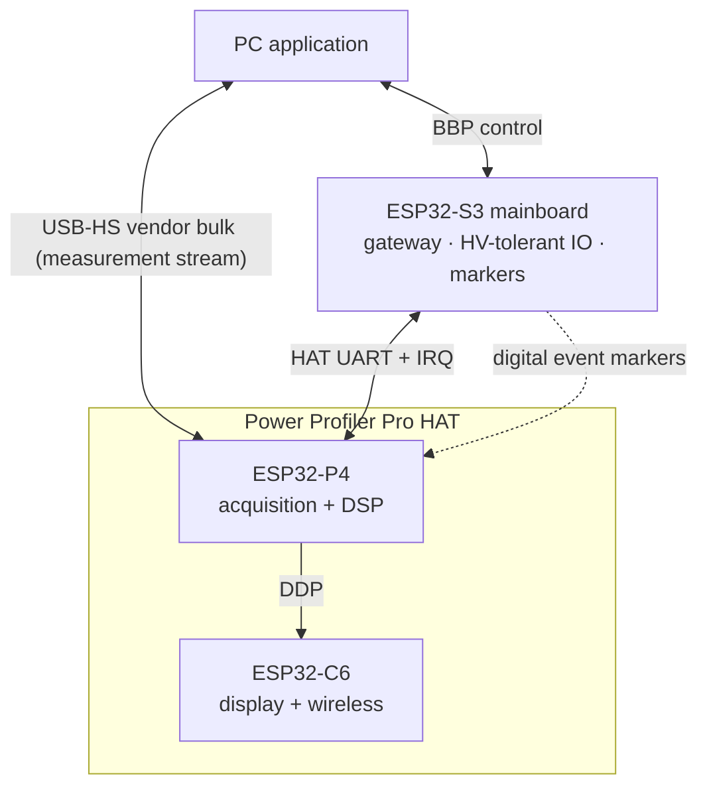
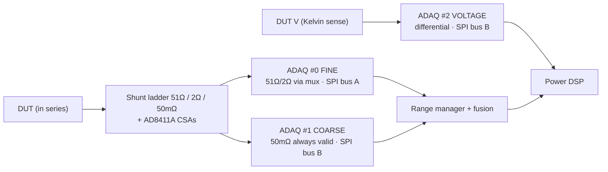
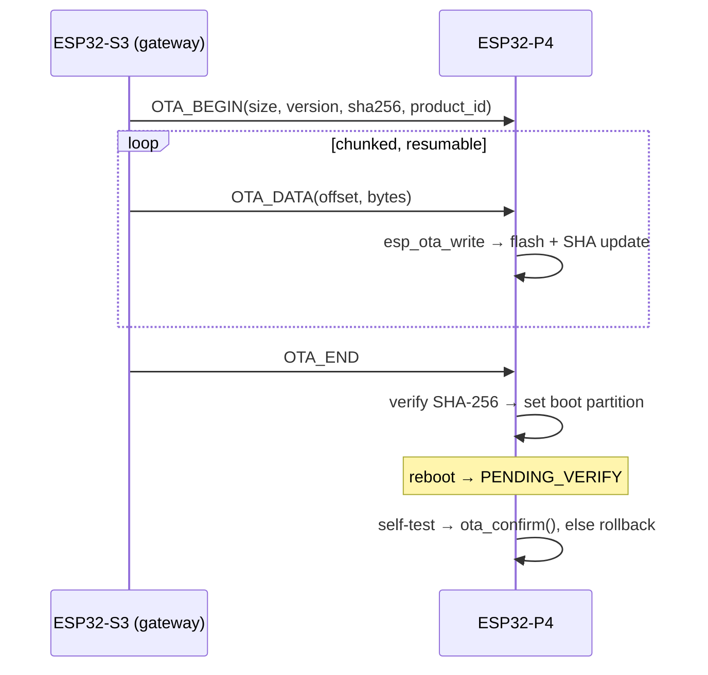

# Power Profiler Pro HAT - firmware

A 24-bit, nA–3 A seamless-autoranging power analyzer and source-measure unit, in
the class of Joulescope, Qoitech Otii and Nordic PPK2. The whole analysis
pipeline runs on the HAT; the PC receives results, not raw samples.

Two MCUs, both in one Waveshare module:

| | Chip | Role | Version | Source |
|---|---|---|---|---|
| **P4** | ESP32-P4, dual RISC-V @ 360 MHz, 32 MB PSRAM, 16 MB flash | Acquisition, DSP, USB-HS streaming | `2.1.0` | [ESP32P4/](ESP32P4/) |
| **C6** | ESP32-C6 | Local display, buttons, wireless | `2.2.0` | [ESP32C6/](ESP32C6/) |

Built with ESP-IDF 5.5 via PlatformIO.

## What it does

- **Measure** DUT current from nanoamps to 3 A with seamless hardware
  auto-ranging, plus true DUT voltage over 4-wire Kelvin sense.
- **Source** the DUT from an integrated programmable supply, 0–20 V up to 2.5 A.
- **Compute** instantaneous power, accumulated energy (mWh/J) and charge
  (mAh/C), running statistics, multi-resolution zoom tiers, and a continuous
  FFT spectrum - all on the P4.
- **Stream** the results to a PC over USB High-Speed, or over WiFi to the iOS
  app.

## How it connects



The **data plane** leaves the P4's own USB-HS port (J5) straight to the PC. The
**control plane** arrives at the S3 mainboard and is forwarded over the HAT
UART. They are independent, so stream throughput does not depend on control
traffic.

P4 ↔ C6 wire format: [display-protocol.md](display-protocol.md)

## Signal chain and auto-ranging

Three ADAQ7769-1 24-bit Σ-Δ µModules. Current is ranged in the **analog
domain** by an SR-latch feedback loop across a 51 Ω / 2 Ω / 50 mΩ shunt ladder;
the P4 observes the active range and can override it.



| Range | Shunt | ADC path | Span | Role |
|---|---|---|---|---|
| HI | 51 Ω | FINE (muxed) | nA – ~1.4 mA | precision low current |
| MID | 2 Ω | FINE (muxed) | ~1.4 – 37 mA | precision mid |
| LO | 50 mΩ | COARSE (dedicated) | ~37 mA – 3 A | high current, and gap fill |

The COARSE channel is always valid, so it fills the gap whenever FINE switches
range - with boundary hysteresis and a short cross-fade. The fused current
`i[n]` therefore has no holes or steps. All three ADAQs share one MCLK and a
SYNC line for sample-aligned acquisition.

**COARSE and VOLTAGE share SPI bus B and a single SYNC line**, so they cannot be
phase-staggered. Any acquisition mode that starves one starves the other.

## DSP pipeline

```mermaid
flowchart LR
    I["i&#91;n&#93; fused"] --> MR["Multi-resolution<br/>min/max/mean tiers"]
    V["v&#91;n&#93;"] --> PWR["p = v · i"]
    I --> PWR
    PWR --> ENE["Energy mWh/J<br/>Charge mAh/C"]
    PWR --> STAT["Statistics<br/>min/max/mean/RMS/std"]
    PWR --> FFT["Welch FFT"]
    MR --> OUT["USB framer"]
    ENE --> OUT
    STAT --> OUT
    FFT --> OUT
```



- **Power** - `p[n] = v[n]·i[n]`, voltage held and interpolated between the
  slower voltage-channel updates.
- **Energy and charge** - trapezoidal integration in `double` for drift-free
  long runs, independently resettable for marker-windowed measurements.
- **Multi-resolution** - cascaded ×100 decimation tiers (min/max/mean per
  bucket) so the PC can pan and zoom without a full-rate transfer.
- **Spectrum** - continuous Welch FFT (esp-dsp, 64–4096 pt, Hann /
  Blackman-Harris / rectangular, 50 % overlap) on current or power.

### Super Resolution mode

A low-noise acquisition mode: maximum ADC decimation (Sinc3 ×8192, exactly
1000 sps at fMOD/8192) followed by a Blackman-windowed-sinc FIR decimator
(`src/dsp/sr_filter.c`). Output is 1 ksps current, 500 sps voltage.

Best measured noise density is **0.70 nA/√Hz** at Sinc5 ×256 - about 0.4 bits
quieter than the Wideband ×256 default, at no cost. Noise is flat with
temperature (median −0.03 bits over ΔT +26.3 °C). Method, sweep tooling and
traps: [../../Docs/noise-characterisation.md](../../Docs/noise-characterisation.md)

## Specifications

| Parameter | Value |
|---|---|
| ADC | 3× ADAQ7769-1, 24-bit Σ-Δ, up to 1.024 MSPS each |
| Current range | nA – 3 A, three hardware ranges (51 / 2 / 0.05 Ω), seamless autorange |
| Current sample rate | Configurable; 443 kSPS aggregate measured at the saturation point |
| Voltage | Differential 4-wire Kelvin sense, target 50 kSPS |
| Source / SMU | 0–20 V, ≤ 2.5 A (LTM8056 + DS4424 trim) |
| Reference | 4.096 V (ADR4540) |
| Temperature | 2× AD7415 over I²C (ADG area, power area) |
| Host interface | USB 2.0 High-Speed vendor bulk on J5 |
| Control interface | HAT UART via the ESP32-S3 |
| Memory | 32 MB PSRAM (sample ring, multi-res buffers, deep capture), 16 MB flash |
| OTA | Dual-slot A/B, SHA-256 verified, streamed, rollback-safe |

```
V_DUT = 10.85 V − 90.9 kΩ · I_DAC(ch1)    →  ~1.76 … 19.94 V
Current limit: full scale 2.636 A via DS4424 ch0 (LTM8056 CTL)
IINMON / IOUTMON monitored on ESP32-P4 ADC1
```

## USB stream format

A compact, CRC-protected, framed vendor-bulk stream, separate from BBP:

```
┌──────┬─────┬─────┬──────┬───────┬─────────────┬───────────┬──────┐
│ MAGIC│ VER │TYPE │FLAGS │  SEQ  │ PAYLOAD LEN │  PAYLOAD  │CRC16 │
│ BB 50│  1B │ 1B  │  2B  │  4B   │      2B     │  N bytes  │  2B  │
└──────┴─────┴─────┴──────┴───────┴─────────────┴───────────┴──────┘
```

| Record (device → PC) | Contents |
|---|---|
| `WAVEFORM` | Block of fused samples - i, v, p, range, source, flags |
| `STATS` | min / max / mean / RMS / std for I, V, P |
| `ENERGY` | Energy mWh/J, charge mAh/C, elapsed time |
| `FFT` | Spectrum magnitude bins |
| `MARKER` | Digital event index and timestamp |
| `STATUS` | Range, streaming and source state, set points, board temperatures |

Control (PC → device): `START`, `STOP`, `SET_RATE`, `RANGE_LOCK`,
`RESET_ENERGY`, `RESET_STATS`, `FFT_CONFIG`, `SET_SOURCE`.

## Module map

```
ESP32P4/
  include/config.h      Board pin map, shunts, SMU, S3 link, power rails
  include/version.h     Semantic version + product id (bb-daq-p4)
  src/adaq7769/         24-bit ADC driver - registers, SPI+CRC, HAL, DMA stream
  src/range/            Autorange observe/override, per-range calibration
  src/fusion/           Seamless FINE + COARSE reconstruction
  src/dsp/              power_dsp · multires · spectrum · sr_filter
  src/smu/              Programmable DUT supply and IIN/IOUT monitoring
  src/ad741x/           AD7415 temperature sensors
  src/ds4424/           IDAC trim for source voltage and current limit
  src/stream/           usb_proto · usb_stream (framer) · usb_backend (TinyUSB HS)
  src/link/             s3_link - HAT-protocol slave to the mainboard
  src/ota/              Streaming dual-slot OTA with SHA-256 and rollback
  src/perf/             daq_perf - per-stage cycle profiler
  src/board/            Board integration and command dispatch
  partitions.csv        Dual-OTA partition table

ESP32C6/
  src/display.c gfx.c ui.c menu.c theme.c     ST7789 UI
  src/ddp.c                                   Display protocol link to the P4
  src/buttons.c npx.c settings.c              Input, LEDs, persisted settings
  src/wifi_hosted.c                           Wireless link
```

## Build

```bash
cd Firmware/DAQ_HAT/ESP32P4
pio run -e esp32p4
pio run -e esp32p4 -t upload --upload-port <PORT>

cd ../ESP32C6
pio run -e esp32c6 -t upload --upload-port <PORT>
```

The first build downloads the ESP-IDF 5.5 RISC-V toolchain and the managed
components (`esp_tinyusb`, `esp-dsp`) - expect several minutes.

**PlatformIO does not merge new `sdkconfig.defaults` values into an already
generated `sdkconfig.esp32p4`.** After editing defaults, grep the generated file
to confirm the value landed. A `CONFIG_TINYUSB_VENDOR_TX_BUFSIZE` that never
applied silently dropped 100 % of waveform frames - the host saw only 10 Hz
summary frames and nothing else.

The build uses `-O2` (`CONFIG_COMPILER_OPTIMIZATION_PERF`): +9.2 % capture
throughput and a *smaller* image than the IDF default `-Og`.

## Profiling

`faststat` tells you how many samples survived; it cannot tell you where the
time went. The `perf` console command (`src/perf/daq_perf.h`) timestamps every
stage of both hot loops with the RISC-V cycle counter.

```bash
# on the P4 console (prompt "daq> ")
perf on      # arm sampling; also resets counters and the task snapshot
perf off     # stop BEFORE dumping, or the console print pollutes the result
perf show    # stages, per-task CPU and stack, heap, active tunables

# from the host
python tests/tools/daq_p4_profile.py --window 5   # ODR sweep with cycle budgets
python tests/tools/daq_p4_sanity.py               # sample integrity + linearity
```

Reading the output:

- **`k` column** - `C` is CPU work, `W` is blocked wall time. Never add a `W`
  row to a CPU budget.
- **Read `min` next to `avg`.** `daq_fast` runs at priority 12 and is preempted
  by TinyUSB (13), `daq_ctrl`/`s3_link` (14) and `daq_repl` (15), so averages
  include preemption. `min` is the uncontended cost.
- **`adaq_cap` shows zero runtime in the task table.** FreeRTOS credits run time
  at context switches and that task never yields - use the `cap.*` stages.
- `-DDAQ_PERF_ENABLED=0` in `platformio.ini` compiles the profiler out entirely
  (−1152 B RAM, −7754 B flash, no residual branch).

## OTA

The S3 is the network gateway but cannot stage a full image, so firmware is
streamed chunk by chunk: each `OTA_DATA` frame is written straight to P4 flash,
holding only the current chunk in RAM. Chunks are offset-checked and resumable
after a link hiccup.



The C6 is flashed by the P4 driving its ROM loader, so the P4 must still be
running its current image when the C6 is written. That is why the system-wide
update order is **RP2040 → C6 → P4 → S3**.

## Status

Done: ADAQ7769-1 driver, range manager and per-range calibration, seamless
fusion, power DSP, USB-HS streaming, multi-resolution zoom and Welch FFT,
programmable SMU, S3 HAT link with sync epoch, streaming OTA with rollback,
Super Resolution mode, C6 display and firmware screens.

Planned: logging and export, DRDY-gated DMA fast path toward 1 MSPS on the
shared bus, per-board factory calibration.

Open question: the ×32 (256 kSPS) acquisition settings measure roughly 300×
worse in noise *density* than the best settings. Not yet explained.

Some GPIO assignments around the S3-link UART/IRQ versus ADAQ3 DRDY and J5
expansion are still flagged in `config.h` and should be reconciled against the
final schematic.

## See also

- [../../Docs/daq-hat-hardware.md](../../Docs/daq-hat-hardware.md) - netlist-verified
  pinout, IC list, power tree, I²C addresses
- [../../Docs/power-analyzer.md](../../Docs/power-analyzer.md) - architecture and
  design rationale
- [display-protocol.md](display-protocol.md) - P4 ↔ C6 wire format
- [../hat-uart-protocol.md](../hat-uart-protocol.md) - ESP32-S3 ↔ HAT wire format

Key ICs: 3× ADAQ7769-1 (24-bit DAQ), 3× AD8411A (current-sense amp), ADG5204
(mux), LTM8056 (DUT buck-boost), DS4424 (quad IDAC), ADR4540 (4.096 V
reference), SiT8208 (16.384 MHz MCLK), 2× AD7415 (temperature).
