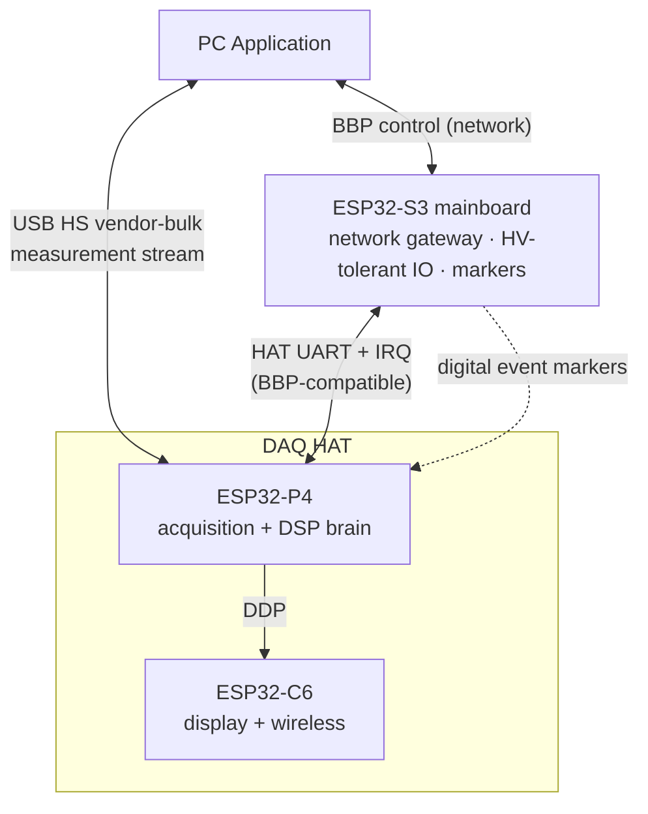
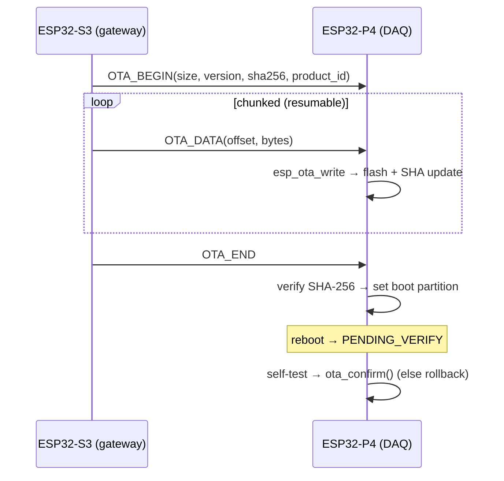

# BugBuster DAQ HAT — IoT Power Analyzer

> A 24-bit, nA–3A seamless-autoranging precision **power analyzer** and
> **source-measure unit** built on the BugBuster DAQ HAT. It measures, conditions,
> and analyzes device-under-test (DUT) power consumption on-device, then streams
> the results to a PC over USB High-Speed — in the same class as Joulescope,
> Qoitech Otii, and Nordic PPK2.

**Target:** ESP32-P4 (RISC-V dual-core @ 360 MHz, 32 MB PSRAM, 16 MB flash)
**Firmware:** ESP-IDF 5.5 (PlatformIO / pioarduino) · **Status:** in active development
**Firmware version:** see [`include/version.h`](ESP32P4/include/version.h)

---

## 1. What it does

The DAQ HAT turns a DUT current/voltage measurement into a full power-analysis
pipeline that runs entirely on the ESP32-P4:

- **Measure** DUT current from **nanoamps to 3 amps** with seamless hardware
  auto-ranging, plus true DUT voltage via 4-wire Kelvin sense.
- **Source** the DUT with an integrated programmable supply (0–20 V, up to 2.5 A).
- **Compute** instantaneous power, accumulated energy (mWh/J) and charge (mAh/C),
  running statistics, multi-resolution zoom tiers, and a continuous FFT spectrum.
- **Stream** the results live to a PC application over USB High-Speed.
- **Integrate** into the BugBuster system as a HAT on the ESP32-S3 mainboard,
  with network connectivity and robust over-the-air firmware updates.

---

## 2. System architecture



- **Data plane** — the P4 streams high-rate measurement frames out its **own
  USB-HS** port (J5) directly to the PC, independent of the control plane.
- **Control plane** — BBP control arrives at the S3 mainboard and is forwarded to
  the P4 over the HAT UART (same connector/protocol the RP2040 HAT used). The S3
  detects the HAT type at boot and dynamically loads the DAQ resource set.
- **Co-processor** — the ESP32-C6 (on the same module) drives the local display
  and wireless link.

---

## 3. Signal chain & auto-ranging

Three ADAQ7769-1 24-bit Σ-Δ µModules form the acquisition front-end. Current is
ranged in the **analog domain** by an SR-latch feedback loop across a 51 Ω / 2 Ω /
50 mΩ shunt ladder; the P4 observes (and can override) the active range.

```mermaid
flowchart LR
    DUT["DUT (in series)"] --> SH["Shunt ladder<br/>51Ω / 2Ω / 50mΩ<br/>+ AD8411A CSAs"]
    SH --> FINE["ADAQ #0 FINE<br/>51Ω/2Ω via mux<br/>dedicated SPI bus A"]
    SH --> COARSE["ADAQ #1 COARSE<br/>50mΩ always-valid<br/>shared SPI bus B"]
    VIN["DUT V (Kelvin sense)"] --> VOLT["ADAQ #2 VOLTAGE<br/>differential<br/>shared SPI bus B"]
    FINE --> FUSE
    COARSE --> FUSE["Range manager<br/>+ fusion<br/>seamless i&#91;n&#93;"]
    VOLT --> DSP
    FUSE --> DSP["Power DSP core"]
```



| Range | Active shunt | ADC path | Approx. span | Role |
|-------|--------------|----------|--------------|------|
| HI  | 51 Ω  | FINE (muxed) | nA – ~1.4 mA  | precision low-current |
| MID | 2 Ω   | FINE (muxed) | ~1.4 – 37 mA  | precision mid |
| LO  | 50 mΩ | COARSE (dedicated) | ~37 mA – 3 A | high-current + gap-fill |

**Seamless reconstruction:** the COARSE channel (always valid on the 50 mΩ shunt)
fills the gap whenever the FINE channel switches range, with boundary hysteresis
and a short cross-fade, so the fused current `i[n]` has no holes or steps. All
three ADAQ share one MCLK and a SYNC line for sample-aligned acquisition.

---

## 4. On-device DSP pipeline

```mermaid
flowchart LR
    I["i&#91;n&#93; (fused)"] --> MR["Multi-resolution<br/>min/max/mean tiers<br/>(zoom)"]
    V["v&#91;n&#93;"] --> PWR["p = v · i"]
    I --> PWR
    PWR --> ENE["Energy mWh / J<br/>Charge mAh / C<br/>(double accumulators)"]
    PWR --> STAT["Statistics<br/>min/max/mean/RMS/std"]
    PWR --> FFT["Welch FFT<br/>continuous spectrum"]
    MR --> OUT
    ENE --> OUT
    STAT --> OUT
    FFT --> OUT["USB framer"]
```



- **Power** `p[n] = v[n]·i[n]`, with voltage held/interpolated between the slower
  voltage-channel updates.
- **Energy / charge** integrated in `double` (trapezoidal) for drift-free long
  runs; independently resettable for marker-windowed measurements.
- **Statistics** — min / max / mean / RMS / std over the active window.
- **Multi-resolution** — cascaded ×100 decimation tiers (min/max/mean per bucket)
  for PC pan/zoom without full-rate transfer.
- **Spectrum** — continuous Welch FFT (esp-dsp, 64–4096 pt, Hann /
  Blackman-Harris / rectangular, 50 % overlap) on current or power.

---

## 5. Specifications

| Parameter | Value |
|-----------|-------|
| ADC | 3× ADAQ7769-1, 24-bit Σ-Δ, up to 1.024 MSPS each |
| Current range | nA – 3 A, 3 hardware ranges (51 / 2 / 0.05 Ω), seamless autorange |
| Current sample rate | configurable, target **250 kSPS** (≤512 kSPS shared bus / 1.024 MSPS dedicated) |
| Voltage measurement | differential 4-wire Kelvin sense, target **50 kSPS** |
| Source / SMU | 0–20 V output, ≤2.5 A limit (LTM8056 + DS4424 trim) |
| Reference | 4.096 V (ADR4540) |
| Temperature monitors | 2× AD7415 (I²C, ADG + power areas) |
| Compute | power, energy (mWh/J), charge (mAh/C), min/max/mean/RMS/std, multi-res zoom, Welch FFT |
| Host interface | USB 2.0 High-Speed vendor-bulk (J5) — live measurement stream |
| Control interface | BugBuster HAT UART (BBP-compatible) via ESP32-S3 |
| Memory | 32 MB PSRAM (sample ring + multi-res buffers + deep capture), 16 MB flash |
| OTA | dual-slot A/B, SHA-256 verified, streaming (no full-image staging), rollback-safe |

### Source / SMU detail

```
V_DUT = 10.85 V − 90.9 kΩ · I_DAC(ch1)   →   ~1.76 … 19.94 V
Current limit: full-scale 2.636 A via DS4424 ch0 (LTM8056 CTL)
Input/output current monitored on ESP32-P4 ADC1 (IINMON / IOUTMON)
```

---

## 6. Feature comparison

| Feature | PPK2 | Otii | Joulescope | **DAQ HAT** |
|---------|:----:|:----:|:----------:|:-----------:|
| Seamless autorange | ✓ | ✓ | ✓ | ✓ (3 HW ranges, dual-ADC gap-fill) |
| Source / SMU | ✓ | ✓ | – | ✓ (0–20 V, 2.5 A) |
| Energy / charge | ✓ | ✓ | ✓ | ✓ (mWh / J / mAh / C) |
| Statistics (min/max/mean/RMS/std) | ✓ | ✓ | ✓ | ✓ |
| Multi-resolution zoom | ✓ | ✓ | ✓ | ✓ |
| FFT / spectrum | – | – | ✓ | ✓ (continuous Welch) |
| Digital event markers | ✓ (8) | ✓ | ✓ | ✓ (via S3) |
| Continuous live streaming | ✓ | ✓ | ✓ | ✓ (USB-HS) |
| Network + OTA | – | – | – | ✓ (via S3) |

---

## 7. USB streaming protocol

A compact, CRC-protected, framed vendor-bulk stream (separate from BBP):

```
┌──────┬─────┬─────┬──────┬───────┬────────────┬────────────┬──────┐
│ MAGIC│ VER │TYPE │FLAGS │  SEQ  │ PAYLOAD LEN │  PAYLOAD   │CRC16 │
│ BB 50│  1B │ 1B  │ 1B+1 │  4B   │     2B      │   N bytes  │  2B  │
└──────┴─────┴─────┴──────┴───────┴────────────┴────────────┴──────┘
```

| Record (device → PC) | Contents |
|----------------------|----------|
| `WAVEFORM` | block of fused samples (i, v, p, range, source, flags) |
| `STATS` | min/max/mean/RMS/std for I, V, P |
| `ENERGY` | energy mWh/J, charge mAh/C, elapsed time |
| `FFT` | spectrum magnitude bins |
| `MARKER` | digital event index + timestamp |
| `STATUS` | range, streaming/source state, set-points |

Control (PC → device): `START`, `STOP`, `SET_RATE`, `RANGE_LOCK`,
`RESET_ENERGY`, `RESET_STATS`, `FFT_CONFIG`, `SET_SOURCE`.

---

## 8. Firmware module map

```
ESP32P4/
├── include/
│   ├── config.h          board pin map, shunts, SMU, S3-link, power rails
│   └── version.h         semantic firmware version + product id
├── src/
│   ├── adaq7769/         24-bit ADC driver: regs, low-level SPI+CRC, HAL, DMA stream
│   ├── range/            range_manager — observe/override autorange + per-range cal
│   ├── fusion/           current_fusion — seamless FINE+COARSE reconstruction
│   ├── dsp/              power_dsp (p/E/Q/stats) · multires (zoom) · spectrum (FFT)
│   ├── smu/              programmable DUT supply (LTM8056 via DS4424) + IIN/IOUT mon
│   ├── ad741x/           AD7415 I²C temperature sensors
│   ├── ds4424/           DS4424 I²C IDAC (source-voltage / current-limit trim)
│   ├── stream/           usb_proto · usb_stream (framer) · usb_backend (TinyUSB HS)
│   ├── link/             s3_link — HAT-protocol slave to the ESP32-S3 mainboard
│   ├── ota/              streaming dual-slot OTA with SHA-256 + rollback
│   ├── board/            daq_board — full board integration + command dispatch
│   └── main.c            bring-up + processing/stream loop
└── partitions.csv        dual-OTA partition table (ota_0 / ota_1 / otadata)
```

---

## 9. Firmware versioning & OTA

- **Versioning** — central [`version.h`](ESP32P4/include/version.h) with semantic
  `MAJOR.MINOR.PATCH`, packed `FW_VERSION_U32`, and `FW_PRODUCT_ID` (`bb-daq-p4`).
  Reported over the S3 link via `GET_VERSION`.
- **Split / streaming OTA** — the S3 mainboard is the network gateway but **cannot
  stage a full image**, so firmware streams chunk-by-chunk: each `OTA_DATA` frame
  is written **straight to the P4 flash** (only the current chunk in RAM). Chunks
  are offset-checked and **resumable** after a link hiccup.
- **Integrity & safety** — product-id + size guards, full-image **SHA-256**
  verification before switching the boot partition, **dual-slot A/B** layout, and
  **rollback**: a new image boots `PENDING_VERIFY` and must self-confirm
  (`ota_confirm()`) after a health check or the bootloader reverts.



---

## 10. Building

```bash
cd Firmware/DAQ_HAT/ESP32P4
python -m platformio run -e esp32p4          # build
python -m platformio run -e esp32p4 -t upload --upload-port <COMx>
```

**Notes**
- First build downloads the ESP-IDF 5.5 RISC-V toolchain and managed components
  (`esp_tinyusb`, `esp-dsp`) — several minutes.
- Board id in `platformio.ini` is `esp32-p4-evboard`.
- The USB-HS vendor class is enabled in `sdkconfig.defaults`
  (`CONFIG_TINYUSB_VENDOR_COUNT=1`); the dual-OTA partition table is selected via
  `CONFIG_PARTITION_TABLE_CUSTOM` → `partitions.csv`.

---

## 11. Hardware reference

The authoritative, netlist-verified pinout, IC list, power tree, and I²C address
map is in [`../../Docs/FIRMWARE_HARDWARE_REFERENCE.md`](../../Docs/FIRMWARE_HARDWARE_REFERENCE.md).
The system architecture and design rationale are in
[`../../Docs/PowerAnalyzer_Architecture.md`](../../Docs/PowerAnalyzer_Architecture.md).

Key ICs: 3× **ADAQ7769-1** (24-bit DAQ), 3× **AD8411A** (current-sense amp),
**ADGS2414D/ADG5204** (mux), **LTM8056** (DUT buck-boost), **DS4424** (quad IDAC),
**ADR4540** (4.096 V ref), **SiT8208** (16.384 MHz MCLK), 2× **AD7415** (temp).

---

## 12. Roadmap

| Stage | Status |
|-------|:------:|
| ADAQ7769-1 driver (regs, SPI+CRC, HAL, DMA streaming) | ✅ |
| Range manager + per-range calibration | ✅ |
| Seamless current fusion (FINE + COARSE) | ✅ |
| Power DSP (power, energy, charge, statistics) | ✅ |
| USB-HS streaming + TinyUSB vendor backend | ✅ |
| Multi-resolution zoom + continuous Welch FFT | ✅ |
| Programmable source / SMU (0–20 V, 2.5 A) | ✅ |
| ESP32-S3 HAT link (BBP-compatible) + sync epoch | ✅ |
| Firmware versioning + streaming OTA + rollback | ✅ |
| Triggers + logging / export | ⏳ planned |
| DRDY-gated DMA fast path (toward 1 MSPS shared bus) | ⏳ planned |
| Per-board factory calibration | ⏳ planned |

> ⚠ **Pre-bring-up note:** some final GPIO assignments (S3-link UART/IRQ vs. ADAQ3
> DRDY / J5 expansion) are flagged in `config.h` and must be reconciled against the
> final schematic before hardware bring-up.
