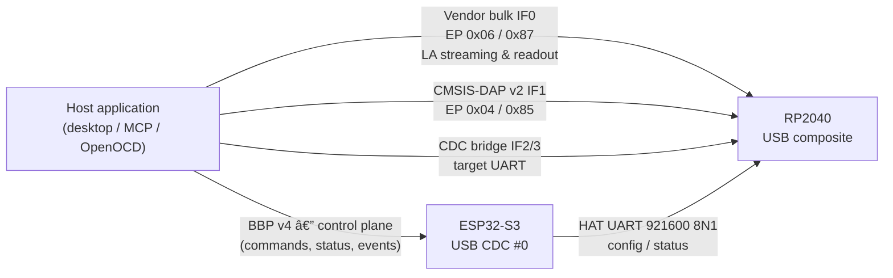

# BugBuster HAT — Extended Architecture & Feature Plan

**Date:** 2026-04-02
**HAT MCU:** RP2040 (Dual Cortex-M0+, 264KB SRAM, PIO, USB)
**SWD Base:** Fork of [raspberrypi/debugprobe](https://github.com/raspberrypi/debugprobe) (CMSIS-DAP)
**Target:** BugBuster PCB mode only

---

## 1. Hardware Overview

```
┌─────────────────────────────────────────────────────────────┐
│                     BugBuster Main Board                     │
│                                                              │
│  ESP32-S3 ──UART0──> HAT_TX/RX ──> RP2040                  │
│            ──GPIO47─> HAT_DETECT   (ADC voltage divider)     │
│            <─GPIO15─> HAT_IRQ      (open-drain, shared)      │
│                                                              │
│  VADJ1 (3-15V) ─────────────────> HAT VADJ1_PASS            │
│  VADJ2 (3-15V) ─────────────────> HAT VADJ2_PASS            │
│                                                              │
│  EXP_EXT_1..4 (via MUX S4) ────> HAT I/O lines              │
└─────────────────────────────────────────────────────────────┘
                         │
                         â–¼
┌─────────────────────────────────────────────────────────────┐
│                        HAT Board                             │
│                                                              │
│  RP2040 (debugprobe fork + BugBuster extensions)             │
│  ├── USB IF 0 ─────── Vendor bulk — LA data plane           │
│  │                     (EP 0x06 OUT / 0x87 IN)               │
│  ├── USB IF 1 ─────── CMSIS-DAP v2 (HID/vendor)              │
│  ├── USB IF 2/3 ────── CDC UART bridge to target             │
│  ├── PIO 0 ──────────── SWD engine (from debugprobe)         │
│  ├── PIO 1 ──────────── Logic analyzer capture (4 SMs)       │
│  ├── UART0 (slave) ──── BugBuster management bus             │
│  └── GPIO ───────────── Connector enables, LEDs       │
│                                                              │
│  │                                                              │
│  Connector A (Target 1)                                      │
│  ├── VADJ1_PASS power ── switched via EN_A                   │
│  ├── EXP_EXT_1 (SWDIO), EXP_EXT_2 (SWCLK) ──    │
│  └── GND                                                     │
│                                                              │
│  Connector B (Target 2)                                      │
│  ├── VADJ2_PASS power ── switched via EN_B                   │
│  ├── EXP_EXT_3, EXP_EXT_4 ── GPIO/Trace          │
│  └── GND                                                     │
└─────────────────────────────────────────────────────────────┘
```

### 1.1 Host USB topology (HAT present)

The HAT enumerates **three** USB interfaces alongside the ESP32's CDC ports.
When the HAT is installed the host sees two independent USB devices — one
per MCU — and uses each for different classes of traffic:



**Key property:** LA data and SWD debug traffic do NOT traverse the ESP32 or
the HAT UART. The ESP32 only configures and arms the LA (via
`HAT_LA_CONFIG` / `HAT_LA_ARM` / `HAT_LA_STREAM_START` over the HAT UART);
sample data flows directly from the RP2040's vendor-bulk endpoint to the
host. See [`../Docs/LogicAnalyzer.md`](../Docs/LogicAnalyzer.md) for the
full packet format and rearm protocol.

---

## 2. SWD Architecture — debugprobe Integration

### 2.1 Why Fork debugprobe (Not Reimplement)

The Raspberry Pi debugprobe project provides:
- **PIO-accelerated SWD** — hardware-timed SWCLK/SWDIO via PIO state machines (`probe.pio`)
- **CMSIS-DAP v1 + v2** — industry-standard debug protocol over USB
- **CDC UART bridge** — USB serial for target UART
- **SWO trace** — Serial Wire Output capture
- **FreeRTOS** — task-based architecture with proper USB handling
- **Pico SDK 2.0** — mature build system (CMake)
- **Wide tool support** — works with OpenOCD, pyOCD, probe-rs, VS Code, etc.

Reimplementing SWD from scratch would duplicate thousands of lines of tested PIO code,
CMSIS-DAP protocol handling, and USB descriptors. Instead, we fork and extend.

### 2.2 debugprobe Internals (Key Components)

| Component | File | Purpose |
|-----------|------|---------|
| SWD PIO engine | `probe.pio`, `probe.c` | PIO programs for SWD bit timing |
| SWD protocol | `sw_dp_pio.c` | SWD request/response, parity, ACK handling |
| CMSIS-DAP | `DAP.c`, `DAP_vendor.c` | USB command processing (standard + vendor) |
| USB stack | `usb_descriptors.c`, TinyUSB | CMSIS-DAP HID/Bulk + CDC endpoints |
| UART bridge | `cdc_uart.c` | USB CDC ↔ target UART |
| Main loop | `main.c` | FreeRTOS tasks, LED control |

**PIO usage:**
- PIO 0: SWD engine (SWCLK output, SWDIO bidirectional)
- PIO 1: Available for our logic analyzer

**USB endpoints (as shipped on `bb-hat-2.0`):**
- EP `0x06/0x87`: **BB_LA vendor bulk** — Logic Analyzer streaming / readout (interface 0)
- EP `0x04/0x85`: CMSIS-DAP commands (interface 1, vendor class per DAP v2 spec)
- EP `0x02/0x83`: CDC UART data (target bridge)
- EP `0x81`: CDC notification

The LA interface is deliberately placed on interface **0** so TinyUSB's
built-in vendor driver claims it; the custom DAP driver
(`lib/debugprobe/src/tusb_edpt_handler.c`) claims interface 1 only. Prior to
2026-04 the indices were swapped and TinyUSB/DAP fought for ownership.

### 2.3 Integration Strategy

**We do NOT modify the SWD/CMSIS-DAP core.** Our additions run alongside:

```
┌─────────────────────────────────────────────┐
│              RP2040 Firmware                  │
│                                              │
│  ┌────────────────────────────────────────┐  │
│  │  debugprobe core (unmodified)          │  │
│  │  ├── DAP task (CMSIS-DAP over USB)     │  │
│  │  ├── SWD PIO engine (PIO 0)           │  │
│  │  ├── CDC UART bridge                   │  │
│  │  └── SWO capture                       │  │
│  └────────────────────────────────────────┘  │
│                                              │
│  ┌────────────────────────────────────────┐  │
│  │  BugBuster extensions (new code)       │  │
│  │  ├── UART0 command handler task        │  │
│  │  │   ├── Power management (EN_A/B)     │  │
│  │  │   ├── HVPAK I/O voltage control     │  │
│  │  │   ├── Pin configuration routing     │  │
│  │  │   ├── Logic analyzer control        │  │
│  │  │   └── Status/detect reporting       │  │
│  │  ├── Logic analyzer PIO (PIO 1)        │  │
│  │  └── IRQ signaling (GPIO8→GPIO15)      │  │
│  └────────────────────────────────────────┘  │
│                                              │
│  Shared: GPIO, power state, pin config       │
└─────────────────────────────────────────────┘
```

**Key principle:** The host computer talks to the SWD probe directly via USB CMSIS-DAP.
BugBuster's role is **management** — power control, voltage setup, pin routing, and
coordination. BugBuster does NOT proxy SWD commands through UART.

### 2.4 Host-Side Debug Workflow

```
Desktop App / Python Script
    │
    ├──[USB CMSIS-DAP]──> RP2040 debugprobe ──> Target SWD
    │                     (direct, no proxy)
    │
    └──[BugBuster BBP/HTTP]──> ESP32-S3 ──[UART]──> RP2040 BugBuster task
                               (management only: power, voltage, pin config)
```

1. User selects target voltage in BugBuster desktop app → ESP32 sets VADJ via DS4424
2. User clicks "Enable Target Power" → ESP32 sends HAT_SET_POWER via UART → RP2040 toggles EN_A
3. User clicks "Configure SWD" → ESP32 sends HAT_SET_ALL_PINS → RP2040 routes SWDIO/SWCLK
4. User opens OpenOCD / pyOCD / VS Code → connects to RP2040 USB CMSIS-DAP directly
5. Debug session runs over USB — BugBuster is not in the debug data path
6. BugBuster monitors target power, can emergency-disconnect if fault detected

### 2.5 What BugBuster Manages (via UART to RP2040)

| Function | BugBuster's Role |
|----------|-----------------|
| SWD protocol | **None** — handled by debugprobe over USB |
| Target power | Enable/disable connectors, set VADJ voltage |
| I/O voltage | Set IO voltage via RP2040 |
| Pin routing | Configure which EXP_EXT goes where |
| Target detect | RP2040 can report if SWD target responds |
| Emergency stop | BugBuster can cut power on fault |
| Status display | Show debug probe state in BugBuster UI |

### 2.6 debugprobe Fork Modifications

Minimal changes to the debugprobe codebase:

1. **`main.c`** — Add a new FreeRTOS task: `bugbuster_cmd_task` on Core 0
   - Initializes UART0 for BugBuster command bus
   - Runs the HAT protocol frame parser
   - Dispatches commands to power/pin/LA handlers
   - Priority: lower than DAP task (debug is real-time critical)

2. **`CMakeLists.txt`** — Add our source files:
   - `bugbuster_hat.c` — command handler, power control
   - `bugbuster_hvpak.c` — HVPAK I2C/SPI driver
   - `bugbuster_la.c` — logic analyzer PIO control
   - `bugbuster_protocol.c` — frame parser/builder (CRC-8, sync)

3. **`board_bugbuster_hat_config.h`** — New board config:
   - Pin assignments (UART0 TX/RX, EN_A, EN_B, IRQ)
   - SWD pins (matching HAT PCB routing)
   - LED pins

4. **`DAP_config.h`** — Adjust SWD pin assignments to match HAT PCB layout

5. **No changes to:** `probe.c`, `probe.pio`, `sw_dp_pio.c`, `DAP.c`, `SWO.c`

---

## 3. Feature Modules

### Module 1: Target Power Management (Implement First)

Controls power delivery to each target connector and configures I/O voltage levels.

**Capabilities:**
- Per-connector power enable/disable (EN_A, EN_B) via RP2040 GPIO
- Voltage pass-through from VADJ1 → Connector A, VADJ2 → Connector B
- BugBuster controls VADJ1/VADJ2 voltage via DS4424 IDAC (already implemented)
- IO voltage programming — sets the level translation voltage to match target
- Power sequencing: set I/O voltage → enable connector → route pins
- Overcurrent detection via RP2040 ADC (if shunt resistor present)

**HAT Protocol Commands (RP2040 side):**

| CMD | Name | Payload | Description |
|-----|------|---------|-------------|
| 0x10 | SET_POWER | connector(u8), enable(u8) | Enable/disable connector power |
| 0x11 | GET_POWER_STATUS | — | Read power state for both connectors |
| 0x12 | SET_IO_VOLTAGE | voltage_mv(u16) | Set IO level (mV) |
| 0x13 | GET_IO_VOLTAGE | — | Read current I/O voltage setting |

**BugBuster BBP Commands (ESP32 side):**

| BBP ID | Name | Forwards to HAT CMD |
|--------|------|---------------------|
| 0xCA | HAT_SET_POWER | 0x10 |
| 0xCB | HAT_GET_POWER_STATUS | 0x11 |
| 0xCC | HAT_SET_IO_VOLTAGE | 0x12 |

**Power-On Sequence:**
1. BugBuster sets VADJ1/VADJ2 to desired voltage (DS4424)
2. BugBuster sends `HAT_SET_IO_VOLTAGE` → RP2040 programs IO voltage
3. Wait for voltage stabilization (~1ms)
4. BugBuster sends `HAT_SET_POWER(connector=A, enable=1)` → RP2040 asserts EN_A
5. Wait for target power good
6. BugBuster sends `HAT_SET_ALL_PINS` → RP2040 routes EXP_EXT lines
7. Target is now powered and debug/GPIO connections are live

---

### Module 2: SWD Debug Integration (Implement Second)

**The SWD protocol itself is handled entirely by debugprobe over USB CMSIS-DAP.**
BugBuster's role is management and coordination.

**What we add to the RP2040 BugBuster task:**

| CMD | Name | Payload | Description |
|-----|------|---------|-------------|
| 0x20 | GET_DAP_STATUS | — | Is debugprobe USB connected? Target detected? |
| 0x21 | GET_TARGET_INFO | — | DPIDR if target connected, SWD clock speed |
| 0x22 | SET_SWD_CLOCK | freq_khz(u16) | Adjust SWD clock (calls probe_set_swclk_freq) |

**What the host debug tools do directly (not through BugBuster):**
- OpenOCD, pyOCD, probe-rs connect to RP2040 USB CMSIS-DAP endpoint
- All SWD transactions (read/write DP/AP, memory, flash) go over USB
- BugBuster is not in this path — zero latency overhead

**What BugBuster Desktop App shows:**
- Target power status (from Module 1)
- Whether a debug tool is connected to the CMSIS-DAP port
- Target DPIDR (queried via UART from RP2040)
- Quick-setup wizard: "Click to configure SWD Debug" →
  1. Set VADJ to target voltage
  2. Set IO voltage
  3. Enable connector power
  4. Route EXP_EXT_1=SWDIO, EXP_EXT_2=SWCLK
  5. Show "Ready — connect with OpenOCD/VS Code"

**Python API convenience:**
```python
bb.hat_setup_swd(target_voltage=3.3)  # One-call setup:
# 1. Sets VADJ, 2. Sets IO voltage, 3. Enables power, 4. Routes SWD pins
# Returns: {"dpidr": "0x0BB11477", "ready": True}
```

---

### Module 3: Logic Analyzer (Implement Third)

Uses RP2040 **PIO 1** (PIO 0 is reserved for debugprobe SWD). Can operate simultaneously
with an active debug session.

**Capabilities:**
- 1–4 channel digital capture on EXP_EXT_3/EXP_EXT_4 (or all 4 if SWD not in use)
- Sample rates: configurable via PIO clock divider
  - 4 channels: up to 25 MHz each
  - 2 channels: up to 50 MHz each
  - 1 channel: up to 100 MHz
- Trigger: edge (rising/falling/both), level, pattern match
- Capture buffer: RP2040 SRAM ring buffer (~200KB)
- DMA: continuous PIO FIFO → SRAM transfer
- Readout: chunked transfer via BugBuster UART (offline), or future RP2040 USB endpoint

**PIO 1 Allocation:**
- SM 0: Channel capture (1–4 channels multiplexed)
- SM 1: Trigger detection (optional hardware trigger)
- DMA channels: 2 (double-buffered ping-pong)

**HAT Protocol Commands:**

| CMD | Name | Payload | Description |
|-----|------|---------|-------------|
| 0x30 | LA_CONFIG | channels(u8), rate_khz(u32), depth_samples(u16) | Configure capture |
| 0x31 | LA_SET_TRIGGER | type(u8), channel(u8), edge(u8) | Set trigger condition |
| 0x32 | LA_ARM | — | Arm trigger, start waiting |
| 0x33 | LA_FORCE_TRIGGER | — | Force immediate capture |
| 0x34 | LA_GET_STATUS | — | State: idle/armed/capturing/done + samples captured |
| 0x35 | LA_READ_DATA | offset(u32), len(u16) | Read captured data chunk |
| 0x36 | LA_STOP | — | Abort capture |

**Bandwidth — chosen path (implemented in `bb-hat-2.0`):**

The HAT UART (even at 921600 baud ≈ 92 KB/s) cannot carry sustained LA data
above a few hundred kHz across 4 channels. The RP2040's LA data path is
therefore a **dedicated USB vendor-bulk interface** (IF0, EP `0x06` OUT /
`0x87` IN) that the host claims directly via libusb. This keeps LA streaming
off the HAT UART and off the ESP32 entirely.

- **Interface 0** is claimed by TinyUSB's built-in vendor driver
  (`BB_LA_VENDOR_ITF = 0`); interface 1 is the CMSIS-DAP vendor interface
  claimed by the custom DAP driver.
- **Packet layout:** 4-byte header (`[type:u8][seq:u8][payload_len:u8][info:u8]`)
  plus 0–60 bytes of payload, so a full 64-byte FS USB bulk packet is one
  frame.
- **Packet types:** `PKT_START`, `PKT_DATA` (raw or RLE), `PKT_STOP`
  (with stop-reason info byte), `PKT_ERROR`.
- **Ring buffer:** 8 slots × 2432 bytes ≈ 19.5 KB on the RP2040 — sized so
  the host has ~5 ms of slack at 1 MHz / 4 ch before DMA overrun.
- **Throughput ceiling:** ~1.1 MB/s sustained (USB 2.0 Full-Speed).
- **Consecutive-run rearm:** `HAT_LA_STOP` performs a STOP-first preflight,
  SIE endpoint reset, then `tud_vendor_n_fifo_clear` — see
  [`../Docs/LogicAnalyzer.md`](../Docs/LogicAnalyzer.md) §6.1.

RLE compression (typical 10:1 on digital signals) is still used to trade CPU
for bandwidth inside a single run, but is now about fitting noisy signals
into the link rather than fitting any signal at all.

One-shot readout (e.g. `HAT_CMD_LA_USB_SEND` for offline capture-then-dump)
uses the same vendor-bulk endpoint with a simpler length-prefixed format.

**Simultaneous SWD + LA:**

PIO 0 handles SWD (debugprobe), PIO 1 handles LA (our code). They operate independently.
The logic analyzer can capture EXP_EXT_3/EXP_EXT_4 (GPIO/trace) while EXP_EXT_1/EXP_EXT_2
are used for SWD. This enables:
- Capture SWO trace on EXP_EXT_3 while debugging via SWD on EXP_EXT_1/2
- Monitor target GPIO signals during a debug session
- Trigger LA capture on a GPIO event, then halt target via SWD

---

## 4. RP2040 Firmware Architecture

```
┌──────────────────────────────────────────────────────┐
│                   RP2040 Firmware                      │
│                                                        │
│  FreeRTOS Tasks:                                       │
│  ┌──────────────────────────────────────────────────┐  │
│  │ Core 0                                           │  │
│  │ ├── dap_task (debugprobe) — CMSIS-DAP commands   │  │
│  │ ├── cdc_task (debugprobe) — USB UART bridge      │  │
│  │ └── bb_cmd_task (NEW) — BugBuster UART handler   │  │
│  │     ├── Frame parser (0xAA sync + CRC-8)         │  │
│  │     ├── Power manager (EN_A, EN_B, sequencing)   │  │
│  │     ├── IO voltage control (DS4424 DAC)     │  │
│  │     ├── Pin config (EXP_EXT routing state)        │  │
│  │     └── LA control (start/stop/readout)           │  │
│  └──────────────────────────────────────────────────┘  │
│  ┌──────────────────────────────────────────────────┐  │
│  │ Core 1 (optional, for CPU-intensive LA)          │  │
│  │ └── LA DMA management + compression              │  │
│  └──────────────────────────────────────────────────┘  │
│                                                        │
│  PIO 0: SWD engine (debugprobe, untouched)             │
│  PIO 1: Logic analyzer capture (BugBuster extension)   │
│                                                        │
│  USB: CMSIS-DAP + CDC (debugprobe) + optional LA bulk  │
│  UART0: BugBuster command bus (115200, slave)           │
└──────────────────────────────────────────────────────┘
```

---

## 5. Command ID Space (HAT UART Protocol)

| Range | Module | Status |
|-------|--------|--------|
| 0x01–0x0F | Core (PING, INFO, PIN_CONFIG, RESET) | Implemented |
| 0x10–0x1F | Power Management (connectors, IO voltage) | Phase 1 |
| 0x20–0x2F | SWD Management (status, clock config) | Phase 2 |
| 0x30–0x3F | Logic Analyzer (config, trigger, readout) | Phase 3 |
| 0x40–0x7F | *(Reserved for future modules)* | — |

---

## 6. BBP Command Mapping (BugBuster ESP32 ↔ Host)

| BBP ID | Name | HAT CMD | Module |
|--------|------|---------|--------|
| 0xC5 | HAT_GET_STATUS | 0x02 | Core |
| 0xC6 | HAT_SET_PIN | 0x03 | Core |
| 0xC7 | HAT_SET_ALL_PINS | 0x03 | Core |
| 0xC8 | HAT_RESET | 0x05 | Core |
| 0xC9 | HAT_DETECT | — | Core (ADC) |
| 0xCA | HAT_SET_POWER | 0x10 | Power |
| 0xCB | HAT_GET_POWER_STATUS | 0x11 | Power |
| 0xCC | HAT_SET_IO_VOLTAGE | 0x12 | Power |
| 0xCD | HAT_GET_DAP_STATUS | 0x20 | SWD Mgmt |
| 0xCE | HAT_SET_SWD_CLOCK | 0x22 | SWD Mgmt |
| 0xCF | HAT_LA_CONFIG | 0x30 | Logic Analyzer |
| 0xD5 | HAT_LA_ARM | 0x32 | Logic Analyzer |
| 0xD6 | HAT_LA_STATUS | 0x34 | Logic Analyzer |
| 0xD7 | HAT_LA_READ_DATA | 0x35 | Logic Analyzer |
| 0xD8 | HAT_LA_STOP | 0x36 | Logic Analyzer |
| 0xD9 | HAT_LA_STOP (alt) | 0x36 | Logic Analyzer |
| 0xDA | HAT_LA_TRIGGER | — | Logic Analyzer |

---


## 8. Implementation Roadmap

### Phase 1: Target Power Management + debugprobe fork setup

**RP2040 side:**
1. Fork debugprobe, create `board_bugbuster_hat_config.h`
2. Add `bb_cmd_task` FreeRTOS task to `main.c`
3. Implement HAT protocol frame parser (`bugbuster_protocol.c`)
4. Implement power control: GPIO for EN_A, EN_B
5. Test: UART commands control power, CMSIS-DAP still works over USB

**BugBuster ESP32 side:**
1. Add BBP commands 0xCA–0xCC with UART forwarding
2. HTTP endpoints: `POST /api/hat/power`, `POST /api/hat/io_voltage`
3. Desktop UI: power toggles + I/O voltage selector in HAT tab
4. Python: `hat_set_power()`, `hat_set_io_voltage()`

**Deliverable:** User powers targets at correct voltage from BugBuster app. CMSIS-DAP
debug works over USB simultaneously. Pin configuration routes SWD/GPIO signals.

### Phase 2: SWD Management Layer

**RP2040 side:**
1. Add HAT commands 0x20–0x22 (query DAP status, target DPIDR, set SWD clock)
2. Read debugprobe internal state to report connection/target status

**BugBuster side:**
1. Add BBP commands 0xCD–0xCE
2. Desktop UI: "SWD Debug" section showing target status + quick-setup wizard
3. Python: `hat_setup_swd(voltage)` convenience function

**Deliverable:** One-click SWD setup from BugBuster app. Status reporting. Debug via USB.

### Phase 3: Logic Analyzer

**RP2040 side:**
1. PIO 1 capture programs (`bugbuster_la.pio`)
2. DMA double-buffer management
3. Trigger engine (edge/pattern)
4. HAT commands 0x30–0x36
5. SRAM buffer management and chunked readout

**BugBuster side:**
1. BBP commands 0xCF, 0xD5–0xD8
2. HTTP endpoints for LA control and data
3. Desktop UI: waveform viewer with trigger config
4. Python: `hat_la_capture()`, `hat_la_get_data()`

**Deliverable:** 1–4 channel logic capture, viewable in BugBuster app. Can run
simultaneously with SWD debug (PIO 0 = SWD, PIO 1 = LA).

---

## 9. Desktop App UI Vision

### HAT Tab Layout (All Phases Complete)

```
┌──────────────────────────────────────────────────────────────┐
│ HAT Status          [SWD/GPIO HAT v1.0]  [Refresh]          │
│ ● Detected  ● Connected  ● DAP Active  IO: 3.3V             │
├──────────────────────────────────────────────────────────────┤
│ Target Power                                                  │
│  Connector A: [ON /OFF]  VADJ1: 3.3V   I: 45mA              │
│  Connector B: [ON /OFF]  VADJ2: 5.0V   I: 12mA              │
│  I/O Voltage: [▼ 3.3V ▼]  (IO level translation)        │
│  [Power Sequence: IO first ▼]                                │
├──────────────────────────────────────────────────────────────┤
│ Pin Configuration                                             │
│  EXT_1: [▼ SWDIO  ▼]   EXT_2: [▼ SWCLK  ▼]                │
│  EXT_3: [▼ TRACE1 ▼]   EXT_4: [▼ GPIO4  ▼]                │
│  [SWD Debug] [GPIO Mode] [SWD+SWO] [Disconnect All]         │
├──────────────────────────────────────────────────────────────┤
│ SWD Debug                                                     │
│  Target: STM32F411  DPIDR: 0x0BB11477                        │
│  CMSIS-DAP: ● Connected (OpenOCD)  SWD Clock: 4 MHz         │
│  [Quick Setup: 3.3V SWD] [Set Clock ▼]                      │
├──────────────────────────────────────────────────────────────┤
│ Logic Analyzer                                                │
│  Channels: [▼ 2 ▼]  Rate: [▼ 1 MHz ▼]  Depth: 200K samples │
│  Trigger: [▼ Ch3 Rising Edge ▼]                              │
│  Status: ● Armed (waiting for trigger)                        │
│  [Arm] [Force] [Stop] [Download Data]                        │
│                                                               │
│  ──CH3──┐   ┌──────┐   ┌────────                            │
│          └───┘      └───┘                                     │
│  ──CH4────────┐         ┌──────────                          │
│               └─────────┘                                     │
└──────────────────────────────────────────────────────────────┘
```
