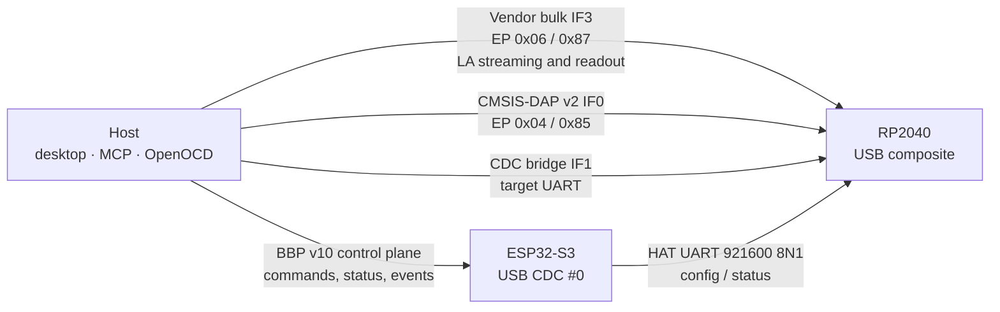

# Logic Analyzer HAT - architecture

How the RP2040 HAT is put together, and why. For build and flash instructions
see [RP2040/README.md](RP2040/README.md); for the wire format see
[hat-uart-protocol.md](hat-uart-protocol.md); for pin- and connector-level facts
see [../Docs/la-hat-hardware.md](../Docs/la-hat-hardware.md).

The firmware is a fork of
[raspberrypi/debugprobe](https://github.com/raspberrypi/debugprobe) with
BugBuster extensions bolted alongside. The debugprobe core is not modified.

## Two USB devices, one bench

With the HAT installed the host sees **two independent USB devices**, one per
MCU, and uses each for a different class of traffic.



**Neither LA data nor SWD traffic passes through the ESP32 or the HAT UART.**
The ESP32 only configures and arms the logic analyzer (`HAT_LA_CONFIG`,
`HAT_LA_ARM`, `HAT_LA_STREAM_START` over the HAT UART); samples flow straight
from the RP2040's vendor-bulk endpoint to the host. That split is what makes
sustained 1 MHz 4-channel streaming possible - a 921600-baud UART could never
carry it.

The `tud_descriptor_configuration_cb()` subclass patch in
`RP2040/src/bb_usb_descriptors.c` is what keeps these interfaces separate at
runtime. Do not remove it; see [RP2040/README.md](RP2040/README.md).

## Why fork debugprobe

debugprobe already provides PIO-accelerated SWD with hardware-timed
SWCLK/SWDIO, CMSIS-DAP v1 and v2, a CDC UART bridge, SWO trace capture, a
FreeRTOS task structure with correct USB handling, a mature Pico SDK build, and
compatibility with every mainstream debug tool. Reimplementing that would
duplicate thousands of lines of tested PIO and protocol code for no gain.

Crucially it uses only **PIO 0**, which leaves **PIO 1** free for the logic
analyzer.

| Component | File | Purpose |
|---|---|---|
| SWD PIO engine | `probe.pio`, `probe.c` | PIO programs for SWD bit timing |
| SWD protocol | `sw_dp_pio.c` | Request/response, parity, ACK handling |
| CMSIS-DAP | `DAP.c`, `DAP_vendor.c` | USB command processing |
| USB stack | `usb_descriptors.c`, TinyUSB | DAP + CDC endpoints |
| UART bridge | `cdc_uart.c` | USB CDC to target UART |

## What the fork adds

Additions run alongside the core; `probe.c`, `probe.pio`, `sw_dp_pio.c`,
`DAP.c` and `SWO.c` are untouched.

```
┌─────────────────────────────────────────────┐
│              RP2040 firmware                │
│                                             │
│  debugprobe core (unmodified)               │
│  ├── dap_task - CMSIS-DAP over USB          │
│  ├── SWD PIO engine (PIO 0)                 │
│  ├── CDC UART bridge                        │
│  └── SWO capture                            │
│                                             │
│  BugBuster extensions                       │
│  ├── bb_cmd_task - HAT UART command handler │
│  │   ├── Rail enables and current sense     │
│  │   ├── Level-shifter OE / direction       │
│  │   ├── HAT IO bank routing                │
│  │   ├── Logic analyzer control             │
│  │   ├── WS2812B status LEDs                │
│  │   └── Status and detect reporting        │
│  ├── Logic analyzer capture (PIO 1)         │
│  ├── Vendor-bulk LA data endpoint           │
│  └── IRQ signalling (GPIO8 → ESP32)         │
└─────────────────────────────────────────────┘
```

Task placement is load-bearing: `bb_cmd_task` is pinned to Core 1 and
`usb_thread` to Core 0. The rules that follow from that are in
[RP2040/README.md](RP2040/README.md#tasks).

## SWD

The host talks to the probe **directly** over USB CMSIS-DAP. The mainboard's
role is management only: rail voltage and enables, target detection, and
emergency power-off. It never proxies SWD transactions.

```
Desktop app / Python
    │
    ├──[USB CMSIS-DAP]──▶ RP2040 debugprobe ──▶ target SWD
    │                     (direct, no proxy)
    │
    └──[BBP]──▶ ESP32-S3 ──[HAT UART]──▶ RP2040 bb_cmd_task
                (power, rails, target detect, status)
```

A typical session:

1. Set the target rail voltage, which the ESP32 applies through the HAT.
2. Enable the rail. The HAT asserts the enable and reports current draw.
3. Connect the target to the dedicated 5-pin debug connector
   (VADJ4 · SWCLK · SWDIO · TRACE · GND).
4. Point OpenOCD, pyOCD, probe-rs or VS Code at the RP2040's CMSIS-DAP
   interface. The debug session runs entirely over USB.
5. The mainboard keeps monitoring rail current and can cut power on a fault.

SWD is **not** routed through the pin matrix. Function slots 0x01-0x04 in the
HAT protocol (formerly SWDIO / SWCLK / TRACE1 / TRACE2) are permanently reserved
and rejected - see [hat-uart-protocol.md](hat-uart-protocol.md).

Target detection is available over the control plane:
`BBP_CMD_HAT_DETECT_TARGET` (0xDB) triggers an active DPIDR probe.

## Logic analyzer

PIO 1, four state machines, entirely independent of PIO 0. **The logic analyzer
can run during an active debug session.**

| Property | Value |
|---|---|
| Channels | 1-4 on GPIO2-GPIO5 |
| Live streaming | up to 1 MHz × 4 channels over USB vendor bulk |
| Offline capture | up to 125 MHz single-channel into SRAM, then downloaded |
| Trigger | rising, falling, high, low - implemented in PIO, not software |
| Compression | run-length encoding, typically 10:1 on digital signals |
| Buffer | 8 slots × 2432 B ≈ 19.5 KB ring, roughly 5 ms of host slack at 1 MHz × 4 ch |
| Throughput ceiling | ~1.1 MB/s sustained (USB 2.0 Full-Speed) |

Wire format on the data endpoint: a 4-byte header
(`[type:u8][seq:u8][payload_len:u8][info:u8]`) plus 0-60 bytes of payload, so a
full 64-byte Full-Speed bulk packet carries exactly one frame. Packet types are
`PKT_START`, `PKT_DATA` (raw or RLE), `PKT_STOP` with a stop-reason byte, and
`PKT_ERROR`.

Consecutive runs need care: `HAT_LA_STOP` performs a STOP-first preflight, an
SIE endpoint reset, then `tud_vendor_n_fifo_clear`. Full detail, including the
rearm protocol, is in [../Docs/logic-analyzer.md](../Docs/logic-analyzer.md).

### Two routes

The desktop app chooses between them:

- **Low-speed route** - GPIO2-GPIO5 through the mainboard MUX. Four channels,
  reaches the mainboard's IO terminals.
- **High-speed route** - the level-shifted connector bank. Three usable channels
  on Conn1, but no MUX in the path.

Selected with `BBP_CMD_HAT_LA_SET_ROUTE` (0xD4), which also enforces MUX mutual
exclusion against other IO users.

## Command surface

HAT UART command ranges:

| Range | Module |
|---|---|
| 0x01-0x06 | Core: PING, INFO, pin config, reset, capabilities |
| 0x10-0x13 | Power and IO voltage |
| 0x20-0x22 | SWD management: DAP status, target info, clock |
| 0x30-0x3B | Logic analyzer |
| 0x40-0x48 | Rails, LEDs, calibration, IO bank, level shift |
| 0x49-0x4D | Firmware update and calibration export |
| 0x50-0x66 | Power Profiler Pro HAT (different HAT, same UART) |

Host-facing BBP commands that the ESP32 maps onto them:

| BBP | Name | HAT cmd |
|---|---|---|
| 0xC3 | `HAT_GET_CAPS` | 0x06 |
| 0xC4 | `HAT_GET_RAIL_STATUS` | 0x40 |
| 0xC5 | `HAT_GET_STATUS` | 0x02 |
| 0xC6 / 0xC7 | `HAT_SET_PIN` / `HAT_SET_ALL_PINS` | 0x03 |
| 0xC8 | `HAT_RESET` | 0x05 |
| 0xC9 | `HAT_DETECT` | - (ESP32-side GPIO) |
| 0xCA / 0xCB | `HAT_SET_POWER` / `HAT_GET_POWER` | 0x10 / 0x11 |
| 0xCC | `HAT_SET_IO_VOLTAGE` | 0x12 |
| 0xCD | `HAT_SETUP_SWD` | composite quick-setup |
| 0xCF | `HAT_LA_CONFIG` | 0x30 |
| 0xD2 | `HAT_SET_RAIL_ENABLE` | 0x41 |
| 0xD3 | `HAT_SET_LED_STATE` | 0x42 |
| 0xD4 | `HAT_LA_SET_ROUTE` | 0x3B |
| 0xD5-0xDA | `HAT_LA_ARM` / `FORCE` / `STATUS` / `READ` / `STOP` / `TRIGGER` | 0x32-0x36 |
| 0xDB | `HAT_DETECT_TARGET` | 0x21 |
| 0xAB / 0xAC / 0xAD | `HAT_CALIBRATE_START` / `STATUS` / `IMPORT` | 0x43 / 0x44 / 0x45 |
| 0xAE / 0xAF | `HAT_SET_IO_BANK` / `HAT_SET_LEVEL_SHIFT` | 0x46 / 0x47 |
| 0xB5 | `HAT_SET_RAIL_VOLTAGE` | 0x48 |
| 0xEB / 0xED / 0xEE | `HAT_LA_LOG_ENABLE` / `USB_RESET` / `STREAM_START` | 0x39 / 0x3A / 0x37 |

The definitive tables are `Firmware/ESP32/src/bbp/bbp.h` and
`Firmware/RP2040/src/bb_config.h`. Treat this one as a map, not a contract.
