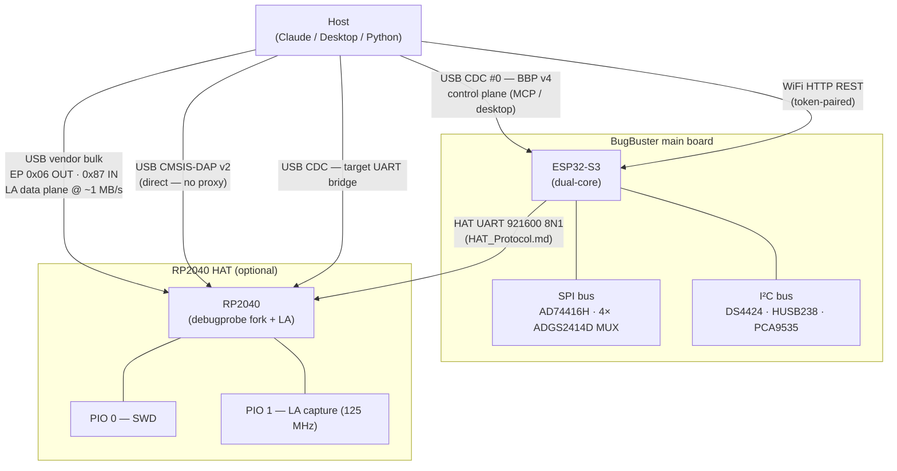
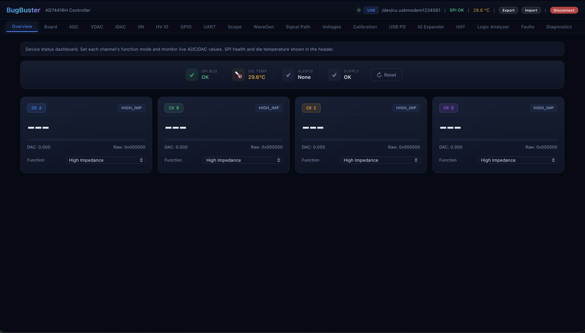
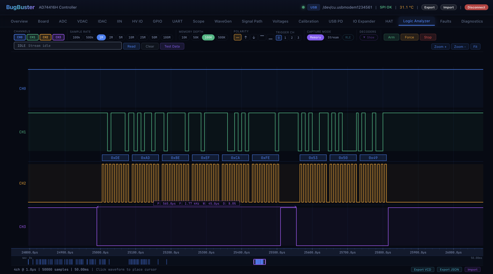

<p align="center">
  
</p>

<h1 align="center">B U G B U S T E R</h1>

<p align="center">
  <strong>Give AI models physical hands to measure, control, and debug real hardware.</strong>
</p>

<p align="center">
  
  
  
  
  
  
  
</p>

<br/>

<p align="center">
  
</p>

<br/>

> BugBuster is an open-source hardware platform that bridges the gap between AI models and the physical world. Through a **Model Context Protocol (MCP) server**, AI assistants like Claude can autonomously measure voltages, drive outputs, capture waveforms, analyze digital signals, and debug embedded targets &mdash; using a single USB-C connection to a purpose-built PCB.
>
> One board. 28 AI-callable tools. A full electronics bench in your AI's hands.

<br/>

## Why BugBuster?

AI models are exceptionally good at reasoning about electronics &mdash; reading datasheets, interpreting schematics, diagnosing faults. What they lack is the ability to **touch the real world**. BugBuster closes that loop.

<table>
<tr>
<td width="50%">

**Without BugBuster**
```
You:    "The output is wrong"
AI:     "Can you measure pin 3?"
You:    *probes pin 3* "It's 1.8V"
AI:     "Expected 3.3V. Check the regulator input."
You:    *probes regulator* "Input is 5V"
AI:     "Check the enable pin..."
        ...20 more round-trips...
```

</td>
<td width="50%">

**With BugBuster**
```
You:   "The output is wrong. Debug it."
AI:    *reads all 4 channels*
       *detects 1.8V where 3.3V expected*
       *checks supply rails — input is 5V*
       *reads enable pin — HIGH, correct*
       *captures ADC snapshot on output*
       "Found it: your 3.3V regulator
        output sags to 1.8V under load.
        Input is fine, EN is high — likely
        thermal shutdown or current-limit."
```

</td>
</tr>
</table>

More scenarios: [`Docs/Scenarios.md`](Docs/Scenarios.md).

<br/>

## What's in the box

<table>
<tr><td>

| | Capability | Highlights |
|:---:|---|---|
| **Measure** | 4-ch 24-bit ADC | V (0–12 V), I (4–20 mA), R, RTD — up to 4.8 kSPS/ch |
| **Drive** | 4-ch 16-bit DAC | V (0–11 V / ±12 V), I (0–25 mA) |
| **Generate** | Waveform engine | Sine / square / triangle / sawtooth, 0.01–100 Hz |
| **Digital I/O** | 12 level-shifted IOs | 1.8–5 V VLOGIC, MUX-routed, debounced counters |
| **Route** | 32-switch MUX | 4 × ADGS2414D octal SPST, break-before-make |
| **Power** | Adjustable supplies | 3–15 V VADJ1/2, USB-PD 5–20 V, 4 e-fuses |
| **Scope** | ADC streaming | Real-time display, BBSC + CSV export |
| **Logic Analyzer**† | 1/2/4 ch @ 1–125 MHz | PIO capture, RLE, hardware triggers, **dedicated RP2040 USB vendor-bulk endpoint** |
| **SWD Probe**† | CMSIS-DAP v2 | OpenOCD / pyOCD / probe-rs / VS Code |
| **UART Bridge** | Transparent passthrough | Configurable baud + pins |

</td></tr>
</table>

†HAT expansion board required.

<br/>

## System architecture



**Two independent USB paths** when the HAT is attached:

- **ESP32 USB CDC** — control plane (BBP v4 binary protocol over COBS + CRC-16).
  MCP server, desktop app, and Python library all speak this.
- **RP2040 USB vendor bulk** — Logic Analyzer data plane. The ESP32 is **not**
  in the LA data path; this decouples capture throughput from the BBP control
  stream and is what makes sustained 1 MHz / 4-ch streaming possible.
  Details: [`Docs/LogicAnalyzer.md`](Docs/LogicAnalyzer.md).

<details>
<summary><strong>Communication transports at a glance</strong></summary>

| Transport | Protocol | Latency | Who talks it | Best for |
|---|---|---|---|---|
| ESP32 USB CDC #0 | BBP v4 (COBS + CRC-16) | < 1 ms | MCP · desktop · Python | Full control + streaming control plane |
| ESP32 HTTP REST | JSON over WiFi | ~10 ms | desktop · Python · browser UI | Remote access, OTA |
| RP2040 USB vendor bulk | 4-byte framed packets | < 1 ms | desktop · Python (libusb) | LA streaming / readout, ~1 MB/s |
| RP2040 USB CMSIS-DAP v2 | standard DAP | < 1 ms | OpenOCD / pyOCD / probe-rs | SWD debug (zero proxy) |
| HAT UART | `0xAA` + CRC-8, 921600 | 1-5 ms | ESP32 ↔ RP2040 only | HAT config / status (see `Firmware/HAT_Protocol.md`) |

Full wire format: [`Firmware/BugBusterProtocol.md`](Firmware/BugBusterProtocol.md).

</details>

<br/>

## Quick start

<details open>
<summary><strong>MCP server (USB — recommended)</strong></summary>

```bash
cd python
pip install -e ".[mcp]"

# Find your port: ls /dev/cu.usbmodem*   (macOS) or ls /dev/ttyACM*  (Linux)
python -m bugbuster_mcp --transport usb --port /dev/cu.usbmodemXXXX
```

Add to `~/.claude/settings.json`:

```json
{
  "mcpServers": {
    "bugbuster": {
      "command": "/path/to/python",
      "args": ["-m", "bugbuster_mcp", "--transport", "usb",
               "--port", "/dev/cu.usbmodemXXXX"]
    }
  }
}
```

`/mcp` in Claude Code to reload. 28 tools appear.

</details>

<details>
<summary><strong>Desktop app (build from source)</strong></summary>

```bash
rustup target add wasm32-unknown-unknown
cargo install trunk tauri-cli

cd DesktopApp/BugBuster
cargo tauri dev       # hot-reload
cargo tauri build     # release bundle
```

</details>

<details>
<summary><strong>Flash firmware (ESP32 + RP2040 HAT)</strong></summary>

```bash
# ESP32-S3
cd Firmware/esp32_ad74416h
pio run -e esp32s3 -t upload
pio run -e esp32s3 -t uploadfs   # web UI to SPIFFS

# RP2040 HAT
cd Firmware/RP2040
git submodule update --init --recursive
mkdir build && cd build
cmake -DPICO_BOARD=bugbuster_hat .. && make -j
# hold BOOTSEL, then: cp bugbuster_hat.uf2 /Volumes/RPI-RP2
```

Current versions: ESP `3.0.0`, HAT `bb-hat-2.0`, Desktop `0.5.0`.
Release workflow + version-sync checklist:
[`Docs/ReleaseChecklist.md`](Docs/ReleaseChecklist.md) — to be added.

</details>

<details>
<summary><strong>Python library (no MCP)</strong></summary>

```python
import bugbuster as bb
from bugbuster import ChannelFunction

with bb.connect_usb("/dev/cu.usbmodemXXXX") as dev:
    dev.set_channel_function(0, ChannelFunction.VOUT)
    dev.set_dac_voltage(0, 5.0)
    print(dev.get_adc_value(1))
```

Full API + HAL examples: [`python/README.md`](python/README.md).

</details>

<br/>

## Safety model

Giving an AI control of real hardware demands hard boundaries. BugBuster
enforces them at the tool layer — the AI cannot bypass these even if instructed:

- **MUX exclusivity** — each IO has exactly one active signal path.
- **E-fuse auto-arm** — configuring any output arms overcurrent protection.
- **Current limit** — 8 mA default; full 25 mA requires `allow_full_range=True`.
- **Voltage confirmation** — supplies above 12 V require `confirm=True`.
- **Board-profile rail lock** — VLOGIC / VADJ1 / VADJ2 can be locked per-board
  via a JSON profile; see [`Docs/board_profiles.md`](Docs/board_profiles.md).
- **Risk gates** — `mux_control`, `register_access` require
  `i_understand_the_risk=True`.
- **Post-action monitoring** — every output operation triggers an automatic
  fault check; warnings propagate back to the AI.

Full rule-by-rule matrix: [`python/bugbuster_mcp/README.md`](python/bugbuster_mcp/README.md).

<br/>

## Desktop app

<table>
  <tr>
    <td align="center">
      
      <br/><sub><b>Overview</b> &mdash; live 4-ch readings, SPI health, temperature</sub>
    </td>
    <td align="center">
      
      <br/><sub><b>Logic Analyzer</b> &mdash; 1–4 ch @ up to 125 MHz, UART/I²C/SPI decoders</sub>
    </td>
  </tr>
</table>

21 tabs total — full screenshot gallery and tab reference in
[`DesktopApp/BugBuster/README.md`](DesktopApp/BugBuster/README.md).

<br/>

## Explore the docs

| Topic | Where to read |
|---|---|
| **MCP tools & prompts** (28 tools, 4 prompts, 6 resources) | [`python/bugbuster_mcp/README.md`](python/bugbuster_mcp/README.md) |
| **Python library** (low-level client + HAL, transports, examples) | [`python/README.md`](python/README.md) |
| **Desktop app** (21 tabs, screenshots, build & release) | [`DesktopApp/BugBuster/README.md`](DesktopApp/BugBuster/README.md) |
| **ESP32-S3 firmware** (FreeRTOS tasks, BBP, HTTP) | [`Firmware/esp32_ad74416h/README.md`](Firmware/esp32_ad74416h/README.md) |
| **RP2040 HAT firmware** (debugprobe fork, LA, SWD, HVPAK) | [`Firmware/RP2040/README.md`](Firmware/RP2040/README.md) |
| **BBP v4 wire format** (handshake, frames, opcodes, events) | [`Firmware/BugBusterProtocol.md`](Firmware/BugBusterProtocol.md) |
| **HAT UART protocol** (ESP32 ↔ RP2040, 921600 8N1) | [`Firmware/HAT_Protocol.md`](Firmware/HAT_Protocol.md) |
| **HAT architecture** (RP2040, debugprobe, HVPAK, connectors) | [`Firmware/HAT_Architecture.md`](Firmware/HAT_Architecture.md) |
| **Logic Analyzer & vendor-bulk streaming** | [`Docs/LogicAnalyzer.md`](Docs/LogicAnalyzer.md) |
| **Hardware** (ICs, power topology, ESP32 pinout) | [`Docs/Hardware.md`](Docs/Hardware.md) |
| **Board profiles** (schema, rail lock, MCP integration) | [`Docs/board_profiles.md`](Docs/board_profiles.md) |
| **HVPAK descriptor validation** | [`Docs/hvpak-descriptor-validation.md`](Docs/hvpak-descriptor-validation.md) |
| **Real-world scenarios** | [`Docs/Scenarios.md`](Docs/Scenarios.md) |
| **Test suite** (unit, simulator, device) | [`tests/README.md`](tests/README.md) |

<br/>

## Repository map

```
BugBuster/
├── Firmware/
│   ├── esp32_ad74416h/          ESP-IDF firmware (PlatformIO) — main controller
│   ├── RP2040/                  HAT firmware (Pico SDK + debugprobe fork)
│   ├── BugBusterProtocol.md     BBP v4 wire format (USB CDC + HTTP REST)
│   ├── HAT_Protocol.md          ESP32 ↔ RP2040 UART framing
│   ├── HAT_Architecture.md      HAT board architecture reference
│   └── FirmwareStructure.md     Cross-firmware reference
│
├── DesktopApp/BugBuster/        Tauri v2 + Leptos 0.7 (21 tabs)
│
├── python/
│   ├── bugbuster/               Control library (USB + HTTP, 100+ methods)
│   ├── bugbuster_mcp/           MCP server (28 tools, 4 prompts, 6 resources)
│   └── examples/                Annotated example scripts
│
├── tests/                       pytest — unit, simulator, hardware-in-the-loop
│
├── Docs/                        Architecture, Scenarios, Hardware, LA, board profiles
├── PCB Material/                Altium schematics + layout
└── Scripts/                     One-off test and automation scripts
```

<br/>

## License

MIT &mdash; see [LICENSE](LICENSE).
