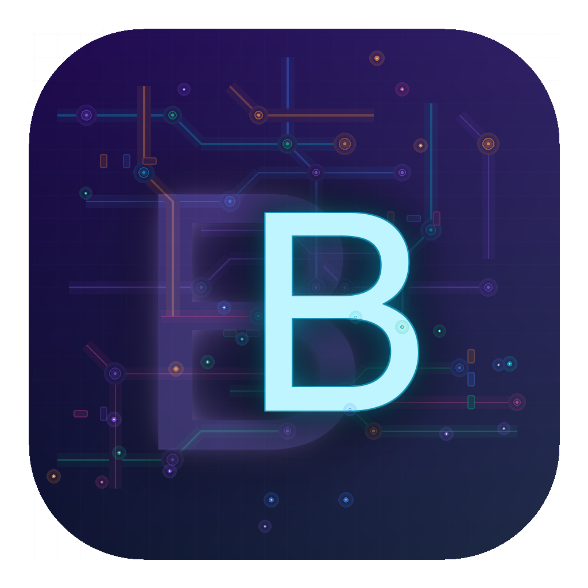
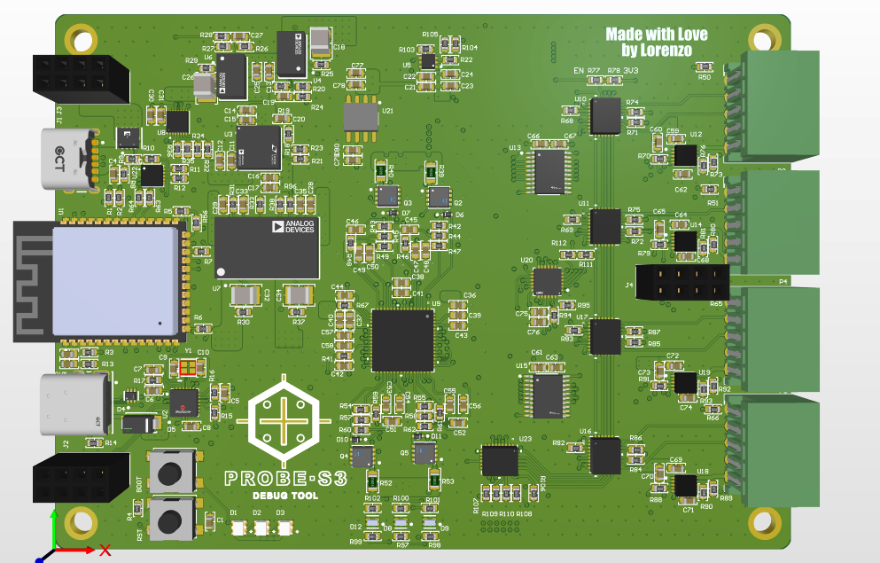
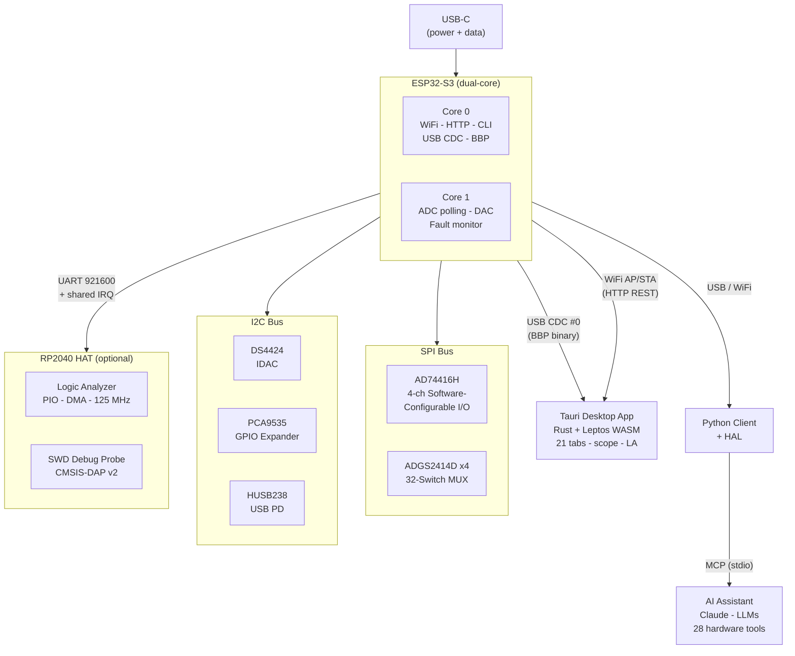
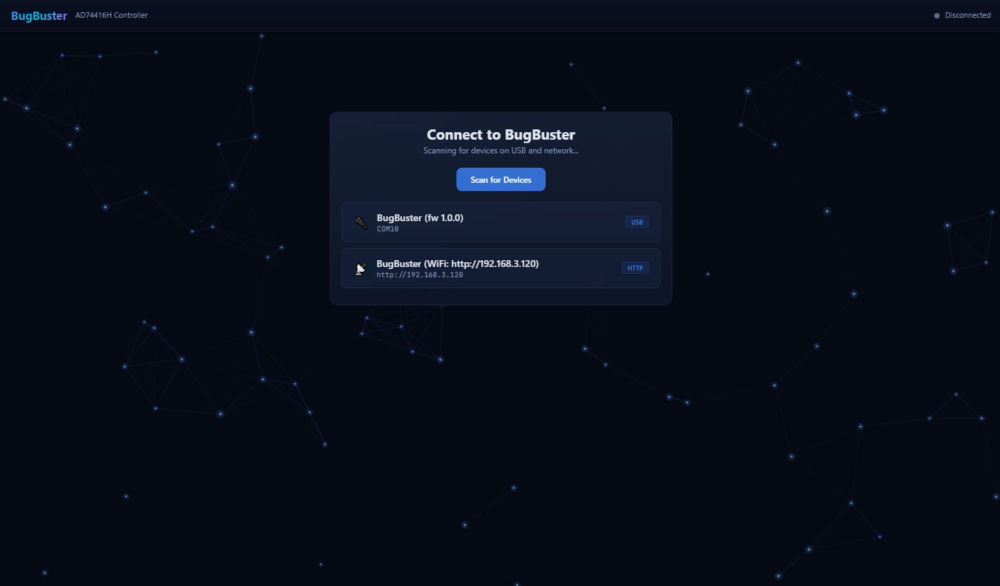
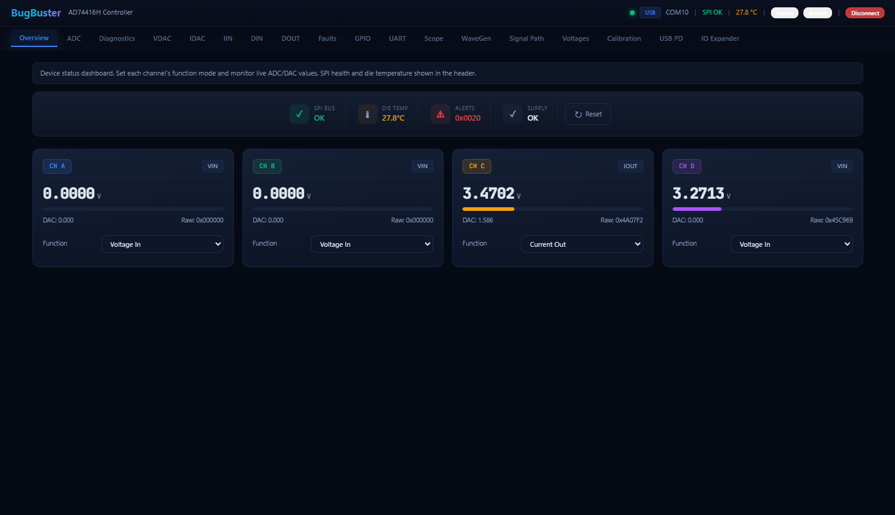
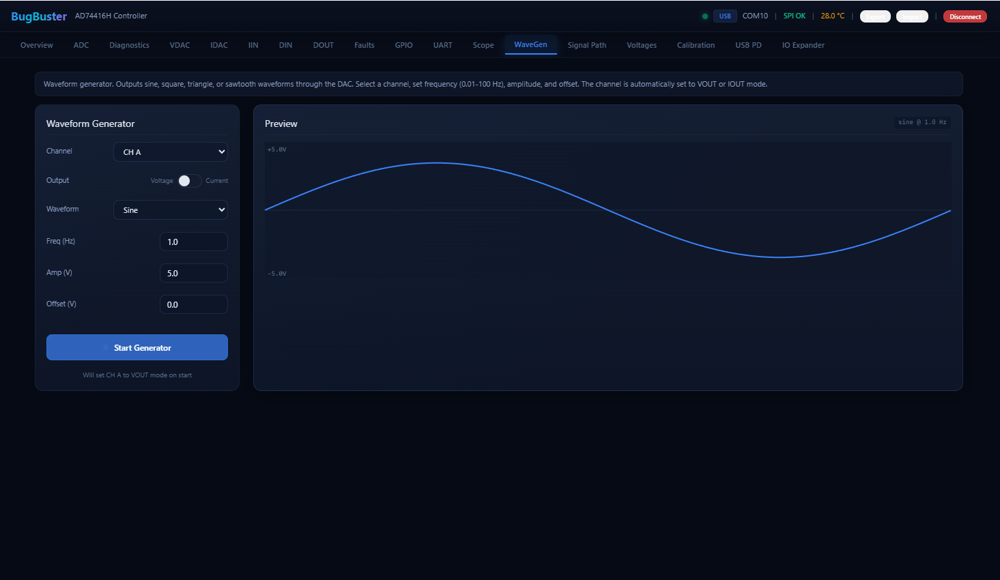
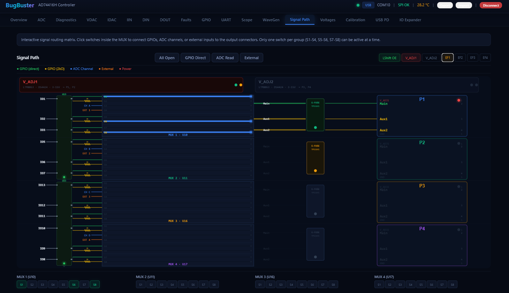
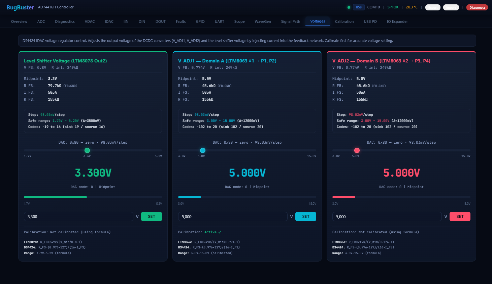
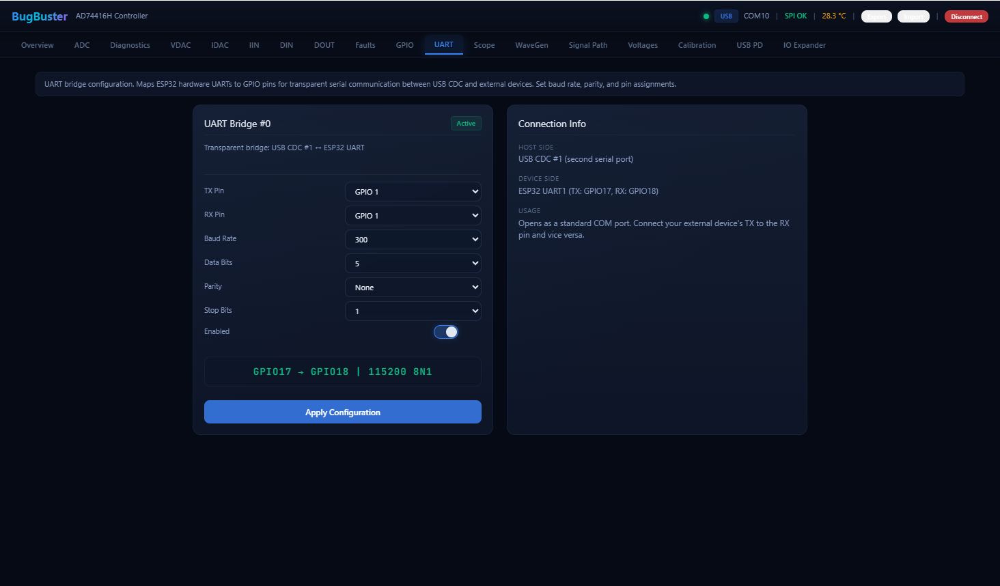
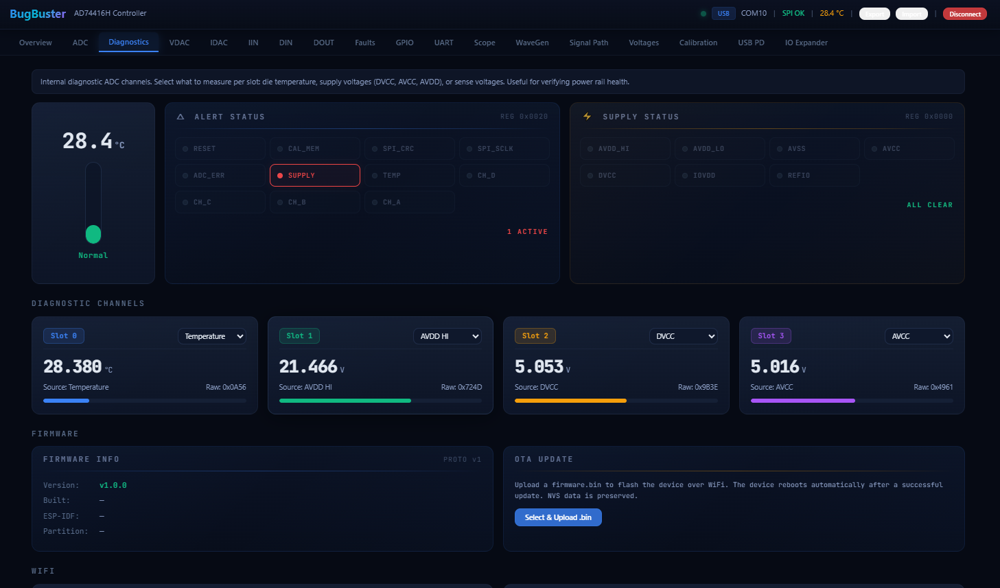

<p align="center">
  
</p>

<h1 align="center">B U G B U S T E R</h1>

<p align="center">
  <strong>Give AI models physical hands to measure, control, and debug real hardware.</strong>
</p>

<p align="center">
  
  
  
  
  
  
  
</p>

<br/>

<p align="center">
  
</p>

<br/>

> BugBuster is an open-source hardware platform that bridges the gap between AI models and the physical world. Through a **Model Context Protocol (MCP) server**, AI assistants like Claude can autonomously measure voltages, drive outputs, capture waveforms, analyze digital signals, and debug embedded targets &mdash; using a single USB-C connection to a purpose-built PCB.
>
> One board. 28 AI-callable tools. A full electronics bench in your AI's hands.

<br/>

## Why BugBuster?

AI models are exceptionally good at reasoning about electronics &mdash; reading datasheets, interpreting schematics, diagnosing faults. What they lack is the ability to **touch the real world**. BugBuster closes that loop.

Instead of describing a problem to an AI and manually probing every test point yourself, you connect BugBuster to your circuit and let the AI drive the investigation. It decides what to measure, configures the right input mode, reads the result, reasons about it, and moves on &mdash; exactly like an experienced engineer would, but at machine speed and with zero context fatigue.

<table>
<tr>
<td width="50%">

**Without BugBuster**
```
You:    "The output is wrong"
AI:     "Can you measure pin 3?"
You:     *probes pin 3* "It's 1.8V"
AI:     "Expected 3.3V. Check the regulator input."
You:     *probes regulator* "Input is 5V"
AI:     "Check the enable pin..."
         ...20 more round-trips...
```

</td>
<td width="50%">

**With BugBuster**
```
You:    "The output is wrong. Debug it."
AI:      *reads all 4 channels*
         *detects 1.8V where 3.3V expected*
         *checks supply rails — input is 5V*
         *reads enable pin — HIGH, correct*
         *captures ADC snapshot on output*
         "Found it: your 3.3V regulator output
          is sagging to 1.8V under load.
          The 5V input is fine and EN is high
          — likely a thermal shutdown or
          the regulator is current-limited."
```

</td>
</tr>
</table>

<br/>

---

<br/>

## Contents

<table>
<tr>
<td width="50%">

&nbsp;&nbsp;&bull;&nbsp; <a href="#what-ai-can-do">What AI Can Do</a><br/>
&nbsp;&nbsp;&bull;&nbsp; <a href="#mcp-server">MCP Server</a><br/>
&nbsp;&nbsp;&bull;&nbsp; <a href="#safety-model">Safety Model</a><br/>
&nbsp;&nbsp;&bull;&nbsp; <a href="#real-world-scenarios">Real-World Scenarios</a><br/>
&nbsp;&nbsp;&bull;&nbsp; <a href="#hardware-capabilities">Hardware Capabilities</a><br/>
&nbsp;&nbsp;&bull;&nbsp; <a href="#system-architecture">System Architecture</a><br/>
&nbsp;&nbsp;&bull;&nbsp; <a href="#hardware-design">Hardware Design</a><br/>

</td>
<td width="50%">

&nbsp;&nbsp;&bull;&nbsp; <a href="#hat-expansion-board">HAT Expansion Board</a><br/>
&nbsp;&nbsp;&bull;&nbsp; <a href="#desktop-app">Desktop App</a><br/>
&nbsp;&nbsp;&bull;&nbsp; <a href="#python-library">Python Library</a><br/>
&nbsp;&nbsp;&bull;&nbsp; <a href="#getting-started">Getting Started</a><br/>
&nbsp;&nbsp;&bull;&nbsp; <a href="#testing">Testing</a><br/>
&nbsp;&nbsp;&bull;&nbsp; <a href="#repository-map">Repository Map</a><br/>
&nbsp;&nbsp;&bull;&nbsp; <a href="#license">License</a><br/>

</td>
</tr>
</table>

<br/>

---

<br/>

## What AI Can Do

With BugBuster connected to a circuit under test, an AI assistant gains the ability to **independently** perform the following actions through natural language &mdash; no human in the loop required:

<table>
<tr><td>

| | Capability | What the AI controls |
|:---:|---|---|
| **Measure** | 4-channel 24-bit ADC | Voltage (0&ndash;12 V), current (4&ndash;20 mA), resistance, RTD temperature |
| **Drive** | 4-channel 16-bit DAC | Voltage output (0&ndash;11 V / &plusmn;12 V), current source (0&ndash;25 mA) |
| **Generate** | Waveform generator | Sine, square, triangle, sawtooth &mdash; 0.01&ndash;100 Hz |
| **Capture** | ADC snapshot engine | N samples over T seconds with statistics (min/max/mean/stddev/frequency) |
| **Analyze** | Logic analyzer | 1&ndash;4 channels at up to 125 MHz, hardware triggers, RLE compression |
| **Switch** | 12 digital I/Os | Read/write logic levels, level-shifted to target voltage (1.8&ndash;5 V) |
| **Route** | 32-switch MUX matrix | Configurable signal paths between analog, digital, and HAT functions |
| **Power** | Adjustable supplies | 3&ndash;15 V programmable rails, USB PD negotiation (5&ndash;20 V), e-fuse protection |
| **Debug** | SWD probe | CMSIS-DAP v2 for ARM Cortex-M targets (flash, halt, inspect) |
| **Bridge** | UART passthrough | Configurable serial bridge to communicate with target devices |

</td></tr>
</table>

Every action includes automatic fault detection &mdash; after each output-driving operation, the AI receives e-fuse status, power-good flags, and supply health, enabling it to catch and respond to overcurrent, short circuits, or supply collapse in real time.

<br/>

---

<br/>

## MCP Server

BugBuster exposes all hardware capabilities through an **MCP (Model Context Protocol) server** &mdash; the standard interface for giving AI models access to external tools. Any MCP-compatible client (Claude Code, Claude Desktop, or custom agents) can connect and operate the hardware.

### Quick Setup

```bash
# Install
cd python && pip install -e ".[mcp]"

# Run (USB &mdash; full functionality)
python -m bugbuster_mcp --transport usb --port /dev/cu.usbmodemXXXXXX

# Run (WiFi &mdash; remote access)
python -m bugbuster_mcp --transport http --host 192.168.4.1
```

<details>
<summary><strong>Claude Code integration</strong></summary>

Add to `~/.claude/settings.json`:

```json
{
  "mcpServers": {
    "bugbuster": {
      "command": "/path/to/BugBuster/python/.venv/bin/python",
      "args": ["-m", "bugbuster_mcp", "--transport", "usb", "--port", "/dev/cu.usbmodemXXXXXX"]
    }
  }
}
```

Run `/mcp` in Claude Code to reload. The server appears with 28 available tools.

</details>

### 28 Tools across 9 Groups

| Group | Tools | Purpose |
|---|---|---|
| **Discovery** | `device_status` &middot; `device_info` &middot; `check_faults` &middot; `selftest` | Understand what's connected and its health |
| **IO Config** | `configure_io` &middot; `set_supply_voltage` &middot; `reset_device` | Set up channels before measurement or output |
| **Analog In** | `read_voltage` &middot; `read_current` &middot; `read_resistance` | 24-bit precision measurement |
| **Analog Out** | `write_voltage` &middot; `write_current` | Drive test signals or power rails |
| **Digital IO** | `read_digital` &middot; `write_digital` | Logic-level interaction with target devices |
| **Waveform** | `start_waveform` &middot; `stop_waveform` &middot; `capture_adc_snapshot` &middot; `capture_logic_analyzer` | Signal generation and analysis |
| **Serial** | `setup_serial_bridge` &middot; `setup_swd` &middot; `uart_config` | Communicate with or debug targets |
| **Power** | `usb_pd_status` &middot; `usb_pd_select` &middot; `power_control` &middot; `wifi_status` | Manage power delivery and supply rails |
| **Advanced** | `mux_control` &middot; `register_access` &middot; `idac_control` | Low-level access with explicit risk gates |

### Guided Workflows

Four built-in prompt templates guide the AI through complex multi-step procedures:

| Prompt | What it does |
|---|---|
| `debug_unknown_device` | Non-invasive characterization: probe voltages, detect signals, identify protocols |
| `measure_signal` | Structured measurement with statistics, frequency analysis, and waveform classification |
| `program_target` | SWD firmware flashing with pre-flight checks (HAT required) |
| `power_cycle_test` | Automated reliability testing with configurable cycles and pass/fail criteria |

### Resources

The AI can query read-only state at any time for context:

| URI | Description |
|---|---|
| `bugbuster://status` | Full device state snapshot (channels, power, HAT, faults) |
| `bugbuster://power` | Supply voltages, USB PD contract, e-fuse status |
| `bugbuster://faults` | Active faults with remediation hints |
| `bugbuster://hat` | HAT detection, SWD target, logic analyzer state |
| `bugbuster://capabilities` | Static reference: IO modes, voltage ranges, feature matrix |

See [`python/bugbuster_mcp/README.md`](python/bugbuster_mcp/README.md) for the full MCP server documentation.

<br/>

---

<br/>

## Safety Model

Giving an AI control over real hardware demands robust safety boundaries. BugBuster enforces protection at the tool layer &mdash; the AI cannot bypass these constraints even if instructed to:

| Protection | Mechanism |
|---|---|
| **MUX exclusivity** | Each IO has exactly one active signal path. Analog and digital cannot be mixed. |
| **E-fuse auto-enable** | Configuring any output automatically arms overcurrent protection for that IO block. |
| **Current limiting** | `write_current` defaults to 8 mA max. Full 25 mA range requires explicit `allow_full_range=True`. |
| **Voltage confirmation** | Supply voltages above 12 V require `confirm=True` to prevent accidental overvoltage. |
| **VLOGIC lock** | Logic-level voltage is set once at server startup (`--vlogic`). The AI cannot change it mid-session. |
| **Risk gates** | Low-level tools (`mux_control`, `register_access`) require `i_understand_the_risk=True`. |
| **Post-action monitoring** | Every output operation triggers an automatic fault check. Warnings propagate to the AI's response. |

```
VADJ1 (3-15 V) --> IOs 1-6   (E-fuses 1 & 2)
VADJ2 (3-15 V) --> IOs 7-12  (E-fuses 3 & 4)
VLOGIC (locked) --> all 12 IOs (level shifters)
```

<br/>

---

<br/>

## Real-World Scenarios

### Debugging a sensor that reports incorrect values

> **You:** "The temperature sensor on IO 1 reads 150C but the room is 22C. Figure out why."
>
> **AI:** Configures IO 1 as analog input. Reads voltage (0.48 V &mdash; consistent with 150C for a PT100). Switches to RTD mode with 4-wire excitation. Measures 108.7 ohm. Notes that a PT100 at 22C should read ~108.9 ohm. Concludes: the sensor is correct; the target's ADC reference voltage is wrong. Measures the target's 3.3 V rail on IO 4 &mdash; reads 2.87 V. Reports: "Your 3.3 V reference is sagging to 2.87 V, which causes the firmware's voltage-to-temperature conversion to overread by 128C."

### Automated production test

> **You:** "Test the board on connectors A and B. Check 3.3V rail, verify I2C pull-ups, and confirm the status LED blinks at 1 Hz."
>
> **AI:** Powers connector A at 3.3 V. Reads supply on IO 1 (3.31 V, within spec). Configures IO 2 as digital input, checks pull-up (reads HIGH, confirmed). Configures IO 3 as digital input, captures 5 seconds of data, detects toggling at 0.98 Hz. Reports: "All three checks pass. 3.3 V rail nominal, I2C pull-ups present, LED blinks at 0.98 Hz (within 1 Hz &plusmn;5% tolerance)."

### Reverse-engineering an unknown board

> **You:** "I found this PCB in a drawer. Figure out what it does."
>
> **AI:** Runs `selftest` to confirm BugBuster is healthy. Configures all 4 analog inputs. Sweeps all 12 IOs to detect pull-ups, pull-downs, and driven signals. Finds 3.3 V on IO 1, a steady DC level on IO 4, and toggling activity on IOs 7-8. Sets up UART bridge on IOs 2-3, detects 115200 baud traffic. Captures logic analyzer data on IOs 7-8 at 1 MHz, decodes I2C, identifies device address 0x48. Reports: "This is a temperature monitoring board with an I2C sensor (likely TMP117 at 0x48), serial debug output at 115200 baud, and a 3.3 V enable line. The sensor is currently reading 23.5C."

<br/>

---

<br/>

## Hardware Capabilities

<table>
<tr><td>

| | Capability | Specification |
|:---:|---|---|
| **ADC** | 4-channel analog input | 24-bit sigma-delta, up to 4.8 kSPS/ch, 8 voltage/current ranges |
| **DAC** | 4-channel analog output | 16-bit, 0&ndash;11 V unipolar / &plusmn;12 V bipolar / 0&ndash;25 mA current |
| **WaveGen** | Waveform generator | Sine, square, triangle, sawtooth &mdash; 0.01&ndash;100 Hz |
| **DIO** | 12 digital I/Os | Level-shifted to VLOGIC (1.8&ndash;5 V), MUX-routed, counters + debounce |
| **RTD** | Resistance measurement | 2/3/4-wire RTD with 125 uA / 250 uA excitation |
| **MUX** | 32-switch matrix | 4x ADGS2414D octal SPST, break-before-make |
| **PSU** | Adjustable supplies | DS4424 IDAC tunes DCDC 3&ndash;15 V, 4x e-fuse protected outputs |
| **USB PD** | Power Delivery | HUSB238 negotiates 5&ndash;20 V from USB-C source |
| **WiFi** | Wireless control | AP + STA, built-in web UI, REST API, OTA updates |
| **Scope** | Real-time oscilloscope | ADC streaming, 10 ms bucket aggregation, BBSC + CSV export |
| **LA** | Logic analyzer | RP2040 HAT &mdash; 1/2/4 ch, PIO capture up to 125 MHz, RLE, triggers |
| **SWD** | Debug probe | RP2040 HAT &mdash; CMSIS-DAP v2 for ARM Cortex-M targets |

</td></tr>
</table>

### IO Architecture

The board has **12 physical IOs** organized into 2 power domains, each with 2 IO blocks of 3 IOs:

```
Block 1 (VADJ1, 3-15 V)                Block 2 (VADJ2, 3-15 V)
  IO_Block 1 [E-fuse 1, MUX U10]         IO_Block 3 [E-fuse 3, MUX U16]
    IO 1  - analog + digital + HAT          IO 7  - analog + digital + HAT
    IO 2  - digital only                    IO 8  - digital only
    IO 3  - digital only                    IO 9  - digital only
  IO_Block 2 [E-fuse 2, MUX U11]         IO_Block 4 [E-fuse 4, MUX U17]
    IO 4  - analog + digital + HAT          IO 10 - analog + digital + HAT
    IO 5  - digital only                    IO 11 - digital only
    IO 6  - digital only                    IO 12 - digital only
```

Each IO is routed through an ADGS2414D octal switch &mdash; functions are **mutually exclusive** (one active path at a time). **VLOGIC** (1.8&ndash;5 V, set at startup) controls the logic level for all digital IOs through TXS0108E level shifters.

<br/>

---

<br/>

## System Architecture



### Communication Transports

| Transport | Protocol | Latency | Best for |
|---|---|---|---|
| **USB CDC** | BBP (COBS + CRC-16) | < 1 ms | Full control, streaming, HAT features |
| **WiFi HTTP** | REST API (JSON) | ~10 ms | Remote access, OTA updates |

Both transports are abstracted behind a unified `Transport` interface. The MCP server, Python library, and desktop app all work over either transport.

<details>
<summary><strong>BBP Frame Format</strong></summary>

```
[COBS-encoded content][0x00 frame delimiter]

Raw pre-COBS layout:
  [msg_type: 1 B][seq: 2 B LE][cmd_id: 1 B][payload: 0-N B][CRC16-CCITT: 2 B LE]
```

- **Handshake:** host sends `0xBB 0x42 0x55 0x47`; device responds with magic + firmware version
- **COBS** removes all `0x00` bytes from the payload; `0x00` is the exclusive frame delimiter
- **CRC-16/CCITT** (poly `0x1021`, init `0xFFFF`) covers all bytes before the CRC field

</details>

<details>
<summary><strong>FreeRTOS Task Layout</strong></summary>

<br/>

| Task | Core | Priority | Purpose |
|---|---|---|---|
| `taskAdcPoll` | 1 | 3 | Read ADC results, convert to engineering units, accumulate scope buckets |
| `taskFaultMonitor` | 1 | 4 | Alert/fault status, DIN counters, GPIO, supply diagnostics |
| `taskCommandProcessor` | 1 | 2 | Dequeue and execute hardware commands (channel func, DAC, config) |
| `taskI2cPoll` | 1 | 1 | Poll DS4424 / HUSB238 / PCA9535 state |
| `taskWavegen` | 1 | 3 | Generate waveform samples, write DAC codes at target frequency |
| `mainLoopTask` | 0 | 1 | CLI input, BBP handshake, binary protocol, heartbeat |

</details>

<br/>

---

<br/>

## Hardware Design

The PCB is designed in **Altium Designer**. Full schematics and layout live in [`PCB Material/`](PCB%20Material/).

### Key ICs

| IC | Function | Interface |
|---|---|---|
| **AD74416H** | 4-ch software-configurable I/O &mdash; 24-bit ADC, 16-bit DAC | SPI (up to 20 MHz) |
| **ADGS2414D x4** | 32-switch SPST analog MUX matrix | SPI (daisy-chain) |
| **DS4424** | 4-ch IDAC &mdash; adjusts LTM8063/LTM8078 feedback network | I2C `0x10` |
| **HUSB238** | USB-C PD sink controller (5&ndash;20 V negotiation) | I2C `0x08` |
| **PCA9535AHF** | 16-bit GPIO expander &mdash; power enables, e-fuse control | I2C `0x23` |
| **LTM8063 x2** | Adjustable step-down DCDC (3&ndash;15 V, 2 A) | Analog (FB pin) |
| **LTM8078** | Level-shifter DCDC | Analog (FB pin) |
| **TPS1641x x4** | E-fuse / current limiters per output port | GPIO enable |

### Power Topology

```
USB-C --> HUSB238 (PD negotiation, default 20 V)
   +-- LTM8063 x2 --> VADJ1 / VADJ2 (3-15 V, DS4424-tuned)
             +-- TPS1641x x4 --> P1..P4 output ports (e-fuse protected)
```

<details>
<summary><strong>ESP32-S3 Pin Assignments</strong></summary>

<br/>

**SPI Bus:**

| Signal | GPIO | Notes |
|---|---|---|
| MISO (SDO) | 8 | From AD74416H |
| MOSI (SDI) | 9 | To AD74416H |
| CS (SYNC) | 10 | AD74416H chip select, active-low |
| SCLK | 11 | 10 MHz default, up to 20 MHz |
| MUX_CS | 12 | ADGS2414D chip select |
| LSHIFT_OE | 14 | Level-shifter output enable |

**AD74416H Control:**

| Signal | GPIO | Notes |
|---|---|---|
| RESET | 5 | Active-low hardware reset |
| ADC_RDY | 6 | Open-drain &mdash; ADC conversion ready |
| ALERT | 7 | Open-drain &mdash; fault output |

**I2C Bus (shared):**

| Signal | GPIO |
|---|---|
| SDA | 1 |
| SCL | 4 |

</details>

<br/>

---

<br/>

## HAT Expansion Board

The **HAT (Hardware Attached on Top)** is an optional **RP2040-based** expansion board that adds logic analysis and SWD debugging to BugBuster.

| Component | Specification |
|---|---|
| **MCU** | RP2040 (dual Cortex-M0+, 264 KB SRAM) |
| **Logic Analyzer** | 1/2/4-ch capture via PIO 1, DMA-driven, up to **125 MHz** sample rate |
| **Triggering** | Hardware edge/level triggers via dedicated PIO state machine |
| **Compression** | Run-length encoding (RLE) for efficient data transfer |
| **SWD Debug Probe** | CMSIS-DAP v2 (debugprobe fork) &mdash; OpenOCD, pyOCD, probe-rs, VS Code |
| **Connectors** | 2 expansion connectors (A/B) with separate VADJ power switching |
| **Detection** | Analog voltage divider on GPIO47 &mdash; auto-detected by main firmware |
| **Communication** | UART 921600 baud + shared open-drain IRQ line |

The desktop app provides dedicated **HAT** and **Logic Analyzer** tabs with canvas rendering, minimap navigation, protocol decoders (UART / I2C / SPI), annotations, and data export.

> HAT features require a USB connection &mdash; not available over WiFi/HTTP.

<br/>

---

<br/>

## Desktop App

Built with **Tauri v2** (Rust backend) and **Leptos 0.7** (WASM frontend). The app provides direct visual control over every hardware feature, independent of AI &mdash; useful for manual debugging, calibration, and monitoring.

<table>
  <tr>
    <td align="center">
      
      <br/><sub><b>Discovery</b> &mdash; auto-detects over USB or WiFi</sub>
    </td>
    <td align="center">
      
      <br/><sub><b>Overview</b> &mdash; live 4-ch readings, SPI health, temperature</sub>
    </td>
  </tr>
  <tr>
    <td align="center">
      
      <br/><sub><b>WaveGen</b> &mdash; sine, square, triangle, sawtooth with live preview</sub>
    </td>
    <td align="center">
      
      <br/><sub><b>Signal Path</b> &mdash; interactive 32-switch MUX visualization</sub>
    </td>
  </tr>
  <tr>
    <td align="center">
      
      <br/><sub><b>Voltages</b> &mdash; DCDC adjustment with calibration curves</sub>
    </td>
    <td align="center">
      
      <br/><sub><b>UART Bridge</b> &mdash; configurable baud, pins, data format</sub>
    </td>
  </tr>
  <tr>
    <td align="center" colspan="2">
      
      <br/><sub><b>Diagnostics</b> &mdash; supply monitoring, fault alerts, OTA firmware update</sub>
    </td>
  </tr>
</table>

<details>
<summary><strong>All 21 Tabs</strong></summary>

| Tab | Function |
|---|---|
| **Overview** | Status dashboard &mdash; SPI health, temperature, all channel summaries |
| **ADC** | 4-channel ADC readings with range / rate / mux config |
| **Diagnostics** | Internal supplies, alerts, firmware info, WiFi, OTA |
| **VDAC** | Voltage DAC output control (unipolar / bipolar) |
| **IDAC** | Current DAC output control |
| **IIN** | Current input monitoring (4&ndash;20 mA loop) |
| **DIN / DOUT** | Digital I/O configuration and control |
| **Faults** | Alert register viewer with per-channel detail |
| **GPIO** | AD74416H GPIO configuration (pins A&ndash;F) |
| **UART** | UART bridge configuration (baud, pins, format) |
| **Scope** | Real-time oscilloscope with BBSC binary + CSV recording |
| **WaveGen** | Waveform generator (sine, square, triangle, sawtooth) |
| **Signal Path** | Interactive MUX switch matrix visualization |
| **Voltages** | DCDC voltage adjustment with calibration |
| **Calibration** | DS4424 IDAC calibration wizard (NVS-persisted) |
| **USB PD** | USB Power Delivery status and PDO selection |
| **IO Expander** | PCA9535 GPIO expander control and fault monitoring |
| **HAT** | HAT board detection, SWD target status, connector power |
| **Logic Analyzer** | 1&ndash;4 ch capture, minimap, decoders (UART/I2C/SPI), annotations, RLE, export |

</details>

<br/>

---

<br/>

## Python Library

A full-featured control library in [`python/`](python/) with dual transport support and two API levels:

<table>
<tr>
<td>

**Low-Level Client** &mdash; direct hardware access

```python
import bugbuster as bb
from bugbuster import ChannelFunction

with bb.connect_usb("/dev/cu.usbmodem1234561") as dev:
    dev.set_channel_function(0, ChannelFunction.VOUT)
    dev.set_dac_voltage(0, 5.0)
    print(dev.get_adc_value(1))
```

</td>
<td>

**HAL** &mdash; Arduino-style port API

```python
from bugbuster import PortMode

with bb.connect_usb("/dev/cu.usbmodem1234561") as dev:
    hal = dev.hal
    hal.begin(supply_voltage=12.0, vlogic=3.3)

    hal.configure(1, PortMode.ANALOG_OUT)
    hal.write_voltage(1, 5.0)
    hal.configure(2, PortMode.DIGITAL_OUT)
    hal.write_digital(2, True)
```

</td>
</tr>
</table>

See [`python/README.md`](python/README.md) for installation, full API reference, and 7 annotated examples.

<br/>

---

<br/>

## Getting Started

### Prerequisites

| Tool | Version | Purpose |
|---|---|---|
| [PlatformIO](https://platformio.org/) | 6.x | ESP32 firmware build + flash |
| [Pico SDK](https://github.com/raspberrypi/pico-sdk) | 2.0+ | RP2040 HAT firmware (optional) |
| [Rust](https://rustup.rs/) | 1.75+ | Desktop app backend |
| [Trunk](https://trunkrs.dev/) | 0.21+ | WASM frontend build |
| [Node.js](https://nodejs.org/) | 18+ | Tauri CLI |

### 1 &mdash; Clone

```bash
git clone --recurse-submodules https://github.com/your-org/BugBuster.git
cd BugBuster
```

### 2 &mdash; Flash ESP32-S3 Firmware

```bash
cd Firmware/esp32_ad74416h
pio run -e esp32s3 -t upload      # Build and flash
pio run -e esp32s3 -t uploadfs    # Flash web UI (SPIFFS)
```

### 3 &mdash; Build Desktop App

```bash
rustup target add wasm32-unknown-unknown
cargo install trunk tauri-cli

cd DesktopApp/BugBuster
cargo tauri dev       # Development (hot-reload)
cargo tauri build     # Release
```

### 4 &mdash; Flash RP2040 HAT *(optional)*

```bash
cd Firmware/RP2040
git submodule update --init --recursive
mkdir build && cd build
cmake -DPICO_BOARD=bugbuster_hat .. && make -j
# Hold BOOTSEL while connecting USB, then:
cp bugbuster_hat.uf2 /Volumes/RPI-RP2
```

### 5 &mdash; Install Python + MCP Server

```bash
cd python
pip install -e ".[mcp]"

# Test the connection
python -c "import bugbuster as bb; dev = bb.connect_usb('/dev/cu.usbmodemXXXXXX'); print(dev.get_status())"

# Start MCP server
python -m bugbuster_mcp --transport usb --port /dev/cu.usbmodemXXXXXX
```

### 6 &mdash; WiFi Access

After flashing, the device broadcasts a WiFi AP:

| Setting | Value |
|---|---|
| SSID | `BugBuster` |
| Password | `bugbuster123` |
| IP | `192.168.4.1` |
| Web UI | `http://192.168.4.1` |
| REST API | `http://192.168.4.1/api/status` |

### 7 &mdash; OTA Firmware Update

1. Connect the device to WiFi (Diagnostics tab)
2. Build new firmware: `pio run -e esp32s3`
3. In the app: **Diagnostics > Firmware > OTA Update** > select `firmware.bin`

<br/>

---

<br/>

## Testing

### Hardware Test Suite

A comprehensive **pytest**-based test suite validates device functionality against real hardware. 12 modules, 120+ tests.

```bash
cd tests
pip install -r requirements-test.txt
python run_tests.py                       # Full suite
pytest device/test_02_channels.py -v      # Single module
pytest device/test_11_hat.py -v --hat     # HAT-specific
```

<details>
<summary><strong>Test modules</strong></summary>

| Module | Coverage |
|---|---|
| `test_01_core` | Ping, status, reset, firmware info |
| `test_02_channels` | All 12 channel functions, ADC/DAC |
| `test_03_gpio` | AD74416H GPIO pins A&ndash;F |
| `test_04_mux` | MUX matrix routing (32 switches) |
| `test_05_power` | DCDC supplies, IDAC, e-fuses |
| `test_06_usbpd` | USB Power Delivery negotiation |
| `test_07_wavegen` | Waveform generator (4 wave types) |
| `test_08_wifi` | WiFi AP/STA modes |
| `test_09_selftest` | Built-in diagnostics |
| `test_10_streaming` | ADC/scope streaming |
| `test_11_hat` | HAT expansion board (requires `--hat`) |
| `test_12_faults` | Alert and fault handling |

</details>

<br/>

---

<br/>

## Repository Map

```
BugBuster/
├── Firmware/
│   ├── esp32_ad74416h/         ESP-IDF firmware (PlatformIO)
│   │   ├── src/                48 source files (drivers, protocol, webserver, HAT)
│   │   ├── data/               SPIFFS web UI (Alpine.js + Tailwind)
│   │   └── partitions.csv      A/B OTA partition table
│   ├── RP2040/                 HAT expansion board firmware (Pico SDK + debugprobe)
│   │   └── src/                Logic analyzer, SWD probe, power management, USB
│   ├── BugBusterProtocol.md    BBP protocol specification (v1.5)
│   ├── FirmwareStructure.md    Firmware reference
│   ├── HAT_Architecture.md     HAT expansion board design
│   └── HAT_Protocol.md         HAT UART protocol specification
│
├── DesktopApp/BugBuster/       Tauri v2 + Leptos 0.7
│   ├── src/                    Leptos WASM frontend (21 tab modules)
│   ├── src-tauri/              Rust backend (transport, commands, LA, state)
│   └── tests/e2e/              WebDriverIO end-to-end tests
│
├── python/
│   ├── bugbuster/              Python control library (USB + HTTP, 100+ methods)
│   ├── bugbuster_mcp/          MCP server for AI integration (28 tools)
│   ├── examples/               7 annotated example scripts
│   └── README.md               Library documentation
│
├── tests/                      Hardware test suite (pytest, 12 modules, 120+ tests)
│
├── PCB Material/               Altium Designer schematics + PCB layout
│   ├── ARCHITECTURE.md         Full system architecture
│   └── BugBuster.pdf           Schematic export
│
├── Docs/                       Datasheets, screenshots, AD74416H reference
├── Libs/                       Altium component libraries
├── notebooks/                  Jupyter notebooks (flash, build, setup, testing)
└── Scripts/                    Test scripts
```

<br/>

---

<br/>

## License

MIT &mdash; see [LICENSE](LICENSE).
