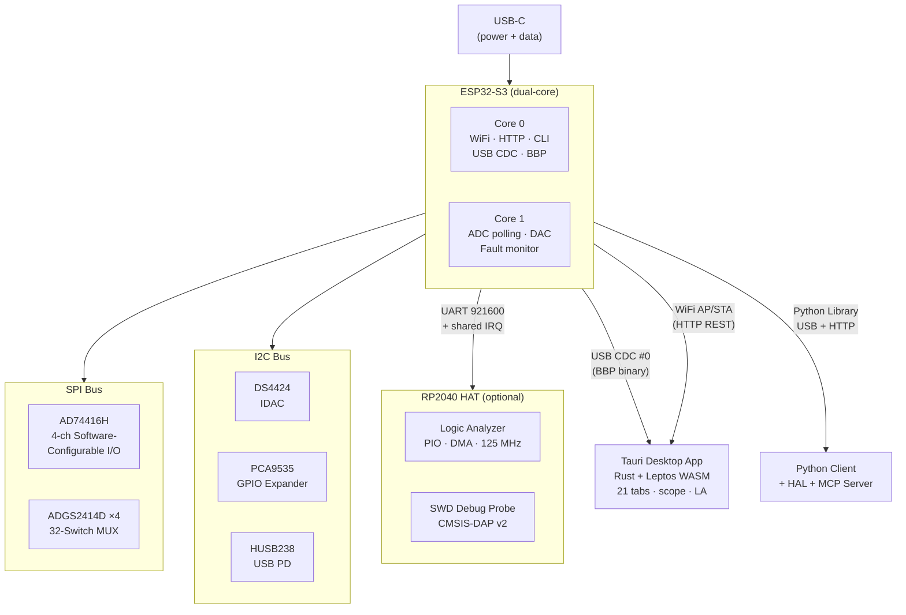
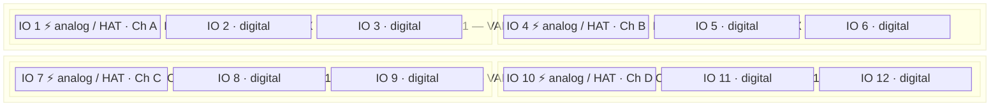

<p align="center">
  
</p>

<h1 align="center">B U G B U S T E R</h1>

<p align="center">
  <em>Open-source, four-channel analog/digital I/O debug and programming platform</em><br/>
  <strong>AD74416H</strong> &middot; <strong>ESP32-S3</strong> &middot; <strong>RP2040 HAT</strong>
</p>

<p align="center">
  
  
  
  
  
  
  
</p>

<br/>

<p align="center">
  
</p>

<br/>

> **One board. One USB-C cable. Replace your bench.**
> BugBuster turns a single connection into a 24-bit ADC, 16-bit DAC, waveform generator, logic analyzer, SWD debug probe, oscilloscope, and programmable power supply — all controllable from a desktop app, Python, or an AI assistant.

<br/>

## Contents

<table>
<tr>
<td width="50%">

&nbsp;&nbsp;&bull;&nbsp; <a href="#capabilities">Capabilities</a><br/>
&nbsp;&nbsp;&bull;&nbsp; <a href="#screenshots">Screenshots</a><br/>
&nbsp;&nbsp;&bull;&nbsp; <a href="#system-architecture">System Architecture</a><br/>
&nbsp;&nbsp;&bull;&nbsp; <a href="#hardware">Hardware</a><br/>
&nbsp;&nbsp;&bull;&nbsp; <a href="#hat-expansion-board">HAT Expansion Board</a><br/>
&nbsp;&nbsp;&bull;&nbsp; <a href="#desktop-app">Desktop App</a><br/>
&nbsp;&nbsp;&bull;&nbsp; <a href="#python-library">Python Library</a><br/>

</td>
<td width="50%">

&nbsp;&nbsp;&bull;&nbsp; <a href="#mcp-server--ai-integration">MCP Server / AI Integration</a><br/>
&nbsp;&nbsp;&bull;&nbsp; <a href="#communication-protocol">Communication Protocol</a><br/>
&nbsp;&nbsp;&bull;&nbsp; <a href="#getting-started">Getting Started</a><br/>
&nbsp;&nbsp;&bull;&nbsp; <a href="#testing">Testing</a><br/>
&nbsp;&nbsp;&bull;&nbsp; <a href="#repository-map">Repository Map</a><br/>
&nbsp;&nbsp;&bull;&nbsp; <a href="#partition-table">Partition Table</a><br/>
&nbsp;&nbsp;&bull;&nbsp; <a href="#license">License</a><br/>

</td>
</tr>
</table>

<br/>

---

<br/>

## Capabilities

<table>
<tr><td>

| | Capability | Specification |
|:---:|---|---|
| **ADC** | 4-channel analog input | 24-bit sigma-delta, up to 4.8 kSPS/ch, 8 voltage/current ranges |
| **DAC** | 4-channel analog output | 16-bit, 0-11 V unipolar / +/-12 V bipolar / 0-25 mA current |
| **WaveGen** | Waveform generator | Sine, square, triangle, sawtooth &mdash; 0.01-100 Hz |
| **DIO** | 12 digital I/Os | Level-shifted to VLOGIC (1.8-5 V), MUX-routed, counters + debounce |
| **RTD** | Resistance measurement | 2/3/4-wire RTD with 125 uA / 250 uA excitation |
| **MUX** | 32-switch matrix | 4x ADGS2414D octal SPST, break-before-make |
| **PSU** | Adjustable supplies | DS4424 IDAC tunes DCDC 3-15 V, 4x e-fuse protected outputs |
| **USB PD** | Power Delivery | HUSB238 negotiates 5-20 V from USB-C source |
| **WiFi** | Wireless control | AP + STA, built-in web UI, REST API, OTA updates |
| **Scope** | Real-time oscilloscope | ADC streaming, 10 ms bucket aggregation, BBSC + CSV export |
| **LA** | Logic analyzer | RP2040 HAT &mdash; 1/2/4 ch, PIO capture up to 125 MHz, RLE, triggers |
| **SWD** | Debug probe | RP2040 HAT &mdash; CMSIS-DAP v2 for ARM Cortex-M targets |
| **MCP** | AI integration | 28 tools for Claude / LLM-driven hardware control |

</td></tr>
</table>

<br/>

---

<br/>

## Screenshots

<table>
  <tr>
    <td align="center">
      
      <br/><sub><b>Discovery</b> &mdash; auto-detects over USB or WiFi</sub>
    </td>
    <td align="center">
      
      <br/><sub><b>Overview</b> &mdash; live 4-ch readings, SPI health, temperature</sub>
    </td>
  </tr>
  <tr>
    <td align="center">
      
      <br/><sub><b>WaveGen</b> &mdash; sine, square, triangle, sawtooth with live preview</sub>
    </td>
    <td align="center">
      
      <br/><sub><b>Signal Path</b> &mdash; interactive 32-switch MUX visualization</sub>
    </td>
  </tr>
  <tr>
    <td align="center">
      
      <br/><sub><b>Voltages</b> &mdash; DCDC adjustment with calibration curves</sub>
    </td>
    <td align="center">
      
      <br/><sub><b>UART Bridge</b> &mdash; configurable baud, pins, data format</sub>
    </td>
  </tr>
  <tr>
    <td align="center" colspan="2">
      
      <br/><sub><b>Diagnostics</b> &mdash; supply monitoring, fault alerts, OTA firmware update</sub>
    </td>
  </tr>
</table>

<br/>

---

<br/>

## System Architecture



<br/>

<details>
<summary><strong>FreeRTOS Task Layout</strong></summary>

<br/>

| Task | Core | Priority | Purpose |
|---|---|---|---|
| `taskAdcPoll` | 1 | 3 | Read ADC results, convert to engineering units, accumulate scope buckets |
| `taskFaultMonitor` | 1 | 4 | Alert/fault status, DIN counters, GPIO, supply diagnostics |
| `taskCommandProcessor` | 1 | 2 | Dequeue and execute hardware commands (channel func, DAC, config) |
| `taskI2cPoll` | 1 | 1 | Poll DS4424 / HUSB238 / PCA9535 state |
| `taskWavegen` | 1 | 3 | Generate waveform samples, write DAC codes at target frequency |
| `mainLoopTask` | 0 | 1 | CLI input, BBP handshake, binary protocol, heartbeat |

</details>

<br/>

---

<br/>

## Hardware

The PCB is designed in **Altium Designer**. Full schematics and layout live in [`PCB Material/`](PCB%20Material/).

### Key ICs

| IC | Function | Interface |
|---|---|---|
| **AD74416H** | 4-ch software-configurable I/O &mdash; 24-bit ADC, 16-bit DAC | SPI (up to 20 MHz) |
| **ADGS2414D x4** | 32-switch SPST analog MUX matrix | SPI (daisy-chain) |
| **DS4424** | 4-ch IDAC &mdash; adjusts LTM8063/LTM8078 feedback network | I2C `0x10` |
| **HUSB238** | USB-C PD sink controller (5-20 V negotiation) | I2C `0x08` |
| **PCA9535AHF** | 16-bit GPIO expander &mdash; power enables, e-fuse control | I2C `0x23` |
| **LTM8063 x2** | Adjustable step-down DCDC (3-15 V, 2 A) | Analog (FB pin) |
| **LTM8078** | Level-shifter DCDC | Analog (FB pin) |
| **TPS1641x x4** | E-fuse / current limiters per output port | GPIO enable |

<details>
<summary><strong>Pin Assignments (ESP32-S3)</strong></summary>

<br/>

**SPI Bus:**

| Signal | GPIO | Notes |
|---|---|---|
| MISO (SDO) | 8 | From AD74416H |
| MOSI (SDI) | 9 | To AD74416H |
| CS (SYNC) | 10 | AD74416H chip select, active-low |
| SCLK | 11 | 10 MHz default, up to 20 MHz |
| MUX_CS | 12 | ADGS2414D chip select |
| LSHIFT_OE | 14 | Level-shifter output enable |

**AD74416H Control:**

| Signal | GPIO | Notes |
|---|---|---|
| RESET | 5 | Active-low hardware reset |
| ADC_RDY | 6 | Open-drain &mdash; ADC conversion ready |
| ALERT | 7 | Open-drain &mdash; fault output |

**I2C Bus (shared):**

| Signal | GPIO |
|---|---|
| SDA | 1 |
| SCL | 4 |

</details>

### Power Topology

```
USB-C --> HUSB238 (PD negotiation, default 20 V)
   └── LTM8063 x2 --> V_ADJ1 / V_ADJ2 (3-15 V, DS4424-tuned)
             └── TPS1641x x4 --> P1..P4 output ports (e-fuse protected)
```

PCA9535 controls all power enables (`VADJ1_EN`, `VADJ2_EN`, `EN_15V`, `EFUSE_EN_1-4`) and monitors power-good / fault signals.

### IO Architecture

The board has **12 physical IOs** organized into 2 Blocks, each with 2 IO_Blocks of 3 IOs:



Each IO is routed through one ADGS2414D octal switch &mdash; options are **MUX-exclusive** (one function at a time):

| IO | Capabilities | MUX Options |
|----|-------------|-------------|
| **1, 4, 7, 10** | Analog + Digital | ESP GPIO (high/low drive) &middot; AD74416H channel &middot; HAT passthrough |
| **2, 3, 5, 6, 8, 9, 11, 12** | Digital only | ESP GPIO (high drive) &middot; ESP GPIO (low drive) |

**VLOGIC** (1.8-5 V, controlled by IDAC ch 0 via TPS74601) sets the logic level for all digital IOs through TXS0108E level shifters.

<br/>

---

<br/>

## HAT Expansion Board

The **HAT (Hardware Attached on Top)** is an optional **RP2040-based** expansion board that plugs into the BugBuster main PCB. It adds logic analysis, SWD debugging, and extended I/O.

| Component | Specification |
|---|---|
| **MCU** | RP2040 (dual Cortex-M0+, 264 KB SRAM) |
| **Logic Analyzer** | 1/2/4-ch capture via PIO 1, DMA-driven, up to **125 MHz** sample rate |
| **Triggering** | Hardware edge/level triggers via dedicated PIO state machine |
| **Compression** | Run-length encoding (RLE) for efficient data transfer |
| **SWD Debug Probe** | CMSIS-DAP v2 (debugprobe fork) &mdash; OpenOCD, pyOCD, probe-rs, VS Code |
| **Connectors** | 2 expansion connectors (A/B) with separate VADJ power switching |
| **Detection** | Analog voltage divider on GPIO47 &mdash; auto-detected by main firmware |
| **Communication** | UART 921600 baud + shared open-drain IRQ line |

Logic analyzer data is streamed over **USB CDC** for gapless, high-throughput transfer to the desktop app.

The desktop app provides two dedicated tabs:
- **HAT** &mdash; Board detection, SWD target status, connector power control, pin configuration
- **Logic Analyzer** &mdash; Full capture UI with canvas renderer, minimap, hover measurements, protocol decoders (UART / I2C / SPI), annotations, and data export

```python
with bb.connect_usb("/dev/cu.usbmodem1234561") as dev:
    dev.hat_la_configure(channels=4, sample_rate=1_000_000, trigger="rising")
    dev.hat_la_arm()
    data = dev.hat_la_read_all()

    dev.hat_set_power(connector="A", enabled=True)
    dev.hat_set_io_voltage(3.3)
```

> HAT features require a USB connection &mdash; not available over WiFi/HTTP.

See [`HAT_Architecture.md`](Firmware/HAT_Architecture.md) and [`HAT_Protocol.md`](Firmware/HAT_Protocol.md) for detailed specs.

<br/>

---

<br/>

## Desktop App

Built with **Tauri v2** (Rust backend) and **Leptos 0.7** (WASM frontend). Device state is polled at 5 Hz over BBP/HTTP and pushed to the UI via Tauri events. Streaming features (scope, logic analyzer) use dedicated high-throughput paths.

### 21 Tabs

| Tab | Function |
|---|---|
| **Overview** | Status dashboard &mdash; SPI health, temperature, all channel summaries |
| **ADC** | 4-channel ADC readings with range / rate / mux config |
| **Diagnostics** | Internal supplies, alerts, firmware info, WiFi, OTA |
| **VDAC** | Voltage DAC output control (unipolar / bipolar) |
| **IDAC** | Current DAC output control |
| **IIN** | Current input monitoring (4-20 mA loop) |
| **DIN / DOUT** | Digital I/O configuration and control |
| **Faults** | Alert register viewer with per-channel detail |
| **GPIO** | AD74416H GPIO configuration (pins A-F) |
| **UART** | UART bridge configuration (baud, pins, format) |
| **Scope** | Real-time oscilloscope with BBSC binary + CSV recording |
| **WaveGen** | Waveform generator (sine, square, triangle, sawtooth) |
| **Signal Path** | Interactive MUX switch matrix visualization |
| **Voltages** | DCDC voltage adjustment with calibration |
| **Calibration** | DS4424 IDAC calibration wizard (NVS-persisted) |
| **USB PD** | USB Power Delivery status and PDO selection |
| **IO Expander** | PCA9535 GPIO expander control and fault monitoring |
| **HAT** | HAT board detection, SWD target status, connector power |
| **Logic Analyzer** | 1-4 ch capture, minimap, decoders (UART/I2C/SPI), annotations, RLE, export |

<details>
<summary><strong>State Flow</strong></summary>

```
Firmware                    Tauri Backend                 Leptos Frontend
--------                    -------------                 ---------------
g_deviceState               ConnectionManager             Leptos signals
(FreeRTOS mutex)            polls GET_STATUS @ 5 Hz       (reactive / WASM)
      |                           |                              |
      +--- BBP/HTTP response ---->+                              |
                                  +--- emit("device-state") --->+
                                  +<-- invoke("set_dac_voltage")-+
                                  |                              |
      +<-- BBP CMD / HTTP POST ---+                              |
```

</details>

<br/>

---

<br/>

## Python Library

A full-featured control library in [`python/`](python/) with dual transport support and two API levels:

<table>
<tr>
<td>

**Low-Level Client** &mdash; direct hardware access

```python
import bugbuster as bb
from bugbuster import ChannelFunction

with bb.connect_usb("/dev/cu.usbmodem1234561") as dev:
    dev.set_channel_function(0, ChannelFunction.VOUT)
    dev.set_dac_voltage(0, 5.0)
    print(dev.get_adc_value(1))
```

</td>
<td>

**HAL** &mdash; Arduino-style port API

```python
from bugbuster import PortMode

with bb.connect_usb("/dev/cu.usbmodem1234561") as dev:
    hal = dev.hal
    hal.begin(supply_voltage=12.0, vlogic=3.3)

    hal.configure(1, PortMode.ANALOG_OUT)
    hal.write_voltage(1, 5.0)
    hal.configure(2, PortMode.DIGITAL_OUT)
    hal.write_digital(2, True)
```

</td>
</tr>
</table>

**Digital IO** &mdash; direct ESP32 GPIO control:

```python
with bb.connect_usb("/dev/cu.usbmodem1234561") as dev:
    dev.dio_configure(1, 2)     # IO 1 -> output
    dev.dio_write(1, True)      # HIGH
    dev.dio_configure(2, 1)     # IO 2 -> input
    print(dev.dio_read(2))      # read level
```

See [`python/README.md`](python/README.md) for installation, full API reference, and 7 annotated examples.

<br/>

---

<br/>

## MCP Server / AI Integration

BugBuster ships an **MCP (Model Context Protocol) server** that exposes all hardware capabilities to AI models like Claude. It wraps the Python library &mdash; no firmware changes required.

### 28 Tools across 9 Groups

| Group | Tools |
|---|---|
| **Discovery & status** | `device_status` &middot; `device_info` &middot; `check_faults` &middot; `selftest` |
| **IO configuration** | `configure_io` &middot; `set_supply_voltage` &middot; `reset_device` |
| **Analog measurement** | `read_voltage` &middot; `read_current` &middot; `read_resistance` |
| **Analog output** | `write_voltage` &middot; `write_current` |
| **Digital IO** | `read_digital` &middot; `write_digital` |
| **Waveform & capture** | `start_waveform` &middot; `stop_waveform` &middot; `capture_adc_snapshot` &middot; `capture_logic_analyzer` |
| **UART & debug** | `setup_serial_bridge` &middot; `setup_swd` &middot; `uart_config` |
| **Power management** | `usb_pd_status` &middot; `usb_pd_select` &middot; `power_control` &middot; `wifi_status` |
| **Advanced** | `mux_control` &middot; `register_access` &middot; `idac_control` |

### Guided Workflows

| Prompt | Use Case |
|---|---|
| `debug_unknown_device` | Non-invasive device characterization |
| `measure_signal` | Structured single-channel measurement |
| `program_target` | Firmware flashing via SWD (requires HAT) |
| `power_cycle_test` | Automated reliability testing |

### Quick Setup

```bash
cd python && pip install -e ".[mcp]"
python -m bugbuster_mcp --transport usb --port /dev/cu.usbmodem1234561
```

<details>
<summary><strong>Claude Code integration</strong></summary>

Add to `~/.claude/settings.json`:

```json
{
  "mcpServers": {
    "bugbuster": {
      "command": "/path/to/BugBuster/python/.venv/bin/python",
      "args": ["-m", "bugbuster_mcp", "--transport", "usb", "--port", "/dev/cu.usbmodemXXXXXX"]
    }
  }
}
```

</details>

See [`python/bugbuster_mcp/README.md`](python/bugbuster_mcp/README.md) for full documentation.

<br/>

---

<br/>

## Communication Protocol

Two transports, both abstracted behind a `Transport` trait:

| Transport | Protocol | Latency | Use Case |
|---|---|---|---|
| **USB CDC** | BBP (COBS + CRC-16) | < 1 ms | Low-latency, streaming, full control |
| **WiFi HTTP** | REST API (JSON) | ~10 ms | Remote access, OTA updates |

<details>
<summary><strong>BBP Frame Format</strong></summary>

```
[COBS-encoded content][0x00 frame delimiter]

Raw pre-COBS layout:
  [msg_type: 1 B][seq: 2 B LE][cmd_id: 1 B][payload: 0-N B][CRC16-CCITT: 2 B LE]
```

- **Handshake:** host sends `0xBB 0x42 0x55 0x47`; device responds with magic + firmware version
- **COBS** removes all `0x00` bytes from the payload; `0x00` is the exclusive frame delimiter
- **CRC-16/CCITT** (poly `0x1021`, init `0xFFFF`) covers all bytes before the CRC field

</details>

### Command Groups

| Range | Group |
|---|---|
| `0x01-0x04` | Status / Info |
| `0x10-0x1C` | Channel Config (function, DAC, ADC) |
| `0x20-0x23` | Fault management |
| `0x40-0x42` | GPIO (AD74416H pins A-F) |
| `0x43-0x46` | Digital IO (12 ESP32 GPIOs) |
| `0x50-0x52` | UART bridge |
| `0x60-0x63` | ADC + scope streaming |
| `0x90-0x92` | MUX matrix |
| `0xA0-0xA6` | DS4424 IDAC + calibration |
| `0xB0-0xB4` | PCA9535 I/O expander |
| `0xC0-0xC2` | USB Power Delivery |
| `0xC5-0xC9` | HAT expansion (status, pin config, detect) |
| `0xCA-0xCD` | HAT power management + SWD setup |
| `0xCF, 0xD5-0xDA` | HAT logic analyzer (config, arm, trigger, read) |
| `0xD0-0xD1` | Waveform generator |
| `0xE0-0xE4` | Level shifter, WiFi, SPI clock |
| `0xFE-0xFF` | Ping / Disconnect |

See [`BugBusterProtocol.md`](Firmware/BugBusterProtocol.md) for the full specification.

<br/>

---

<br/>

## Getting Started

### Prerequisites

| Tool | Version | Purpose |
|---|---|---|
| [PlatformIO](https://platformio.org/) | 6.x | ESP32 firmware build + flash |
| [Pico SDK](https://github.com/raspberrypi/pico-sdk) | 1.5+ | RP2040 HAT firmware (optional) |
| [Rust](https://rustup.rs/) | 1.75+ | Desktop app backend |
| [Trunk](https://trunkrs.dev/) | 0.21+ | WASM frontend build |
| [Node.js](https://nodejs.org/) | 18+ | Tauri CLI |

### 1 &mdash; Flash ESP32-S3 Firmware

```bash
cd Firmware/esp32_ad74416h
pio run -e esp32s3 -t upload      # Build and flash
pio run -e esp32s3 -t uploadfs    # Flash web UI (SPIFFS)
pio device monitor -b 115200      # Serial monitor
```

> Upload port is set in `platformio.ini`. Adjust to your system or remove to auto-detect.

### 2 &mdash; Build Desktop App

```bash
rustup target add wasm32-unknown-unknown
cargo install trunk tauri-cli

cd DesktopApp/BugBuster
cargo tauri dev       # Development (hot-reload)
cargo tauri build     # Release
```

### 3 &mdash; Flash RP2040 HAT *(optional)*

```bash
# Hold BOOTSEL while connecting USB, then:
cp Firmware/RP2040/build/bugbuster_hat.uf2 /Volumes/RPI-RP2

# Or build from source:
cd Firmware/RP2040 && mkdir build && cd build
cmake .. && make -j
```

See [`notebooks/RP2040.ipynb`](notebooks/RP2040.ipynb) for a step-by-step guide.

### 4 &mdash; Install Python Library

```bash
cd python
pip install -e .              # Core library
pip install -e ".[mcp]"       # With MCP server

cd examples && python 07_digital_io.py
```

### 5 &mdash; WiFi Access

After flashing, the device broadcasts a WiFi AP:

| Setting | Value |
|---|---|
| SSID | `BugBuster` |
| Password | `bugbuster123` |
| IP | `192.168.4.1` |
| Web UI | `http://192.168.4.1` |
| REST API | `http://192.168.4.1/api/status` |

The desktop app auto-discovers the device over USB (preferred) or WiFi.

### 6 &mdash; OTA Firmware Update

1. Connect the device to WiFi (Diagnostics tab)
2. Build new firmware: `pio run -e esp32s3`
3. In the app: **Diagnostics > Firmware > OTA Update** > select `firmware.bin`

<br/>

---

<br/>

## Testing

### Hardware Test Suite

A comprehensive **pytest**-based test suite validates device functionality against real hardware. 12 modules, 120+ tests.

```bash
cd tests
pip install -r requirements-test.txt
python run_tests.py                       # Full suite
pytest device/test_02_channels.py -v      # Single module
pytest device/test_11_hat.py -v --hat     # HAT-specific
```

| Module | Coverage |
|---|---|
| `test_01_core` | Ping, status, reset, firmware info |
| `test_02_channels` | All 12 channel functions, ADC/DAC |
| `test_03_gpio` | AD74416H GPIO pins A-F |
| `test_04_mux` | MUX matrix routing (32 switches) |
| `test_05_power` | DCDC supplies, IDAC, e-fuses |
| `test_06_usbpd` | USB Power Delivery negotiation |
| `test_07_wavegen` | Waveform generator (4 wave types) |
| `test_08_wifi` | WiFi AP/STA modes |
| `test_09_selftest` | Built-in diagnostics |
| `test_10_streaming` | ADC/scope streaming |
| `test_11_hat` | HAT expansion board (requires `--hat`) |
| `test_12_faults` | Alert and fault handling |

**HTTP API tests** (`tests/http_api/`) validate 14 REST endpoint contracts. See [`tests/README.md`](tests/README.md) for the full guide.

### Desktop App E2E

```bash
cd DesktopApp/BugBuster/tests/e2e
npm install && npm test
```

<br/>

---

<br/>

## Repository Map

```
BugBuster/
├── Firmware/
│   ├── esp32_ad74416h/         ESP-IDF firmware (PlatformIO)
│   │   ├── src/                48 source files (drivers, protocol, webserver, HAT)
│   │   ├── data/               SPIFFS web UI (Alpine.js + Tailwind)
│   │   └── partitions.csv      A/B OTA partition table
│   ├── RP2040/                 HAT expansion board firmware (Pico SDK + debugprobe)
│   │   └── src/                Logic analyzer, SWD probe, power management, USB
│   ├── BugBusterProtocol.md    BBP protocol specification (v1.5)
│   ├── FirmwareStructure.md    Firmware reference
│   ├── HAT_Architecture.md     HAT expansion board design
│   └── HAT_Protocol.md         HAT UART protocol specification
│
├── DesktopApp/BugBuster/       Tauri v2 + Leptos 0.7
│   ├── src/                    Leptos WASM frontend (21 tab modules)
│   ├── src-tauri/              Rust backend (transport, commands, LA, state)
│   ├── tests/e2e/              WebDriverIO end-to-end tests
│   └── styles.css              Glass UI theme
│
├── python/
│   ├── bugbuster/              Python control library (USB + HTTP, 100+ methods)
│   ├── bugbuster_mcp/          MCP server for AI integration (28 tools)
│   ├── examples/               7 annotated example scripts
│   └── README.md               Library documentation
│
├── tests/                      Hardware test suite (pytest, 12 modules, 120+ tests)
│
├── PCB Material/               Altium Designer schematics + PCB layout
│   ├── ARCHITECTURE.md         Full system architecture
│   └── BugBuster.pdf           Schematic export
│
├── Docs/                       Component datasheets, screenshots & AD74416H reference
├── Libs/                       Altium component libraries
├── notebooks/                  Jupyter notebooks (flash, build, setup, testing)
└── Scripts/                    Test scripts
```

<br/>

---

<br/>

## Partition Table

The ESP32-S3 uses A/B OTA partitions for safe wireless updates. NVS data (WiFi credentials, DS4424 calibration) is preserved across updates.

| Partition | Type | Offset | Size | Purpose |
|---|---|---|---|---|
| nvs | data | `0x9000` | 20 KB | Settings, WiFi creds, calibration |
| otadata | data | `0xE000` | 8 KB | OTA boot slot selection |
| app0 | app | `0x10000` | 1.6 MB | Firmware slot A |
| app1 | app | `0x1B0000` | 1.6 MB | Firmware slot B |
| spiffs | data | `0x350000` | 704 KB | Web UI assets |

<br/>

---

<br/>

## License

MIT &mdash; see [LICENSE](LICENSE).
