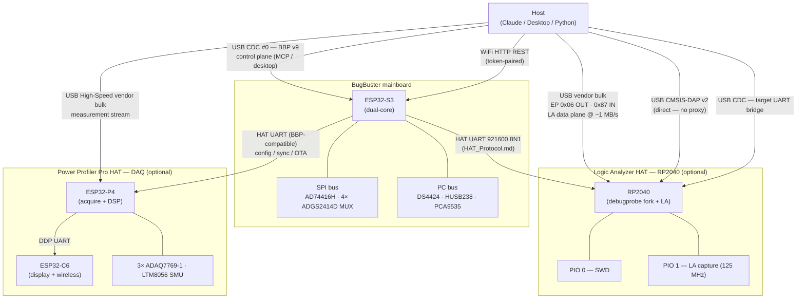
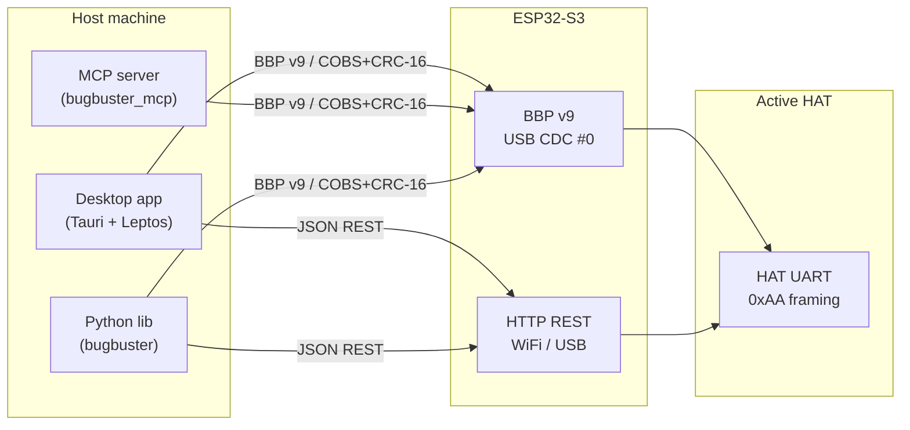

<p align="center">
  
</p>

<h1 align="center">B U G B U S T E R</h1>

<p align="center">
  <strong>Give AI models physical hands to measure, control, and debug real hardware.</strong>
</p>

<p align="center">
  
  
  
  
  
  
  
  
</p>

<br/>

<p align="center">
  
</p>

<br/>

> BugBuster is an open-source hardware platform that bridges the gap between AI models and the physical world. Through a **Model Context Protocol (MCP) server**, AI assistants like Claude can autonomously measure voltages, drive outputs, capture waveforms, analyze digital signals, and debug embedded targets; using a single USB-C connection to a purpose-built PCB.
>
> One mainboard, two snap-on specialist HATs, 59 AI-callable tools; a full electronics bench in your AI's hands.

<br/>

## Why BugBuster?

AI models are exceptionally good at reasoning about electronics; reading datasheets, interpreting schematics, diagnosing faults. What they lack is the ability to **touch the real world**. BugBuster closes that loop.

<table>
<tr>
<td width="50%">

**Without BugBuster**
```
You:    "The output is wrong"
AI:     "Can you measure pin 3?"
You:    *probes pin 3* "It's 1.8V"
AI:     "Expected 3.3V. Check the regulator input."
You:    *probes regulator* "Input is 5V"
AI:     "Check the enable pin..."
        ...20 more round-trips...
```

</td>
<td width="50%">

**With BugBuster**
```
You:   "The output is wrong. Debug it."
AI:    *reads all 4 channels*
       *detects 1.8V where 3.3V expected*
       *checks supply rails — input is 5V*
       *reads enable pin — HIGH, correct*
       *captures ADC snapshot on output*
       "Found it: your 3.3V regulator
        output sags to 1.8V under load.
        Input is fine, EN is high — likely
        thermal shutdown or current-limit."
```

</td>
</tr>
</table>

More scenarios: [`Docs/Scenarios.md`](Docs/Scenarios.md).

<br/>

## Support Development

If you find BugBuster useful and would like to support its ongoing development, hardware prototyping, and maintenance, you can donate via PayPal:

<p align="left">
  <a href="https://www.paypal.com/donate/?hosted_button_id=D736X49DQBQXE">
    
  </a>
</p>

<br/>

## A modular platform

BugBuster is built around an **ESP32-S3 mainboard** that always provides the
core bench instruments, plus a **custom HAT expansion bus** that accepts one of
two purpose-built expansion boards. The mainboard auto-detects the attached HAT
at boot and dynamically exposes its capabilities.

| | Board | Specialty |
|:---:|---|---|
| **Mainboard** | ESP32-S3 | ADC/DAC, waveform gen, 12 digital IOs, MUX routing, adjustable supplies, USB-PD |
| **HAT** | Logic Analyzer HAT (RP2040) | Logic analyzer + CMSIS-DAP SWD debug probe + level-shifted target rails |
| **HAT** | Power Profiler Pro HAT (ESP32-P4 + C6) | nA–3 A precision power analyzer & source-measure unit |

> [!NOTE]
> The two HATs are mutually exclusive &mdash; only one is attached at a time.
> The mainboard works standalone without any HAT.

<br/>

## Mainboard — ESP32-S3 (always present)

<table>
<tr><td>

| | Capability | Highlights |
|:---:|---|---|
| **Measure** | 4-ch 24-bit ADC | V (0–12 V), I (4–20 mA), R, RTD — up to 4.8 kSPS/ch |
| **Drive** | 4-ch 16-bit DAC | V (0–11 V / ±12 V), I (0–25 mA) |
| **Generate** | Waveform engine | Sine / square / triangle / sawtooth, 0.01–100 Hz |
| **Digital I/O** | 12 level-shifted IOs | 1.8–5 V VLOGIC, MUX-routed, debounced counters |
| **Route** | 32-switch MUX | 4 × ADGS2414D octal SPST, break-before-make |
| **Power** | Adjustable supplies | 3–15 V VADJ1/2, USB-PD 5–20 V, 4 e-fuses |
| **Scope** | ADC streaming | Real-time display, BBSC + CSV export |
| **External I2C/SPI** | Bus transactions | Route any IO as SDA/SCL or MOSI/MISO/SCLK/CS; Python + MCP tools included |
| **UART Bridge** | Transparent passthrough | Configurable baud + pins |
| **Quick-setup slots** | Save/restore device state | 5 named snapshots (DAC, channels, routing) — BBP 0xF0–0xF4, `/api/quicksetup/*` HTTP routes |
| **MicroPython runtime** | Script engine | Upload & execute on ESP32, REPL, persistent SPIFFS store, autorun on boot, full API access |
| **CDC auto-recovery** | Serial fallback | BBP idle for 1 min → CDC #0 returns to CLI; CLI keypress reclaims immediately |
| **VADJ PD guard** | Voltage negotiation | VADJ1/VADJ2 capped by USB-PD voltage; firmware + Python + MicroPython enforce safe limits |

</td></tr>
</table>

<br/>

## Expansion HATs

Snap-on HATs extend the mainboard with specialist instruments over the custom
HAT expansion bus. Only one HAT is attached at a time, and the mainboard
auto-detects which one is present at boot.

### Logic Analyzer HAT — RP2040

A debug-and-capture HAT that adds a high-speed logic analyzer and a fully
standalone CMSIS-DAP SWD probe, plus extra level-shifted target rails and IO.
Built on a fork of [raspberrypi/debugprobe](https://github.com/raspberrypi/debugprobe).

<table>
<tr><td>

| | Capability | Highlights |
|:---:|---|---|
| **Logic Analyzer** | 4 ch @ up to 1 MHz (USB stream); up to 125 MHz 1-ch offline | PIO capture, RLE, hardware triggers, dual route (low-speed MUX / high-speed level-shifted), **dedicated RP2040 USB vendor-bulk endpoint** |
| **SWD Probe** | CMSIS-DAP v2 | OpenOCD / pyOCD / probe-rs / VS Code — dedicated 5-pin connector (VADJ4 · SWCLK · SWDIO · TRACE · GND), zero proxy |
| **Target UART Bridge** | USB CDC | Dedicated serial bridge to the target under debug |
| **HAT Power Rails** | VADJ3 + VADJ4 (0–36 V) + 3V3\_ADJ | DS4424-tuned LTM8083 rails, per-rail current monitoring (50 mΩ shunt), auto-calibration |
| **HAT IO Bank** | 8 level-shifted IOs | GPIO10–15 + GPIO20–21, direction-controlled, Conn1 + Conn2 headers |
| **HAT Status LEDs** | 8× WS2812B | Per-connector status indicators, boot animation |

</td></tr>
</table>

Deep dive: [`Firmware/HAT_Architecture.md`](Firmware/HAT_Architecture.md) ·
[`Docs/LogicAnalyzer.md`](Docs/LogicAnalyzer.md).

<br/>

### Power Profiler Pro HAT — DAQ (ESP32-P4 + ESP32-C6)

A 24-bit, nA–3 A seamless-autoranging precision **power analyzer** and
**source-measure unit** in the class of Joulescope, Qoitech Otii, and Nordic
PPK2. The ESP32-P4 acquires and runs the full DSP pipeline on-device, streaming
results to the PC over USB High-Speed; an on-module ESP32-C6 drives the local
display and wireless link.

<table>
<tr><td>

| | Capability | Highlights |
|:---:|---|---|
| **Power Analyzer** | nA – 3 A current, 24-bit | 3× ADAQ7769-1 Σ-Δ, seamless 3-range hardware autorange (51 / 2 / 0.05 Ω), dual-ADC gap-fill |
| **Voltage** | 4-wire Kelvin sense | True differential `V_DUT`, target 50 kSPS |
| **Source / SMU** | 0–20 V output, ≤ 2.5 A | LTM8056 buck-boost + DS4424 trim |
| **On-device DSP** | power · energy · charge · stats · FFT | mWh/J, mAh/C, min/max/mean/RMS/std, multi-resolution zoom, continuous Welch FFT |
| **Live streaming** | USB 2.0 High-Speed | CRC-framed vendor-bulk measurement stream, target ~250 kSPS |
| **Wireless streaming** | WiFi softAP → iOS | P4 hosts its own AP and TCP stream; phone connects directly, bypassing the mainboard network stack |
| **Acquisition control** | ODR · filter · decimation | Configurable from the host with device-confirmed readback of the values actually applied |
| **Signal integrity** | per-sample ADAQ CRC | Glitch rejection at the source, isolated-outlier despiking on device |
| **DUT supply control** | enable · voltage · current limit | `/api/daq/vdut/*` over HTTP **and** BLE; out-of-range setpoints rejected, not clamped |
| **On-board display** | ESP32-C6 + ST7789 | Live readout, settings & diagnostics menu, 3 nav buttons |
| **Event markers** | digital, via mainboard | Correlated to P4 samples through a shared sync epoch |
| **OTA** | both chips, from a release | P4 dual-slot A/B with rollback; C6 flashed via the P4's ROM-loader relay. SHA-256 verified inside the P4, resumable, streamed from the ESP32-S3 |

</td></tr>
</table>

Deep dive: [`Firmware/DAQ_HAT/README.md`](Firmware/DAQ_HAT/README.md) ·
[`Docs/PowerAnalyzer_Architecture.md`](Docs/PowerAnalyzer_Architecture.md).

<br/>

## System architecture


```mermaid
flowchart TB
  HOST["Host<br/>(Claude / Desktop / Python)"]

  subgraph BB["BugBuster mainboard"]
    direction TB
    ESP32["ESP32-S3<br/>(dual-core)"]
    SPI["SPI bus<br/>AD74416H · 4× ADGS2414D MUX"]
    I2C["I²C bus<br/>DS4424 · HUSB238 · PCA9535"]
    ESP32 --- SPI
    ESP32 --- I2C
  end

  subgraph LA["Logic Analyzer HAT — RP2040 (optional)"]
    direction TB
    RP["RP2040<br/>(debugprobe fork + LA)"]
    PIO0["PIO 0 — SWD"]
    PIO1["PIO 1 — LA capture (125 MHz)"]
    RP --- PIO0
    RP --- PIO1
  end

  subgraph DAQ["Power Profiler Pro HAT — DAQ (optional)"]
    direction TB
    P4["ESP32-P4<br/>(acquire + DSP)"]
    C6["ESP32-C6<br/>(display + wireless)"]
    AFE["3× ADAQ7769-1 · LTM8056 SMU"]
    P4 --- AFE
    P4 -->|DDP UART| C6
  end

  HOST -->|"USB CDC #0 — BBP v9<br/>control plane (MCP / desktop)"| ESP32
  HOST -->|"WiFi HTTP REST<br/>(token-paired)"| ESP32
  ESP32 -->|"HAT UART 921600 8N1<br/>(HAT_Protocol.md)"| RP
  ESP32 -->|"HAT UART (BBP-compatible)<br/>config / sync / OTA"| P4

  HOST -->|"USB vendor bulk<br/>EP 0x06 OUT · 0x87 IN<br/>LA data plane @ ~1 MB/s"| RP
  HOST -->|"USB CMSIS-DAP v2<br/>(direct — no proxy)"| RP
  HOST -->|"USB CDC — target UART bridge"| RP

  HOST -->|"USB High-Speed vendor bulk<br/>measurement stream"| P4
```

> [!NOTE]
> Only one HAT is installed at a time. Both attach to the same custom HAT
> expansion bus and HAT UART; the mainboard detects the HAT type at boot and
> loads the matching resource set.


### Host stack


```mermaid
flowchart LR
  subgraph Host["Host machine"]
    Desktop["Desktop app\n(Tauri + Leptos)"]
    MCP["MCP server\n(bugbuster_mcp)"]
    PyLib["Python lib\n(bugbuster)"]
  end

  subgraph ESP["ESP32-S3"]
    BBP["BBP v9\nUSB CDC #0"]
    HTTP["HTTP REST\nWiFi / USB"]
  end

  subgraph HAT["Active HAT"]
    UART["HAT UART\n0xAA framing"]
  end

  Desktop -->|"BBP v9 / COBS+CRC-16"| BBP
  MCP     -->|"BBP v9 / COBS+CRC-16"| BBP
  PyLib   -->|"BBP v9 / COBS+CRC-16"| BBP

  Desktop -->|"JSON REST"| HTTP
  PyLib   -->|"JSON REST"| HTTP

  BBP  --> UART
  HTTP --> UART
```

**Two independent USB paths** when a HAT is attached:

- **ESP32 USB CDC** — control plane (BBP v9 binary protocol over COBS + CRC-16).
  MCP server, desktop app, and Python library all speak this.
- **HAT USB data plane** — the active HAT exposes its own high-throughput USB
  device. On the **Logic Analyzer HAT** this is the RP2040 vendor-bulk endpoint
  for capture data; on the **Power Profiler Pro HAT** it is the ESP32-P4
  USB-HS measurement stream. The ESP32-S3 is **not** in either data path, which
  decouples capture/measurement throughput from the BBP control stream.
  Details: [`Docs/LogicAnalyzer.md`](Docs/LogicAnalyzer.md).

<details>
<summary><strong>Communication transports at a glance</strong></summary>

| Transport | Protocol | Latency | Who talks it | Best for |
|---|---|---|---|---|
| ESP32 USB CDC #0 | BBP v9 (COBS + CRC-16) | < 1 ms | MCP · desktop · Python | Full control + streaming control plane |
| ESP32 HTTP REST | JSON over WiFi | ~10 ms | desktop · Python · browser UI | Remote access, OTA |
| RP2040 USB vendor bulk † | 4-byte framed packets | < 1 ms | desktop · Python (libusb) | LA streaming / readout, ~1 MB/s |
| RP2040 USB CMSIS-DAP v2 † | standard DAP | < 1 ms | OpenOCD / pyOCD / probe-rs | SWD debug (zero proxy) |
| ESP32-P4 USB High-Speed ‡ | BB50 framed (CRC-16) | < 1 ms | desktop · Python (libusb) | Power-measurement stream |
| HAT UART | `0xAA` + CRC-8, 921600 | 1-5 ms | ESP32 ↔ HAT only | HAT config / status (see `Firmware/HAT_Protocol.md`) |

† Logic Analyzer HAT · ‡ Power Profiler Pro HAT.

Full wire format: [`Firmware/BugBusterProtocol.md`](Firmware/BugBusterProtocol.md).

</details>

<br/>

## Quick start

<details open>
<summary><strong>MCP server (USB — recommended)</strong></summary>

```bash
cd python
pip install -e ".[mcp]"

# Find your port: ls /dev/cu.usbmodem*   (macOS) or ls /dev/ttyACM*  (Linux)
python -m bugbuster_mcp --transport usb --port /dev/cu.usbmodemXXXX
```

Add to `~/.claude/settings.json`:

```json
{
  "mcpServers": {
    "bugbuster": {
      "command": "/path/to/python",
      "args": ["-m", "bugbuster_mcp", "--transport", "usb",
               "--port", "/dev/cu.usbmodemXXXX"]
    }
  }
}
```

`/mcp` in Claude Code to reload. 59 tools appear.

</details>

<details>
<summary><strong>Desktop app (build from source)</strong></summary>

```bash
rustup target add wasm32-unknown-unknown
cargo install trunk tauri-cli

cd DesktopApp/BugBuster
cargo tauri dev       # hot-reload
cargo tauri build     # release bundle
```

</details>

<details>
<summary><strong>Flash firmware (mainboard + HATs)</strong></summary>

```bash
# ESP32-S3 mainboard
cd Firmware/ESP32
pio run -e esp32s3 -t upload
pio run -e esp32s3 -t uploadfs   # web UI to SPIFFS

# Logic Analyzer HAT (RP2040)
cd Firmware/RP2040
git submodule update --init --recursive
mkdir build && cd build
cmake -DPICO_BOARD=bugbuster_hat .. && make -j
# hold BOOTSEL, then: cp bugbuster_hat.uf2 /Volumes/RPI-RP2

# Power Profiler Pro HAT (DAQ) — ESP32-P4 acquisition core
cd Firmware/DAQ_HAT/ESP32P4
python -m platformio run -e esp32p4 -t upload --upload-port <COMx>
# ESP32-C6 display co-processor
cd ../ESP32C6
python -m platformio run -e esp32c6 -t upload --upload-port <COMx>
```

Current versions: ESP32-S3 `5.0.0`, Logic Analyzer HAT `bb-hat-5.0`,
Power Profiler Pro HAT ESP32-P4 `2.0.0` and ESP32-C6 `2.0.0`, Desktop `2.0.0`.
Read any of them from source with
`python Firmware/tools/firmware_version.py <esp32|rp2040|p4|c6>`. Release
workflow + version-sync checklist:
[`Docs/ReleaseChecklist.md`](Docs/ReleaseChecklist.md).

Flashing over USB is only needed for bring-up or recovery — **all four MCUs
update over the air from a GitHub release**, orchestrated by the ESP32-S3 via
`update apply [all|rp2040|esp32|p4|c6]` on the serial CLI, `Settings → FW Update`
in the TUI, or `POST /api/update/apply`. The S3 streams each image over the HAT
link and applies them in a firmware-enforced **RP2040 → C6 → P4 → S3** order:
the C6's ROM-loader push is driven *by* the P4, so the P4 must still be running
its current image when the C6 is written, and the S3 goes last because rebooting
it kills the orchestrator.

</details>

<details>
<summary><strong>Python library (no MCP)</strong></summary>

```python
import bugbuster as bb
from bugbuster import ChannelFunction

with bb.connect_usb("/dev/cu.usbmodemXXXX") as dev:
    dev.set_channel_function(0, ChannelFunction.VOUT)
    dev.set_dac_voltage(0, 5.0)
    print(dev.get_adc_value(1))
```

Full API + HAL examples: [`python/README.md`](python/README.md).

</details>

<br/>

## Safety model

Giving an AI control of real hardware demands hard boundaries. BugBuster
enforces them at the tool layer — the AI cannot bypass these even if instructed:

- **MUX exclusivity** — each IO has exactly one active signal path.
- **E-fuse auto-arm** — configuring any output arms overcurrent protection.
- **Current limit** — 8 mA default; full 25 mA requires `allow_full_range=True`.
- **Voltage confirmation** — supplies above 12 V require `confirm=True`.
- **Board-profile rail lock** — VLOGIC / VADJ1 / VADJ2 can be locked per-board
  via a JSON profile; see [`Docs/board_profiles.md`](Docs/board_profiles.md).
- **Risk gates** — `mux_control`, `register_access` require
  `i_understand_the_risk=True`.
- **Post-action monitoring** — every output operation triggers an automatic
  fault check; warnings propagate back to the AI.

Full rule-by-rule matrix: [`python/bugbuster_mcp/README.md`](python/bugbuster_mcp/README.md).

<br/>

## Desktop app

<table>
  <tr>
    <td align="center">
      
      <br/><sub><b>Overview</b> &mdash; live 4-ch readings, SPI health, temperature</sub>
    </td>
    <td align="center">
      
      <br/><sub><b>Logic Analyzer</b> &mdash; 1–4 ch @ up to 125 MHz, UART/I²C/SPI decoders</sub>
    </td>
  </tr>
</table>

21 tabs total — full screenshot gallery and tab reference in
[`DesktopApp/BugBuster/README.md`](DesktopApp/BugBuster/README.md).

<br/>

## Explore the docs

| Topic | Where to read |
|---|---|
| **MCP tools & prompts** (59 tools, 14 groups) | [`python/bugbuster_mcp/README.md`](python/bugbuster_mcp/README.md) |
| **Python library** (100+ client methods, dual transport) | [`python/README.md`](python/README.md) |
| **Desktop app** (19 tabs, screenshots, build & release) | [`DesktopApp/BugBuster/README.md`](DesktopApp/BugBuster/README.md) |
| **ESP32-S3 firmware** (FreeRTOS tasks, BBP, HTTP) | [`Firmware/ESP32/README.md`](Firmware/ESP32/README.md) |
| **Logic Analyzer HAT firmware** (debugprobe fork, LA, SWD) | [`Firmware/RP2040/README.md`](Firmware/RP2040/README.md) |
| **Power Profiler Pro HAT firmware** (DAQ — ESP32-P4 acquisition + DSP, USB-HS stream, OTA) | [`Firmware/DAQ_HAT/README.md`](Firmware/DAQ_HAT/README.md) |
| **Power Profiler Pro architecture** (front-end, autorange, fusion, SMU) | [`Docs/PowerAnalyzer_Architecture.md`](Docs/PowerAnalyzer_Architecture.md) |
| **DAQ HAT display protocol** (P4 ↔ C6, DDP v2) | [`Firmware/DAQ_HAT/DISPLAY_Protocol.md`](Firmware/DAQ_HAT/DISPLAY_Protocol.md) |
| **DAQ HAT hardware reference** (pinout, ICs, power tree, I²C map) | [`Docs/FIRMWARE_HARDWARE_REFERENCE.md`](Docs/FIRMWARE_HARDWARE_REFERENCE.md) |
| **BBP v10 wire format** (handshake, frames, opcodes, events) | [`Firmware/BugBusterProtocol.md`](Firmware/BugBusterProtocol.md) |
| **HAT UART protocol** (ESP32 ↔ HAT, 921600 8N1) | [`Firmware/HAT_Protocol.md`](Firmware/HAT_Protocol.md) |
| **Logic Analyzer HAT architecture** (RP2040, debugprobe, connectors) | [`Firmware/HAT_Architecture.md`](Firmware/HAT_Architecture.md) |
| **External I2C/SPI bus engine** (routed IOs, Python/MCP usage, BBP/HTTP endpoints) | [`Docs/ExternalBus.md`](Docs/ExternalBus.md) |
| **Logic Analyzer & vendor-bulk streaming** | [`Docs/LogicAnalyzer.md`](Docs/LogicAnalyzer.md) |
| **Hardware** (ICs, power topology, ESP32 pinout) | [`Docs/Hardware.md`](Docs/Hardware.md) |
| **Board profiles** (schema, rail lock, MCP integration) | [`Docs/board_profiles.md`](Docs/board_profiles.md) |
| **Real-world scenarios** | [`Docs/Scenarios.md`](Docs/Scenarios.md) |
| **Test suite** (unit, simulator, device) | [`tests/README.md`](tests/README.md) |

<br/>

## Repository map

```
BugBuster/
├── Firmware/
│   ├── ESP32/                   ESP-IDF firmware (PlatformIO) — mainboard controller
│   ├── RP2040/                  Logic Analyzer HAT (Pico SDK + debugprobe fork)
│   ├── DAQ_HAT/                 Power Profiler Pro HAT (ESP32-P4 + ESP32-C6)
│   │   ├── ESP32P4/             Acquisition + DSP core (ESP-IDF 5.5)
│   │   ├── ESP32C6/             Display + wireless co-processor
│   │   └── DISPLAY_Protocol.md  P4 ↔ C6 display protocol (DDP v2)
│   ├── BugBusterProtocol.md     BBP v9 wire format (USB CDC + HTTP REST)
│   ├── HAT_Protocol.md          ESP32 ↔ HAT UART framing
│   ├── HAT_Architecture.md      Logic Analyzer HAT architecture reference
│   └── FirmwareStructure.md     Cross-firmware reference
│
├── DesktopApp/BugBuster/        Tauri v2 + Leptos 0.7 (19 tabs)
│
├── iOSApp/                      Native Swift/SwiftUI iOS app (5 tabs)
│
├── python/
│   ├── bugbuster/               Control library (USB + HTTP, 100+ methods)
│   ├── bugbuster_mcp/           MCP server (59 tools, 14 groups)
│   └── examples/                Annotated example scripts
│
├── tests/                       pytest — unit, simulator, hardware-in-the-loop
│
├── Docs/                        Architecture, Scenarios, Hardware, LA, power analyzer
├── PCB Material/                Altium schematics + layout
└── Scripts/                     One-off test and automation scripts
```

<br/>

## Acknowledgements

The HAT PCBs were provided by [JLCPCB](https://jlcpcb.com) for free to support the open-source community.

<br/>

## License

AGPL-3.0 &mdash; see [LICENSE](LICENSE).

BugBuster is free to use, modify, and self-host. If you distribute a
modified version, or run a modified version as a network service, you must
release the corresponding source under the same license. For closed-source
or commercial-OEM use, contact the maintainer for an alternative license.
