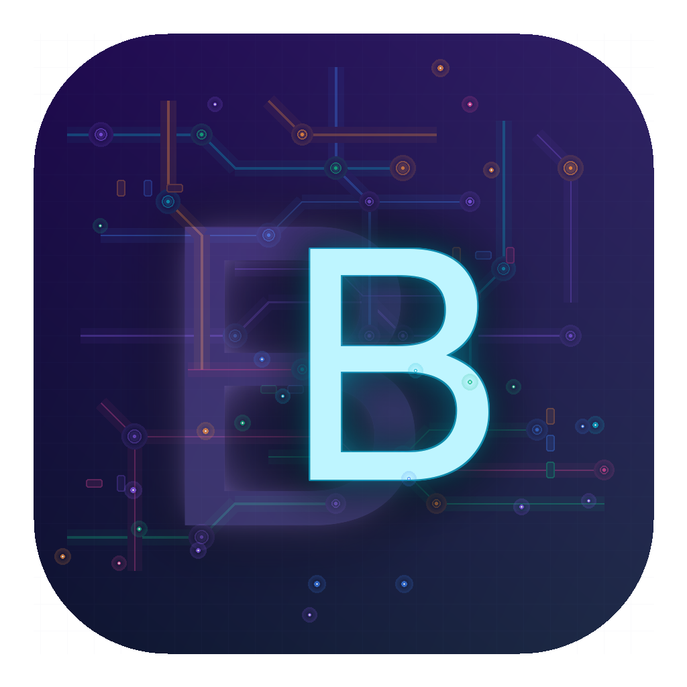
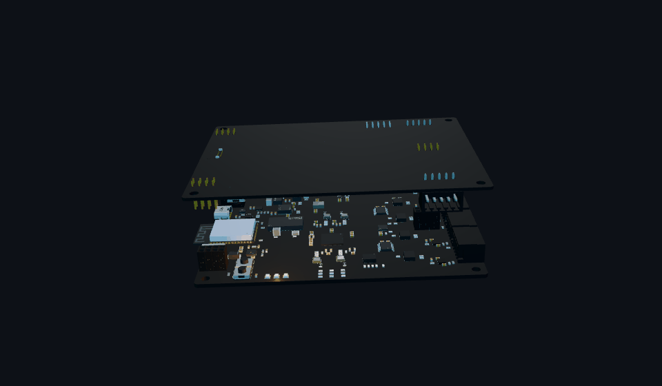
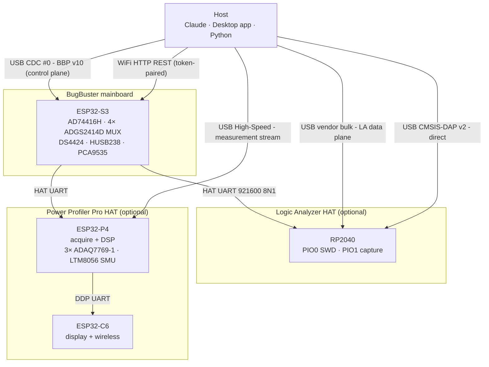
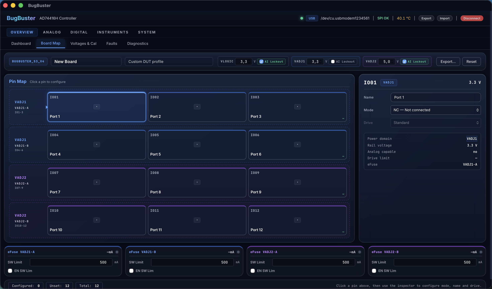
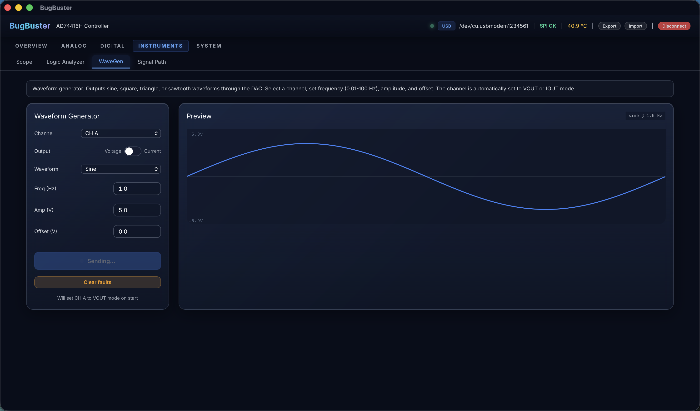

<p align="center">
  
</p>

<h1 align="center">B U G B U S T E R</h1>

<p align="center">
  <strong>An MCP server with a lab attached - so your AI can measure real hardware instead of asking you to.</strong>
</p>

<p align="center">
  
  
  
  
  
</p>

<p align="center">
  
</p>

## What this is

BugBuster is a **bench instrument you can hand to an AI**. One USB-C cable, one
board, and a Model Context Protocol server that exposes **112 tools** - so Claude
(or any MCP client) can read voltages, drive outputs, capture logic traces, scan
an I²C bus, profile power draw, and single-step a target over SWD without a
human in the measurement loop.

It is a real instrument, not a demo rig: 24-bit ADC, 16-bit DAC, 4-channel logic
analyzer, CMSIS-DAP SWD probe, USB-PD supplies, and a nA-resolution power
analyzer. Everything is also usable directly from Python, a desktop app, or an
iOS app - MCP is one front end over the same protocol, not a wrapper around a
toy.

**What it is not.** It will not replace a scope with real bandwidth. The logic
analyzer streams 4 channels at up to 1 MHz over USB (125 MHz single-channel is
capture-then-download, not live), the ADC tops out at 4.8 kSPS/channel, and the
waveform generator covers 0.01–100 Hz. It is built for embedded bring-up, power
profiling, and protocol debugging - not RF or high-speed signal integrity work.

## Why

AI models already reason well about electronics - datasheets, schematics, fault
trees. What they lack is a way to *check*. Without physical access, every
hypothesis costs a round-trip through you.

<table>
<tr>
<td width="50%">

**Without BugBuster**
```
You:    "The output is wrong"
AI:     "Can you measure pin 3?"
You:    *probes pin 3* "It's 1.8V"
AI:     "Expected 3.3V. Check the
         regulator input."
You:    *probes regulator* "Input is 5V"
AI:     "Check the enable pin..."
        ...20 more round-trips...
```

</td>
<td width="50%">

**With BugBuster**
```
You:   "The output is wrong. Debug it."
AI:    *reads all 4 channels*
       *detects 1.8V where 3.3V expected*
       *checks supply rails - input is 5V*
       *reads enable pin - HIGH, correct*
       *captures ADC snapshot on output*
       "Found it: your 3.3V regulator
        sags to 1.8V under load. Input is
        fine, EN is high - likely thermal
        shutdown or current limit."
```

</td>
</tr>
</table>

More worked examples: [Docs/scenarios.md](Docs/scenarios.md)

## Quick start

You need the hardware, Python 3.11+, and an MCP client (Claude Desktop, Claude
Code, or any other).

```bash
cd python
pip install -e ".[mcp]"
```

Find the device's serial port - `ls /dev/cu.usbmodem*` on macOS,
`ls /dev/ttyACM*` on Linux, Device Manager on Windows - then check the link:

```bash
bugbuster-mcp --transport usb --port /dev/cu.usbmodem1234561 --log-level INFO
```

Register it with your MCP client (`claude_desktop_config.json`, or
`~/.claude.json` for Claude Code):

```json
{
  "mcpServers": {
    "bugbuster": {
      "command": "bugbuster-mcp",
      "args": ["--transport", "usb", "--port", "/dev/cu.usbmodem1234561"]
    }
  }
}
```

Reload (`/mcp` in Claude Code), then ask it *"what's on IO 3?"* - it will call
`configure_io` followed by `read_voltage`.

<details>
<summary><strong>Server options</strong></summary>

| Flag | Default | Purpose |
|---|---|---|
| `--transport {usb,http}` | `usb` | Binary BBP over USB CDC, or JSON REST over WiFi |
| `--port PATH` | - | Serial port (USB transport) |
| `--host IP` | `192.168.4.1` | Device address (HTTP transport) |
| `--vlogic FLOAT` | `3.3` | Digital IO logic level, 1.8–5.0 V |
| `--admin-token TOKEN` | - | HTTP admin auth |
| `--log-level LEVEL` | `WARNING` | `DEBUG` / `INFO` / `WARNING` / `ERROR` |

USB CDC #0 holds a **single-client lock** - the MCP server, the desktop app, and
a serial monitor cannot share it. The HTTP transport cannot stream ADC or
logic-analyzer data.

</details>

### Without MCP

```python
from bugbuster import connect_usb, ChannelFunction

with connect_usb("/dev/cu.usbmodem1234561") as bb:
    bb.set_channel_function(0, ChannelFunction.VOUT)
    bb.set_dac_voltage(0, 3.3)
    print(f"{bb.get_adc_value(1).value:.4f} V")
```

Full API: [python/README.md](python/README.md)

## The hardware

BugBuster is built around an **ESP32-S3 mainboard** that always provides the
core bench instruments. A custom expansion bus accepts **one** of two snap-on
HATs, auto-detected at boot. The mainboard works standalone.

### Mainboard - always present

| Capability | Detail |
|---|---|
| **Measure** | 4-ch 24-bit ADC - voltage (0–12 V), current (4–20 mA), resistance, RTD; up to 4.8 kSPS/ch |
| **Drive** | 4-ch 16-bit DAC - 0–11 V / ±12 V, or 0–25 mA |
| **Generate** | Sine / square / triangle / sawtooth, 0.01–100 Hz |
| **Digital IO** | 12 level-shifted IOs, 1.8–5 V VLOGIC, MUX-routed, debounced counters |
| **Route** | 32-switch MUX - 4× ADGS2414D octal SPST, break-before-make |
| **Power** | VADJ1/VADJ2 adjustable 3–15 V (capped by the negotiated USB-PD voltage), USB-PD 5–20 V, 4 e-fuses |
| **Buses** | Route any IO as I²C or SPI; transactions from Python and MCP |
| **Bridges** | Transparent UART passthrough, configurable baud and pins |
| **Scope** | ADC streaming with real-time display, BBSC + CSV export |
| **Quick setup** | 5 named device-state snapshots (DAC, channels, routing) |
| **On-device scripting** | MicroPython runtime - REPL, SPIFFS store, autorun on boot |

### Logic Analyzer HAT - RP2040

Adds capture and a standalone SWD probe. Built on a fork of
[raspberrypi/debugprobe](https://github.com/raspberrypi/debugprobe).

| Capability | Detail |
|---|---|
| **Logic analyzer** | 4 ch @ up to 1 MHz live USB stream; up to 125 MHz single-channel offline. PIO capture, RLE, hardware triggers, dedicated USB vendor-bulk endpoint |
| **SWD probe** | CMSIS-DAP v2 - OpenOCD / pyOCD / probe-rs / VS Code, dedicated 5-pin connector (VADJ4 · SWCLK · SWDIO · TRACE · GND), no proxy through the ESP32 |
| **Target UART** | Separate USB CDC bridge to the target under debug |
| **Rails** | VADJ3 + VADJ4 (0–36 V) + 3V3_ADJ, DS4424-tuned LTM8083, per-rail current monitoring, auto-calibration |
| **IO** | 8 level-shifted IOs across two connectors, 8× WS2812B status LEDs |

[Architecture](Firmware/la-hat-architecture.md) ·
[Logic analyzer & streaming](Docs/logic-analyzer.md)

### Power Profiler Pro HAT - ESP32-P4 + ESP32-C6

A 24-bit, nA–3 A precision power analyzer and source-measure unit, in the class
of Joulescope / Otii / PPK2. The P4 acquires and runs the DSP pipeline
on-device; the C6 drives the local display and wireless link.

| Capability | Detail |
|---|---|
| **Current** | nA–3 A, 3× ADAQ7769-1 Σ-Δ, seamless 3-range hardware autorange (51 / 2 / 0.05 Ω), dual-ADC gap-fill |
| **Voltage** | 4-wire Kelvin differential sense |
| **Source** | 0–20 V, ≤ 2.5 A, LTM8056 buck-boost with DS4424 trim |
| **On-device DSP** | Power, energy, charge, min/max/mean/RMS/std, multi-resolution zoom, continuous Welch FFT |
| **Streaming** | USB 2.0 High-Speed CRC-framed vendor bulk; or WiFi softAP → iOS, bypassing the mainboard network stack |
| **Low-noise mode** | Super Resolution - best measured density 0.70 nA/√Hz ([method](Docs/noise-characterisation.md)) |
| **Signal integrity** | Per-sample ADAQ CRC, isolated-outlier despiking on device |
| **DUT supply** | Enable / voltage / current limit over HTTP and BLE; out-of-range setpoints are rejected, not clamped |
| **Display** | ESP32-C6 + ST7789 - live readout, settings and diagnostics menus |
| **OTA** | P4 dual-slot A/B with rollback; C6 flashed via the P4's ROM-loader relay, SHA-256 verified |

[Firmware](Firmware/DAQ_HAT/README.md) ·
[Analyzer architecture](Docs/power-analyzer.md)

## How it fits together


```mermaid
flowchart TB
  HOST["Host<br/>Claude · Desktop app · Python"]

  subgraph BB["BugBuster mainboard"]
    ESP32["ESP32-S3<br/>AD74416H · 4× ADGS2414D MUX<br/>DS4424 · HUSB238 · PCA9535"]
  end

  subgraph LA["Logic Analyzer HAT (optional)"]
    RP["RP2040<br/>PIO0 SWD · PIO1 capture"]
  end

  subgraph DAQ["Power Profiler Pro HAT (optional)"]
    P4["ESP32-P4<br/>acquire + DSP<br/>3× ADAQ7769-1 · LTM8056 SMU"]
    C6["ESP32-C6<br/>display + wireless"]
    P4 -->|DDP UART| C6
  end

  HOST -->|"USB CDC #0 - BBP v10 (control plane)"| ESP32
  HOST -->|"WiFi HTTP REST (token-paired)"| ESP32
  ESP32 -->|"HAT UART 921600 8N1"| RP
  ESP32 -->|"HAT UART"| P4

  HOST -->|"USB vendor bulk - LA data plane"| RP
  HOST -->|"USB CMSIS-DAP v2 - direct"| RP
  HOST -->|"USB High-Speed - measurement stream"| P4
```

The property that matters is that **control and data are separate USB paths**.
The ESP32-S3 owns the BBP control plane; the active HAT exposes its own
high-throughput USB device for bulk data. Capture and measurement throughput is
therefore independent of the control stream.

<details>
<summary><strong>Transports at a glance</strong></summary>

| Transport | Protocol | Who speaks it | Best for |
|---|---|---|---|
| ESP32 USB CDC #0 | BBP v10 (COBS + CRC-16) | MCP · desktop · Python | Full control plane |
| ESP32 HTTP REST | JSON over WiFi | desktop · Python · web UI | Remote access, OTA |
| RP2040 vendor bulk † | 4-byte framed packets | desktop · Python (libusb) | LA streaming, ~1 MB/s |
| RP2040 CMSIS-DAP v2 † | standard DAP | OpenOCD / pyOCD / probe-rs | SWD debug, no proxy |
| ESP32-P4 USB-HS ‡ | BB50 framed (CRC-16) | desktop · Python (libusb) | Power measurement stream |
| HAT UART | `0xAA` + CRC-8, 921600 | ESP32 ↔ HAT only | HAT config and status |

† Logic Analyzer HAT · ‡ Power Profiler Pro HAT.
Wire format: [Firmware/bbp-protocol.md](Firmware/bbp-protocol.md) ·
[Firmware/hat-uart-protocol.md](Firmware/hat-uart-protocol.md)

</details>

## Safety model

Handing an AI control of powered hardware needs limits it cannot talk its way
past. These are enforced in the tool layer, below the prompt:

- **MUX exclusivity** - each IO has exactly one active signal path.
- **E-fuse auto-arm** - configuring any output arms overcurrent protection.
- **Current ceiling** - 8 mA default; the full 25 mA requires
  `allow_full_range=True`.
- **Voltage confirmation** - supplies above 12 V require `confirm=True`.
- **Risk gates** - `mux_control` and `register_access` refuse to run without
  `i_understand_the_risk=True`.
- **Rail lock** - VLOGIC / VADJ1 / VADJ2 can be pinned per board via a JSON
  profile.
- **Post-action fault check** - every output operation triggers an automatic
  fault read; warnings propagate back to the model.

Constants live in `python/bugbuster_mcp/config.py`. Full matrix:
[python/bugbuster_mcp/README.md](python/bugbuster_mcp/README.md) ·
[Docs/board-profiles.md](Docs/board-profiles.md)

## Desktop app

<table>
  <tr>
    <td align="center">
      
      <br/><sub><b>Overview</b> - live 4-ch readings, SPI health, temperature</sub>
    </td>
    <td align="center">
      
      <br/><sub><b>Logic Analyzer</b> - UART / I²C / SPI decoders</sub>
    </td>
  </tr>
</table>

Tauri v2 + Leptos 0.7, 22 tabs. Build from source:

```bash
rustup target add wasm32-unknown-unknown
cargo install trunk tauri-cli

cd DesktopApp/BugBuster
cargo tauri dev      # hot reload
cargo tauri build    # release bundle
```

Screenshots and tab reference:
[DesktopApp/BugBuster/README.md](DesktopApp/BugBuster/README.md)

## Firmware

All four MCUs update **over the air from a GitHub release** - USB flashing is
only needed for bring-up or recovery. The ESP32-S3 orchestrates, streaming each
image over the HAT link and applying them in a firmware-enforced
**RP2040 → C6 → P4 → S3** order (the C6's ROM-loader push is driven *by* the P4,
so the P4 must still be running its current image when the C6 is written; the S3
goes last because rebooting it kills the orchestrator).

```bash
update apply [all|rp2040|esp32|p4|c6]     # serial CLI
```

Also available as `Settings → FW Update` in the desktop app, or
`POST /api/update/apply`.

<details>
<summary><strong>Flashing over USB</strong></summary>

```bash
# ESP32-S3 mainboard
cd Firmware/ESP32
pio run -e esp32s3 -t upload
pio run -e esp32s3 -t uploadfs        # web UI to SPIFFS

# Logic Analyzer HAT (RP2040)
cd Firmware/RP2040
git submodule update --init --recursive
mkdir build && cd build
cmake -DPICO_BOARD=bugbuster_hat .. && make -j
# hold BOOTSEL, then copy bugbuster_hat.uf2 to the RPI-RP2 volume

# Power Profiler Pro HAT
cd Firmware/DAQ_HAT/ESP32P4 && pio run -e esp32p4 -t upload --upload-port <PORT>
cd ../ESP32C6               && pio run -e esp32c6 -t upload --upload-port <PORT>
```

</details>

Current versions - ESP32-S3 `5.1.0`, Logic Analyzer HAT `bb-hat-5.0`, Power
Profiler Pro P4 `2.1.0` / C6 `2.2.0`, desktop `2.1.0`. Read any of them from
source:

```bash
python Firmware/tools/firmware_version.py {esp32|rp2040|p4|c6} [--expect X.Y.Z]
```

Release workflow: [Docs/release-checklist.md](Docs/release-checklist.md)

## Tests

The stack spans four MCUs, three wire protocols and five host surfaces, so most
defects are **drift** - a constant that disagrees between firmware and host -
rather than logic errors. The suite is built around that.

```bash
PYTHONPATH=python pytest tests/unit tests/synthetic tests/simulator tests/device --sim -q
PYTHONPATH=python pytest tests/integration tests/http_api --sim-full -q
```

**1203 passed, 163 skipped** on the first command - skips are hardware-only
paths; 6 passed, 17 skipped on the second. Add `--hat`, `--daq`, `--swd-target`
and `--device-usb=<PORT>` to run the same assertions against real hardware.
Coverage is ratcheted: a drop fails the build, and lowering the floor is an
explicit diff.

A large part of `tests/unit/` parses the firmware C/C++ sources directly and
asserts that firmware, simulator and host still agree - opcode tables, wire-record
layouts, HTTP route registration, the logical→MUX channel swap, task stack
sizing. Constants are derived from firmware source, never retyped, so a firmware
edit fails the Python suite instead of shipping a silent mismatch.

`Firmware/tools/check_memory.py` runs on every firmware build and fails it if
static DRAM or the OTA image exceeds budget; `tests/tools/mem_watch.py` reports
live SRAM headroom and per-task stack high-water marks from a running board.

Details: [tests/README.md](tests/README.md) ·
[Docs/memory-testing.md](Docs/memory-testing.md)

## Documentation

Start here, then follow the links inside each document.

| If you want to&hellip; | Read |
|---|---|
| Use the MCP tools | [python/bugbuster_mcp/README.md](python/bugbuster_mcp/README.md) |
| Script the device from Python | [python/README.md](python/README.md) |
| Understand the wire protocol | [Firmware/bbp-protocol.md](Firmware/bbp-protocol.md) |
| Work on mainboard firmware | [Firmware/ESP32/README.md](Firmware/ESP32/README.md) |
| Work on the Logic Analyzer HAT | [Firmware/RP2040/README.md](Firmware/RP2040/README.md) |
| Work on the Power Profiler Pro HAT | [Firmware/DAQ_HAT/README.md](Firmware/DAQ_HAT/README.md) |
| Look up a pin, IC, or rail | [Docs/mainboard-hardware.md](Docs/mainboard-hardware.md) · [Docs/daq-hat-hardware.md](Docs/daq-hat-hardware.md) |
| Extend or run the test suite | [tests/README.md](tests/README.md) |

Everything else lives in [Docs/](Docs/).

## Repository map

```
BugBuster/
├── Firmware/
│   ├── ESP32/                 ESP-IDF firmware (PlatformIO) - mainboard
│   ├── RP2040/                Logic Analyzer HAT (Pico SDK + debugprobe fork)
│   ├── DAQ_HAT/               Power Profiler Pro HAT (ESP32-P4 + ESP32-C6)
│   ├── bbp-protocol.md        BBP v10 wire format (USB CDC + HTTP REST)
│   ├── hat-uart-protocol.md   ESP32 ↔ HAT UART framing
│   └── la-hat-architecture.md Logic Analyzer HAT architecture
│
├── DesktopApp/BugBuster/      Tauri v2 + Leptos 0.7 (22 tabs)
├── iOSApp/                    Native Swift/SwiftUI app
│
├── python/
│   ├── bugbuster/             Control library (USB + HTTP)
│   ├── bugbuster_mcp/         MCP server (112 tools, 17 groups)
│   └── examples/              Annotated example scripts
│
├── tests/                     pytest - unit, simulator, hardware-in-the-loop
├── Docs/                      Hardware, protocols, scenarios, methods
├── PCB Material/              Altium schematics + layout
└── Scripts/                   Automation and one-off scripts
```

## Contributing

Issues and pull requests are welcome. Before opening a PR:

1. `PYTHONPATH=python pytest tests/unit tests/synthetic tests/simulator tests/device --sim -q`
   must pass.
2. Wire-protocol changes must keep `PROTO_VERSION` in lockstep across
   `Firmware/ESP32/src/bbp/bbp.h`, `python/bugbuster/protocol.py`, and
   `DesktopApp/BugBuster/src-tauri/src/bbp.rs`.
3. New capabilities on any surface need their manifest under `.mex/manifests/`
   updated in the same change.

## Support development

If BugBuster is useful to you, you can help fund hardware prototyping and
maintenance:

<p align="left">
  <a href="https://www.paypal.com/donate/?hosted_button_id=D736X49DQBQXE">
    
  </a>
</p>

The HAT PCBs were manufactured free of charge by [JLCPCB](https://jlcpcb.com) in
support of the open-source community.

## License

AGPL-3.0 - see [LICENSE](LICENSE).

BugBuster is free to use, modify, and self-host. If you distribute a
modified version, or run a modified version as a network service, you must
release the corresponding source under the same license. For closed-source
or commercial-OEM use, contact the maintainer for an alternative license.
