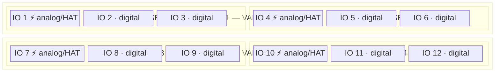
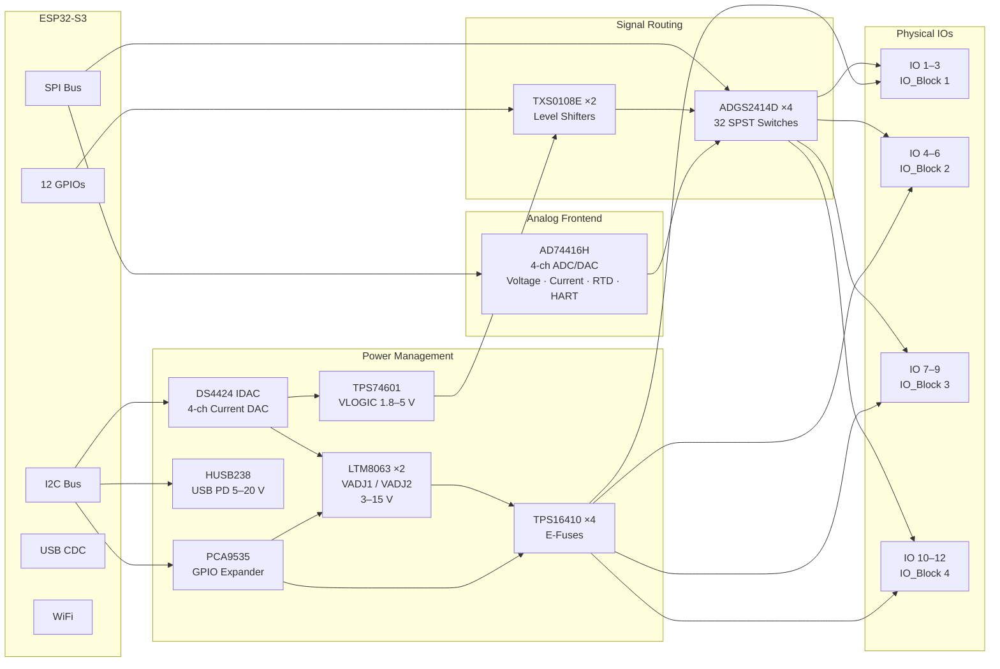

# BugBuster Python Library

Python control library for the **BugBuster** industrial I/O board, built around the
AD74416H quad-channel software-configurable I/O IC on an ESP32-S3 platform.

Supports two communication transports:
- **USB** — Binary protocol (BBP) over CDC serial. Low-latency, supports ADC/scope streaming.
- **HTTP** — WiFi REST API. No streaming, but works wirelessly.

## Transport Feature Comparison

| Feature | USB | HTTP |
|---------|-----|------|
| Core channel I/O (VOUT, IOUT, VIN, IIN, RTD, DIN) | ✅ | ✅ |
| GPIO / MUX / Power management | ✅ | ✅ |
| IDAC / self-test / diagnostics | ✅ | ✅ |
| WiFi management | ✅ | ✅ |
| Waveform generator | ✅ | ✅ |
| ADC streaming (`start_adc_stream`) | ✅ | ❌ |
| Scope streaming (`on_scope_data`) | ✅ | ❌ |
| HAT power control (`hat_set_power`, `hat_get_power`) | ✅ | ❌ (no firmware endpoint) |
| HAT I/O voltage (`hat_set_io_voltage`) | ✅ | ❌ (no firmware endpoint) |
| Logic Analyzer (`hat_la_*`) | ✅ | ❌ |
| UART bridge config (`set_uart_config`) | ✅ | ❌ |
| Direct register access (`register_read`, `register_write`) | ✅ | ❌ |

Methods that raise `NotImplementedError` over HTTP are documented in their docstrings.

## Installation

```bash
pip install pyserial requests
```

Then either install the package:

```bash
pip install -e .
```

Or just add the `python/` directory to your `PYTHONPATH` / `sys.path`.

## Quick Start

### Low-Level Client

Direct access to all hardware: AD74416H channels, MUX switches, IDAC supplies,
GPIO, UART bridge, USB PD, and more.

```python
import bugbuster as bb
from bugbuster import ChannelFunction, AdcRate

# USB connection
with bb.connect_usb("/dev/cu.usbmodem1234561") as dev:
    dev.set_channel_function(0, ChannelFunction.VOUT)
    dev.set_dac_voltage(0, 5.0)

    result = dev.get_adc_value(1)
    print(f"Channel 1: {result.value:.4f} V")

# HTTP connection (WiFi)
with bb.connect_http("192.168.3.102") as dev:
    dev.set_channel_function(0, ChannelFunction.IOUT)
    dev.set_dac_current(0, 12.0)   # 12 mA
```

### HAL (Hardware Abstraction Layer)

Arduino-style `configure() / read() / write()` API that hides MUX routing,
power sequencing, and register-level details behind simple port numbers.

```python
import bugbuster as bb
from bugbuster import PortMode

with bb.connect_usb("/dev/cu.usbmodem1234561") as dev:
    hal = dev.hal
    hal.begin(supply_voltage=12.0, vlogic=3.3)

    # Analog I/O (IO 1, 4, 7, 10 only)
    hal.configure(1, PortMode.ANALOG_OUT)
    hal.write_voltage(1, 5.0)

    hal.configure(4, PortMode.ANALOG_IN)
    print(f"IO 4: {hal.read_voltage(4):.4f} V")

    # Digital I/O (all 12 IOs)
    hal.configure(2, PortMode.DIGITAL_OUT)
    hal.write_digital(2, True)

    # Supply control
    hal.set_voltage(rail=1, voltage=10.0)   # VADJ1 -> 10 V (IO 1-6)
    hal.set_vlogic(3.3)                     # logic level -> 3.3 V

    hal.shutdown()
```

### Digital IO (Direct ESP32 GPIO)

Low-level digital read/write on the 12 ESP32 GPIOs that connect to the
physical IO terminals through the MUX matrix.

```python
with bb.connect_usb("/dev/cu.usbmodem1234561") as dev:
    dev.dio_configure(1, 2)    # IO 1 -> output
    dev.dio_write(1, True)     # drive HIGH

    dev.dio_configure(2, 1)    # IO 2 -> input
    r = dev.dio_read(2)        # read level
    print(f"IO 2: {'HIGH' if r['value'] else 'LOW'}")
```

## Hardware Overview





### IO Capabilities

| IO | Type | MUX Options |
|----|------|-------------|
| **1, 4, 7, 10** | Analog-capable | ESP GPIO (high/low drive) · AD74416H channel · HAT passthrough |
| **2, 3, 5, 6, 8, 9, 11, 12** | Digital-only | ESP GPIO (high drive) · ESP GPIO (low drive) |

### Supply Rails

| Rail | Range | Controls | Set via |
|------|-------|----------|---------|
| **VADJ1** | 3–15 V | VCC on IO 1–6 (IO_Blocks 1 & 2) | `hal.set_voltage(1, V)` |
| **VADJ2** | 3–15 V | VCC on IO 7–12 (IO_Blocks 3 & 4) | `hal.set_voltage(2, V)` |
| **VLOGIC** | 1.8–5.0 V | Logic level for all digital IOs | `hal.set_vlogic(V)` |

## Key Subsystems

| Subsystem | IC | What it does |
|-----------|-----|-------------|
| Analog I/O | AD74416H | 4-ch configurable: voltage/current in+out, RTD, digital, HART |
| MUX Matrix | ADGS2414D x4 | 32 SPST switches routing signals to 12 physical IOs |
| Power Supply | LTM8063 x2 | Adjustable 3-15 V (VADJ1, VADJ2) via DS4424 IDAC |
| Logic Level | TPS74601 | Adjustable 1.8-5 V (VLOGIC) via DS4424 IDAC ch 0 |
| USB PD | HUSB238 | Negotiate 5-20 V from USB-C PD source |
| GPIO Expander | PCA9535 | Power enables, e-fuse control, fault monitoring |
| Level Shift | TXS0108E x2 | Shift digital IOs to VLOGIC level |
| Serial Bridge | ESP32 UART | Configurable UART routed to any 2 IOs via MUX |

## Examples

| # | File | Description |
|---|------|-------------|
| 01 | `01_hello_device.py` | Connect, ping, read device info and status |
| 02 | `02_analog_io.py` | Voltage/current output+input, RTD measurement |
| 03 | `03_adc_streaming.py` | High-speed ADC streaming at up to 9.6 kSPS (USB only) |
| 04 | `04_waveform_and_mux.py` | Waveform generator + MUX switch routing |
| 05 | `05_hal_basics.py` | HAL tutorial — all 12 IO modes, supply control, serial bridge |
| 06 | `06_power_management.py` | USB PD, IDAC voltage control, e-fuse, power sequencing |
| 07 | `07_digital_io.py` | ESP32 GPIO digital read/write over USB and HTTP |

## API Reference

### Factory Functions

```python
bb.connect_usb(port, baudrate=921600, timeout=5.0) -> BugBuster
bb.connect_http(host, port=80, timeout=5.0) -> BugBuster
```

### BugBuster Client — Key Methods

**Connection:**
`ping()`, `reset()`, `get_status()`, `get_device_info()`, `get_firmware_version()`

**Analog Channels (AD74416H):**
`set_channel_function()`, `set_dac_voltage()`, `set_dac_current()`,
`get_adc_value()`, `set_adc_config()`, `set_vout_range()`, `set_current_limit()`,
`set_rtd_config()`, `get_dac_readback()`

**Digital IO (ESP32 GPIO):**
`dio_get_all()`, `dio_configure()`, `dio_write()`, `dio_read()`

**AD74416H GPIO (on-chip, 6 pins A-F):**
`get_gpio()`, `set_gpio_config()`, `set_gpio_value()`

**MUX Switch Matrix:**
`mux_get()`, `mux_set_all()`, `mux_set_switch()`

**Power Management:**
`power_set()`, `power_get_status()`, `idac_set_voltage()`, `idac_get_status()`

**UART Bridge:**
`get_uart_config()`, `set_uart_config()`, `get_uart_pins()`

**USB PD:**
`usbpd_get_status()`, `usbpd_select_voltage()`

**ADC Streaming (USB only):**
`start_adc_stream()`, `stop_adc_stream()`, `on_scope_data()`

**Waveform Generator:**
`start_waveform()`, `stop_waveform()`

### HAL — Key Methods

```python
hal = dev.hal                                  # lazy-initialized
hal.begin(supply_voltage=12.0, vlogic=3.3)     # power-up sequence
hal.configure(io, PortMode.ANALOG_OUT)         # set IO mode
hal.write_voltage(io, 5.0)                     # analog output
hal.read_voltage(io)                           # analog input
hal.write_current(io, 12.0)                    # 4-20 mA output
hal.read_current(io)                           # 4-20 mA input
hal.write_digital(io, True)                    # digital output
hal.read_digital(io)                           # digital input
hal.read_resistance(io)                        # RTD measurement
hal.read_temperature_pt100(io)                 # PT100 temperature
hal.set_voltage(rail, voltage)                 # VADJ supply (rail 1 or 2)
hal.set_vlogic(voltage)                        # logic level (1.8-5.0 V)
hal.set_serial(tx=3, rx=6)                     # UART bridge routing
hal.shutdown()                                 # safe power-down
```

### PortMode Enum

```
DISABLED, ANALOG_IN, ANALOG_OUT, CURRENT_IN, CURRENT_OUT,
DIGITAL_IN, DIGITAL_OUT, DIGITAL_IN_LOW, DIGITAL_OUT_LOW,
RTD, HART, HAT
```

## Protocol

The USB binary protocol (BBP) is documented in
[`Firmware/BugBusterProtocol.md`](../Firmware/BugBusterProtocol.md).

The HTTP REST API mirrors the binary protocol — every binary command has
an equivalent HTTP endpoint documented in the example files and source code.

## License

Internal / proprietary. Contact the project maintainers for licensing.
